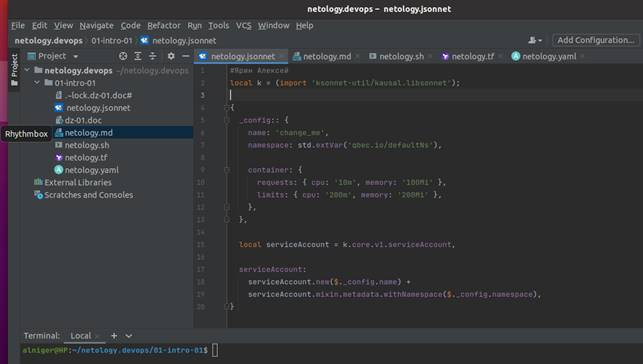

# Домашнее задание к занятию «1.1. Введение в DevOps»

## Задание №1 - Подготовка рабочей среды

Вы пришли на новое место работы или приобрели новый компьютер.
Первым делом надо настроить окружение для дальнейшей работы. 

1. Установить PyCharm Community Edition: https://www.jetbrains.com/ru-ru/pycharm/download/ - это бесплатная версия IDE. 
Если у вас уже установлен любой другой продукт от JetBrains,то можно использовать его. 
1. Установить плагины:
    - Terraform,
    - MarkDown,
    - Yaml/Ansible Support,
    - Jsonnet.
1. Склонировать текущий репозиторий или просто создать файлы для проверки плагинов:
    - [netology.tf](netology.tf) – terraform,
    - [netology.sh](netology.sh) – bash,
    - [netology.md](netology.md) – markdown, 
    - [netology.yaml](netology.yaml) – yaml,
    - [netology.jsonnet](netology.jsonnet) – jsonnet.
1. Убедитесь, что работает подсветка синтаксиса.
1. Добавьте свое имя в каждый файл, сделайте снимок экрана и загрузите его на любой сервис обмена картинками.
1. Ссылки на картинки укажите в личном кабинете как решение домашнего задания. 

Подсветка синтаксиса Jsonnet:

 Подсветка синтаксиса Markdown:

 Подсветка синтаксиса Bash:

 Подсветка синтаксиса Terraform:

Подсветка синтаксиса Yaml:

 

## Задание №2 - Описание жизненного цикла задачи (разработки нового функционала)

1. Проработка между менеджером и Заказчиком задачи, ее требований и сроков.

Доработка задачи.

2.   Анализ требований на выполнение задачи, сроков между Менеджером уточняет с разработчиками. Если задача не выполнима, уходит на доработку (1).

3.   Разработчики и DevOps-инженер разрабатывают и согласовывают перечень инструментов для решения задачи.

4. DevOps-инженер создает среду и инструменты для решения задачи.

5.   Разработчики и DevOps-инженер согласовывают среду и инструменты для решения задачи. Если возникли вопросы, уходит на доработку (3).

6. Разработчики пишут код для задачи. Доработка кода.

7. Разработчики передают код на тестирование. DevOps-инженер создает среду и инструменты для тестирования. Тестировщики тестируют. Если возникают проблемы в коде, уходит на доработку 6.

8. После успешного прохождения всех тестов, выполненная задача передается для ознакомления с Заказчиком. Если у Заказчика возникли вопросы, уходит на доработку 1. 

9. После согласования выполненной задачи с Заказчиком, задача считается выполненной.

10. В случае новых предложений у Заказчика, уходит на разработку вновь (1).

 