### Решение домашнего задания №8 (3.3. Операционные системы, лекция 1"

##### Вопрос 1: Какой системный вызов делает команда cd? В прошлом ДЗ мы выяснили, что cd не является самостоятельной программой, это shell builtin, поэтому запустить strace непосредственно на cd не получится. Тем не менее, вы можете запустить strace на /bin/bash -c 'cd /tmp'. В этом случае вы увидите полный список системных вызовов, которые делает сам bash при старте. Вам нужно найти тот единственный, который относится именно к cd. Обратите внимание, что strace выдаёт результат своей работы в поток stderr, а не в stdout.

Выполним команду:

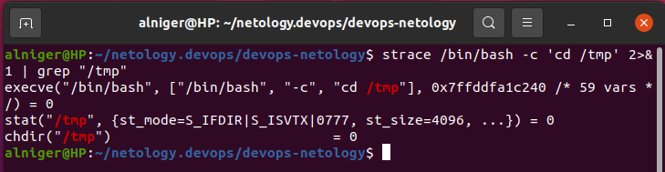

Вызов – chdir (“/tmp”).

##### Вопрос 2:   Попробуйте использовать команду file на объекты разных типов на файловой системе. Например: 

##### vagrant@netology1:~$ file /dev/tty

##### /dev/tty: character special (5/0)

##### vagrant@netology1:~$ file /dev/sda

##### /dev/sda: block special (8/0)

##### vagrant@netology1:~$ file /bin/bash

##### /bin/bash: ELF 64-bit LSB shared object, x86-64

##### Используя strace выясните, где находится база данных file на основании которой она делает свои догадки.

Выполняем  вышеуказанные команды и добавляем команду 
Находим следующие необходимые данные:

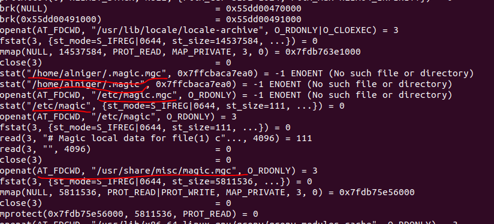

Смотрим содержимое:

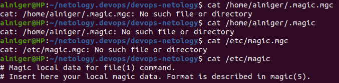

В 3-х  первых файлах нет базы данных.
**/etc/magic** Конфигурационный файл для типов файлов. Содержит описания различных форматов файлов для командной оболочки. Содержит только комментарии.
Далее выполняем команду **cat /usr/share/misc/magic.mgc** и получаем большой вывод с символами.
Смотрим какой тип: 

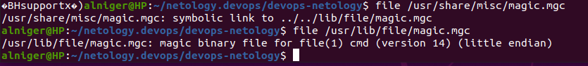

**/usr/share/misc/magic.mgc** – бинарный файл с сигнатурами. Это база данных.

##### Вопрос 3: Предположим, приложение пишет лог в текстовый файл. Этот файл оказался удален (deleted в lsof), однако возможности сигналом сказать приложению переоткрыть файлы или просто перезапустить приложение – нет. Так как приложение продолжает писать в удаленный файл, место на диске постепенно заканчивается. Основываясь на знаниях о перенаправлении потоков предложите способ обнуления открытого удаленного файла (чтобы освободить место на файловой системе).

Создадим файл и запустим процесс:

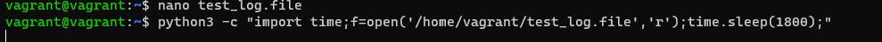

 Запускаем ps aux и узнаем процесс:

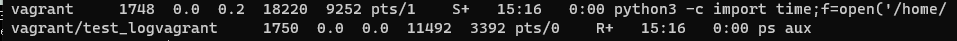

Удаляем файл и узнаем дексриптор:

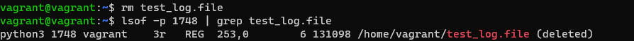

Посмотрим что данные еще хранятся и делаем обнуление:/PROCESS STATE CODES

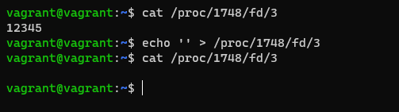

##### Вопрос 4: Занимают ли зомби-процессы какие-то ресурсы в ОС (CPU, RAM, IO)?

Зомби-процессы не занимают ресурсы ОС (CPU, RAM, IO), только висят в таблице процессов.

##### Вопрос 5:  В iovisor BCC есть утилита opensnoop:

##### root@vagrant:~# dpkg -L bpfcc-tools | grep sbin/opensnoop

##### /usr/sbin/opensnoop-bpfcc

##### На какие файлы вы увидели вызовы группы open за первую секунду работы утилиты? Воспользуйтесь пакетом bpfcc-tools для Ubuntu 20.04.

Устанавливаем утилиту: sudo apt-get install bpfcc-tools linux-headers-$(uname -r)
Выполняем запуск и получаем результат (перечень утилит):

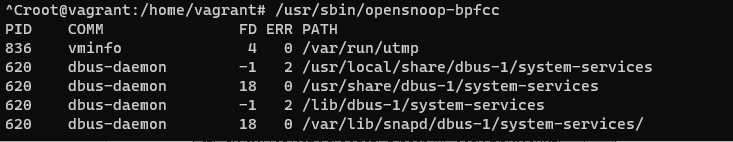

##### Вопрос 6: Какой системный вызов использует uname -a? Приведите цитату из man по этому системному вызову, где описывается альтернативное местоположение в /proc, где можно узнать версию ядра и релиз ОС.

Согласно strace, используется системный вызов uname.
Информация из man 2 uname:

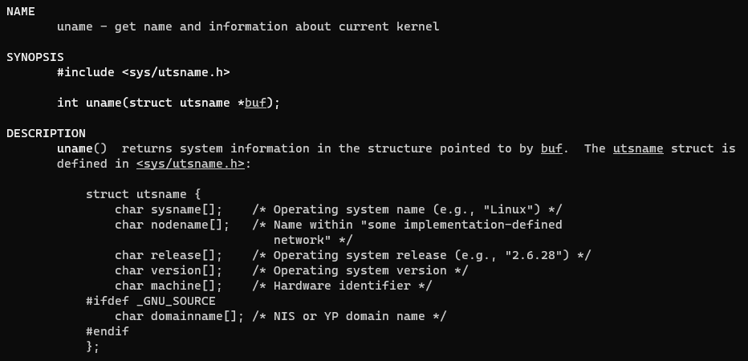

Находим нужную информацию line 60:
 Part of the utsname information is also accessible via **/proc/sys/kernel/{ostype, hostname, os‐release, version, domainname}.**

##### Вопрос 7:  Чем отличается последовательность команд через ; и через && в bash? Например:

##### root@netology1:~# test -d /tmp/some_dir; echo Hi

##### Hi

##### root@netology1:~# test -d /tmp/some_dir && echo Hi

##### root@netology1:~#

##### Есть ли смысл использовать в bash &&, если применить set -e?

“;” – последовательный вызов команд;

“&&” - последовательный вызов команд, и имеет возможность остановить выполнение в случае, если одна из команд не сможет выполниться;

set -e - прекращает выполнение скрипта если команда завершилась ошибкой, выводит в stderr строку с ошибкой. 

С ‘&&’ нет смысла, в случае с ошибкой команды не будут выполняться.

##### Вопрос 8: Из каких опций состоит режим bash set -euxo pipefail и почему его хорошо было бы использовать в сценариях?

Эта оптиция дает возможность писать красивые и безопасные bash скрипты.
set -euxo pipefail

Что всё это значит:

set -e - прекращает выполнение скрипта если команда завершилась ошибкой, выводит в stderr строку с ошибкой. 

set -u - прекращает выполнение скрипта, если встретилась несуществующая переменная.

set -x - выводит выполняемые команды в stdout перед выполненинем.

set -o pipefail - прекращает выполнение скрипта, даже если одна из частей пайпа завершилась ошибкой. 

##### Вопрос 9: Используя -o stat для ps, определите, какой наиболее часто встречающийся статус у процессов в системе. В man ps ознакомьтесь (/PROCESS STATE CODES) что значат дополнительные к основной заглавной буквы статуса процессов. Его можно не учитывать при расчете (считать S, Ss или Ssl равнозначными).

Выполняем команду и получаем результат:

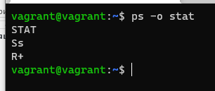

В **man ps** находим ‘**/PROCESS STATE CODES**’ lines 454:
S  -   interruptible sleep (waiting for an event to complete) (прерывистый сон (ожидание завершения события))

s  -  is a session leader (является лидером сеанса)

R  -  running or runnable (on run queue) (работает или запускается (в очереди выполнения))

`+ - is in the foreground process group (находится в группе процессов переднего плана)

