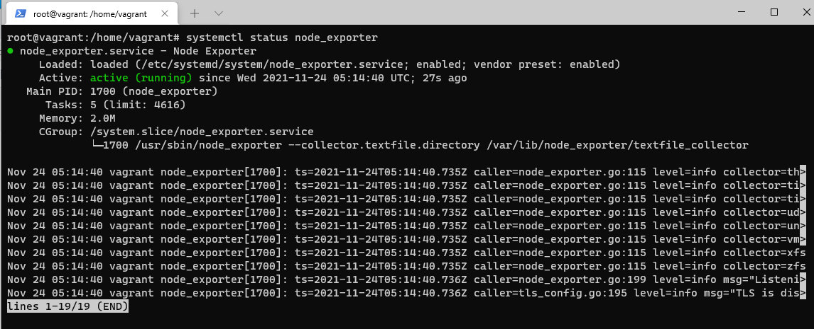
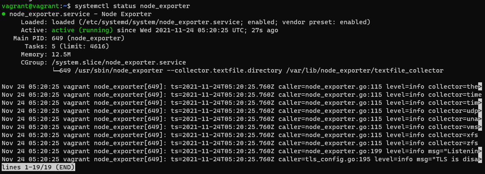
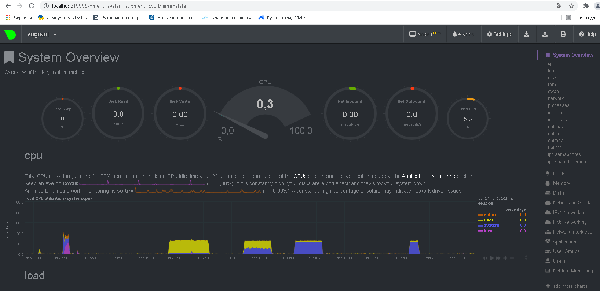
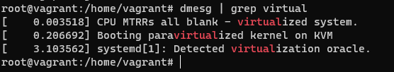
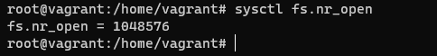
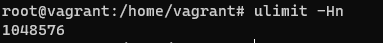
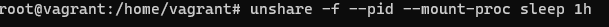
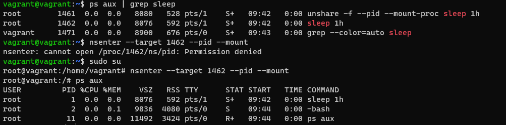
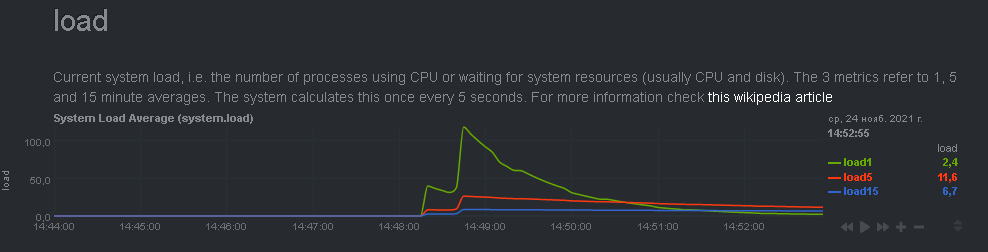
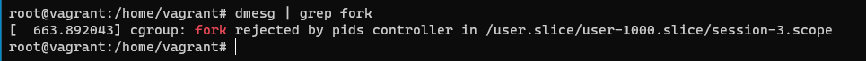

### Решение домашнего задания №9 (3.4. Операционные системы, лекция 2")

##### Вопрос 1: На лекции мы познакомились с node_exporter. В демонстрации его исполняемый файл запускался в background. Этого достаточно для демо, но не для настоящей production-системы, где процессы должны находиться под внешним управлением. Используя знания из лекции по systemd, создайте самостоятельно простой unit-файл для node_exporter:

- ##### поместите его в автозагрузку

- ##### предусмотрите возможность добавления опций к запускаемому процессу через внешний файл (посмотрите, например, на systemctl cat cron)

- ##### удостоверьтесь, что с помощью systemctl процесс корректно стартует, завершается, а после перезагрузки автоматически поднимается.

sudo useradd node_exporter -s /sbin/nologin

wget https://github.com/prometheus/node_exporter/releases/download/v1.3.0/node_exporter-1.3.0.linux-386.tar.gz

$ tar xvfz node_exporter-1.3.0.linux-386.tar.gz

$ cp node_exporter-1.3.0.linux-386.tar.gz /node_exporter /usr/sbin/

Создаем файл /etc/systemd/system/node_exporter.service со следующим содержимым:

`[Unit]`
`Description=Node Exporter`

`[Service]`
`User=node_exporter`
`EnvironmentFile=/etc/sysconfig/node_exporter`
`ExecStart=/usr/sbin/node_exporter $OPTIONS`

`[Install]`
`WantedBy=multi-user.target`

Далее выполняем:

$ mkdir -p /etc/sysconfig

$ touch /etc/sysconfig/node_exporter

Добавляем: OPTIONS="--collector.textfile.directory /var/lib/node_exporter/textfile_collector"

Перезагружаем демонов и запускаем node_exporter:

$ systemctl daemon-reload

$ systemctl enable node_exporter

$ systemctl start node_exporter

После перезагрузки проверяем автозапуск:

##### Вопрос 2: Ознакомьтесь с опциями node_exporter и выводом /metrics по-умолчанию. Приведите несколько опций, которые вы бы выбрали для базового мониторинга хоста по CPU, памяти, диску и сети.

Выполняем:
$ curl http://localhost:9100/metrics и добавлям grep со словами cpu, memory, disk, network. Получаем:
По CPU:
- node_cpu_guest_seconds_total
- node_cpu_seconds_total

По памяти:
- node_memory_Buffers_bytes
- node_memory_Cached_bytes
- node_memory_SwapFree_bytes
- node_memory_SwapTotal_bytes
- node_memory_HardwareCorrupted_bytes
- node_memory_MemAvailable_bytes
- node_memory_MemFree_bytes
- node_memory_MemTotal_bytes

По дискам:
- node_disk_info
- node_disk_io_now
- node_disk_io_time_seconds_total
- node_disk_io_time_weighted_seconds_total
- node_disk_read_bytes_total
- node_disk_read_time_seconds_total
- node_disk_reads_completed_total
- node_disk_reads_merged_total
- node_disk_write_time_seconds_total
- node_disk_writes_completed_total
- node_disk_writes_merged_total
- node_disk_written_bytes_total

По сетке:
- node_network_up
- node_network_speed_bytes
- node_network_transmit_bytes_total
- node_network_transmit_errs_total
- node_network_transmit_queue_length
- node_network_receive_bytes_total
- node_network_receive_errs_total

##### Вопрос 3:     Установите в свою виртуальную машину Netdata. Воспользуйтесь готовыми пакетами для установки (sudo apt install -y netdata). После успешной установки:

#####         ◦ в конфигурационном файле /etc/netdata/netdata.conf в секции [web] замените значение с localhost на bind to = 0.0.0.0,

#####         ◦ добавьте в Vagrantfile проброс порта Netdata на свой локальный компьютер и сделайте vagrant reload: config.vm.network "forwarded_port", guest: 19999, host: 19999

##### После успешной перезагрузки в браузере на своем ПК (не в виртуальной машине) вы должны суметь зайти на localhost:19999. Ознакомьтесь с метриками, которые по умолчанию собираются Netdata и с комментариями, которые даны к этим метрикам.

Получилось красиво:

Поделал краш-тесты на ЦП:

dd if=/dev/urandom | bzip2 -9 > /dev/null

yes > /dev/null

cat /dev/zero > /dev/null

##### Вопрос 4:     Можно ли по выводу dmesg понять, осознает ли ОС, что загружена не на настоящем оборудовании, а на системе виртуализации?

Выполняем команду и получаем результат:

##### Вопрос 5: Как настроен sysctl fs.nr_open на системе по-умолчанию? Узнайте, что означает этот параметр. Какой другой существующий лимит не позволит достичь такого числа (ulimit --help)?

Выполняем и получаем результат:

Это параметр, указывающий максимальное количество открытых файлов в системе. Максимум – 1048576.

Выполняем команду ulimit с параметрами и получаем результат:

Мягкий лимит на кол-во файлов:

Жесткий лимит на кол-во файлов:

##### Вопрос 6: Запустите любой долгоживущий процесс (не ls, который отработает мгновенно, а, например, sleep 1h) в отдельном неймспейсе процессов; покажите, что ваш процесс работает под PID 1 через nsenter. Для простоты работайте в данном задании под root (sudo -i). Под обычным пользователем требуются дополнительные опции (--map-root-user) и т.д.

Выполняем в первом терминале:

Во втором выполняем:

##### Вопрос 7: айдите информацию о том, что такое :(){ :|:& };:. Запустите эту команду в своей виртуальной машине Vagrant с Ubuntu 20.04 (это важно, поведение в других ОС не проверялось). Некоторое время все будет "плохо", после чего (минуты) – ОС должна стабилизироваться. Вызов dmesg расскажет, какой механизм помог автоматической стабилизации. Как настроен этот механизм по-умолчанию, и как изменить число процессов, которое можно создать в сессии?

Эта команда является **логической бомбой**. Она оперирует определением функции с именем ‘:‘, которая вызывает сама себя дважды: один раз на переднем плане и один раз в фоне. 

Согласно графика из Netdata действительно произошла стабилизация.

При помощи команды ulimit -u 10 можно ограничить ограничиваем.

