### Решение домашнего задания №10 (Файловые системы)

##### Вопрос 1: Узнайте о sparse (разряженных) файлах.

Изучил.

##### Вопрос 2: Могут ли файлы, являющиеся жесткой ссылкой на один объект, иметь разные права доступа и владельца? Почему?

Не могут иметь разные права доступа и владельца.

Жесткая ссылка и файл, для которой она создавалась имеют одинаковые inode. Поэтому жесткая ссылка имеет те же права доступа, владельца и время последней модификации, что и целевой файл. Различаются только имена файлов. Фактически жесткая ссылка это еще одно имя для файла.

##### Вопрос 3: Сделайте vagrant destroy на имеющийся инстанс Ubuntu. Замените содержимое Vagrantfile следующим:

`Vagrant.configure("2") do |config|
  config.vm.box = "bento/ubuntu-20.04"
  config.vm.provider :virtualbox do |vb|
    lvm_experiments_disk0_path = "/tmp/lvm_experiments_disk0.vmdk"
    lvm_experiments_disk1_path = "/tmp/lvm_experiments_disk1.vmdk"
    vb.customize ['createmedium', '--filename', lvm_experiments_disk0_path, '--size', 2560]
    vb.customize ['createmedium', '--filename', lvm_experiments_disk1_path, '--size', 2560]
    vb.customize ['storageattach', :id, '--storagectl', 'SATA Controller', '--port', 1, '--device', 0, '--type', 'hdd', '--medium', lvm_experiments_disk0_path]
    vb.customize ['storageattach', :id, '--storagectl', 'SATA Controller', '--port', 2, '--device', 0, '--type', 'hdd', '--medium', lvm_experiments_disk1_path]
  end
end`

##### Данная конфигурация создаст новую виртуальную машину с двумя дополнительными неразмеченными дисками по 2.5 Гб.

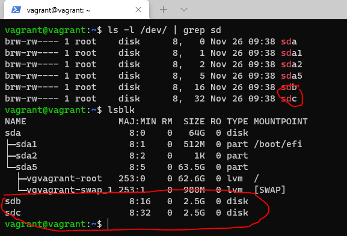

##### Вопрос 4: Используя fdisk, разбейте первый диск на 2 раздела: 2 Гб, оставшееся пространство.

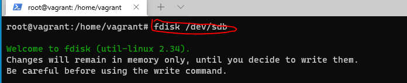

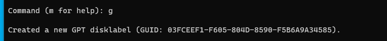

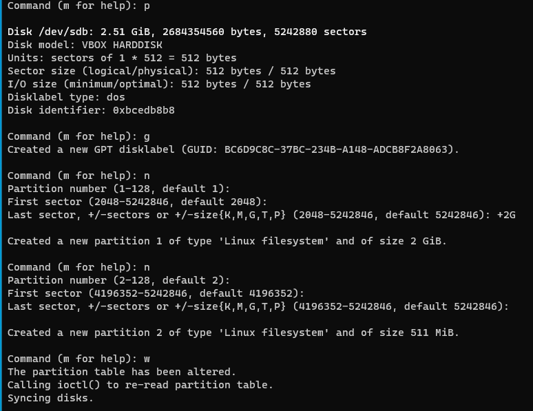

##### Вопрос 5: Используя sfdisk, перенесите данную таблицу разделов на второй диск.

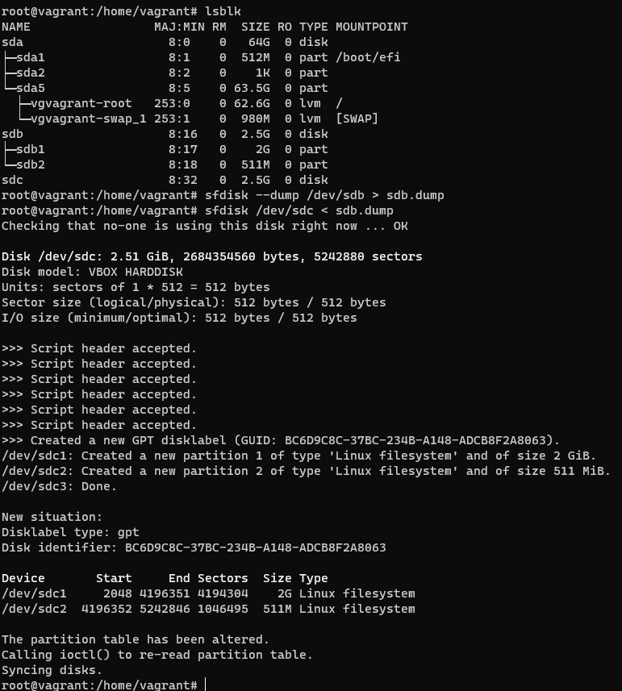

##### Вопрос 6: Соберите mdadm RAID1 на паре разделов 2 Гб.

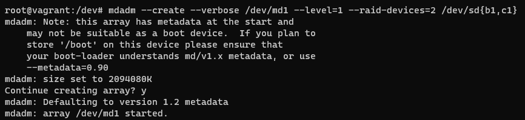

##### Вопрос 7: Соберите mdadm RAID0 на второй паре маленьких разделов.

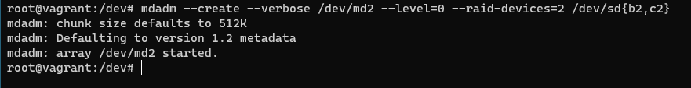

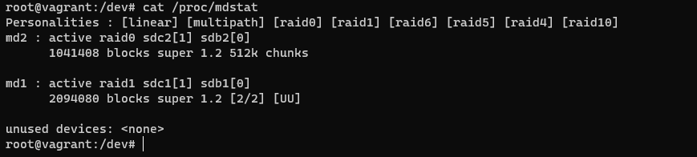

##### Вопрос 8: Создайте 2 независимых PV на получившихся md-устройствах.

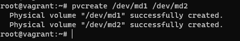

##### Вопрос 9: Создайте общую volume-group на этих двух PV.

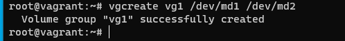

##### Вопрос 10: Создайте LV размером 100 Мб, указав его расположение на PV с RAID0.

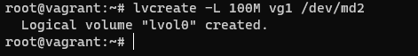

##### Вопрос 11: Создайте mkfs.ext4 ФС на получившемся LV.

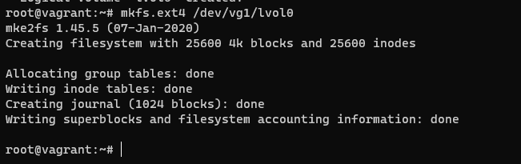

##### Вопрос 12: Смонтируйте этот раздел в любую директорию, например, /tmp/new.

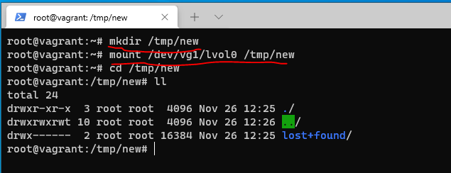

##### Вопрос 13: Поместите туда тестовый файл, например wget https://mirror.yandex.ru/ubuntu/ls-lR.gz -O /tmp/new/test.gz.

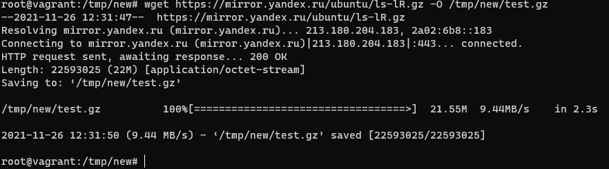

##### Вопрос 14: Прикрепите вывод lsblk.

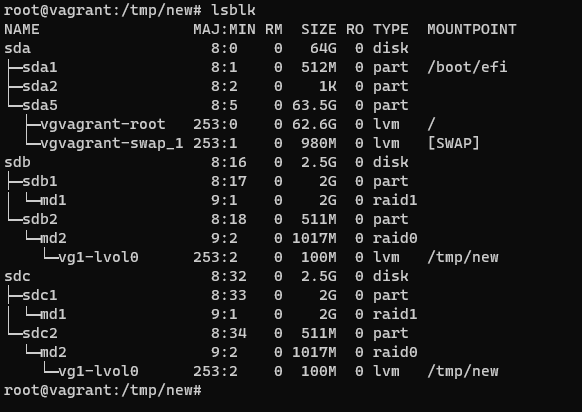

##### Вопрос 15: Протестируйте целостность файла

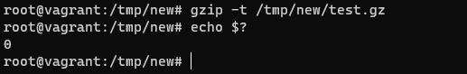

##### Вопрос 16: Погасите тестовый хост, vagrant destroy.

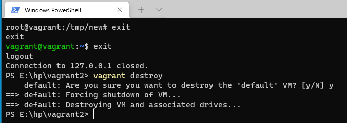
