### Решение домашнего задания №11 (3.6. Компьютерные сети, лекция 1)

##### Вопрос 1: Работа c HTTP через телнет.

- ​	Подключитесь утилитой телнет к сайту stackoverflow.com telnet stackoverflow.com 80

- ​	отправьте HTTP запрос

GET /questions HTTP/1.0

HOST: stackoverflow.com

[press enter]

[press enter]

- ​	В ответе укажите полученный HTTP код, что он означает?

  Направсляем  запрос и получаем:

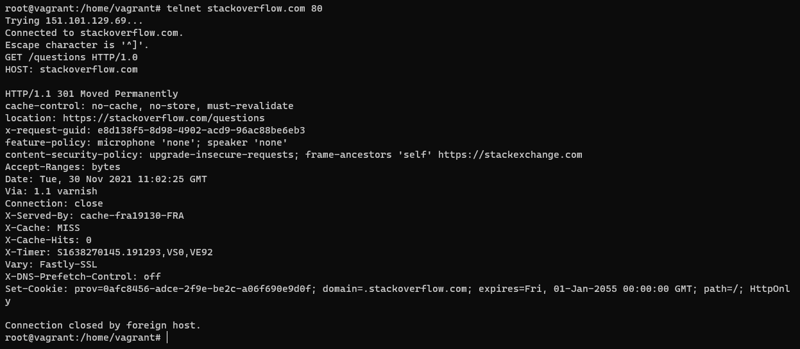

Ответ получен следующий:

Код HTTP/1.1 301 Moved Permanently – это стандартный код ответа HTTP, получаемый в ответ от сервера в ситуации, когда запрошенный ресурс был на постоянной основе перемещён в новое месторасположение, и указывающий на то, что текущие ссылки, использующие данный URL, должны быть обновлены.

##### Вопрос 2: Повторите задание 1 в браузере, используя консоль разработчика F12.

- ​	откройте вкладку Network

- ​	отправьте запрос [http://stackoverflow.com](http://stackoverflow.com/)

- ​	найдите первый ответ HTTP сервера, откройте вкладку Headers

- ​	укажите в ответе полученный HTTP код.

- ​	проверьте время загрузки страницы, какой запрос обрабатывался дольше всего?

- ​	приложите скриншот консоли браузера в ответ.

  

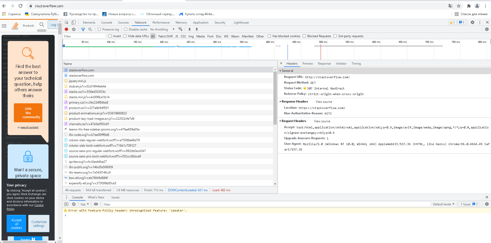

Первый ответ от HTTP сервера получен: 307 Internal Redirect

Код 307 Internal Redirect это вариант кода состояния 307 Temporary Redirect .

Код 307 Temporary Redirect — запрашиваемый ресурс на короткое время доступен по другому URI, указанный в поле Location заголовка.

Перенаправляет на сайт [**https**://stackoverflow.com/](https://stackoverflow.com/)

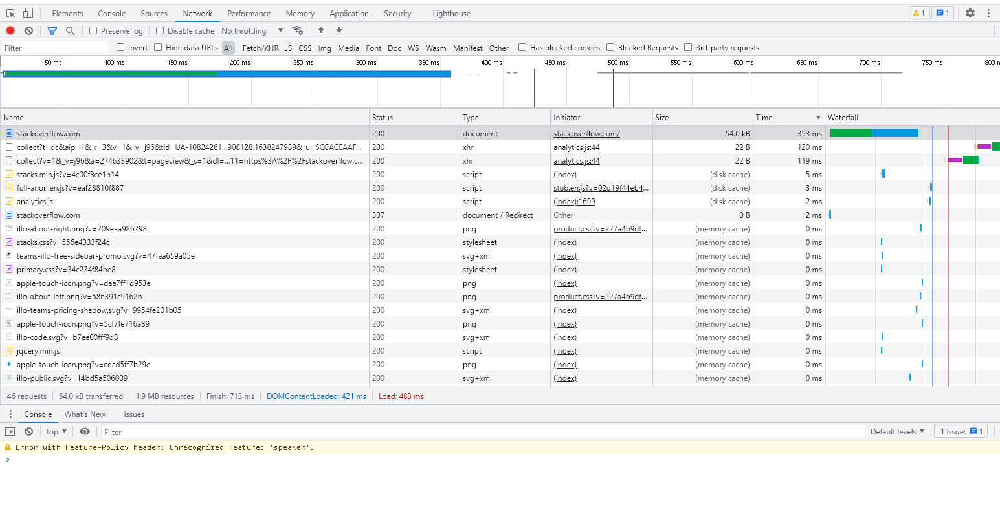

Загрузка страницы: 483 ms

Запрос 353ms больше всего загружался, это основная страница сайта (Type: document).

##### Вопрос 3: Какой IP адрес у вас в интернете?

1 вариант: Можно использовать сайт https://whoer.net/

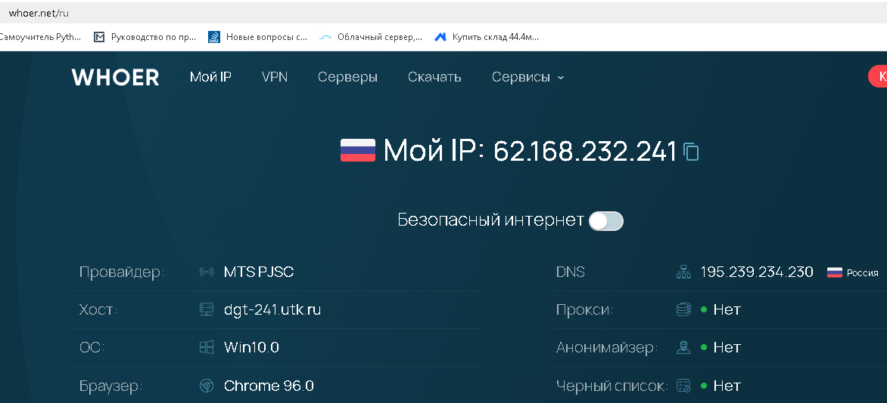

2 вариант: Через консоль Linux

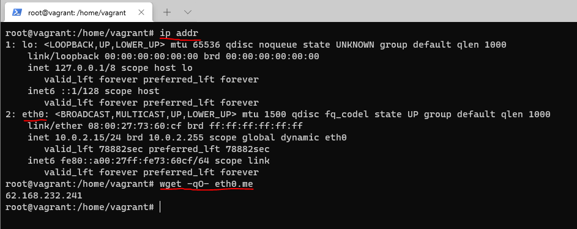

##### Вопрос 4: Какому провайдеру принадлежит ваш IP адрес? Какой автономной системе AS? Воспользуйтесь утилитой whois

Выполняем команду # whois 62.168.232.241

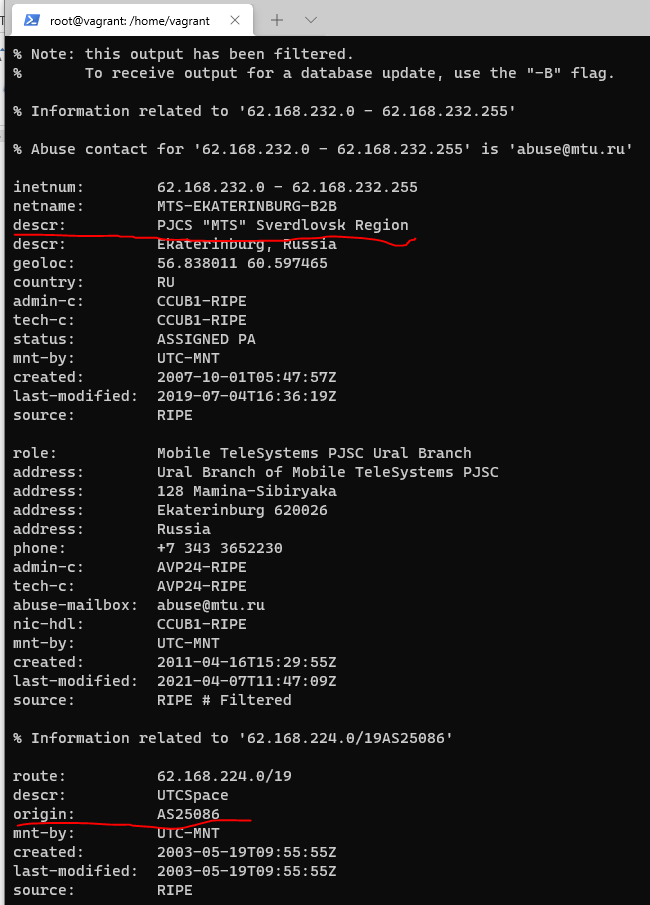

##### Вопрос 5: Через какие сети проходит пакет, отправленный с вашего компьютера на адрес 8.8.8.8? Через какие AS? Воспользуйтесь утилитой traceroute

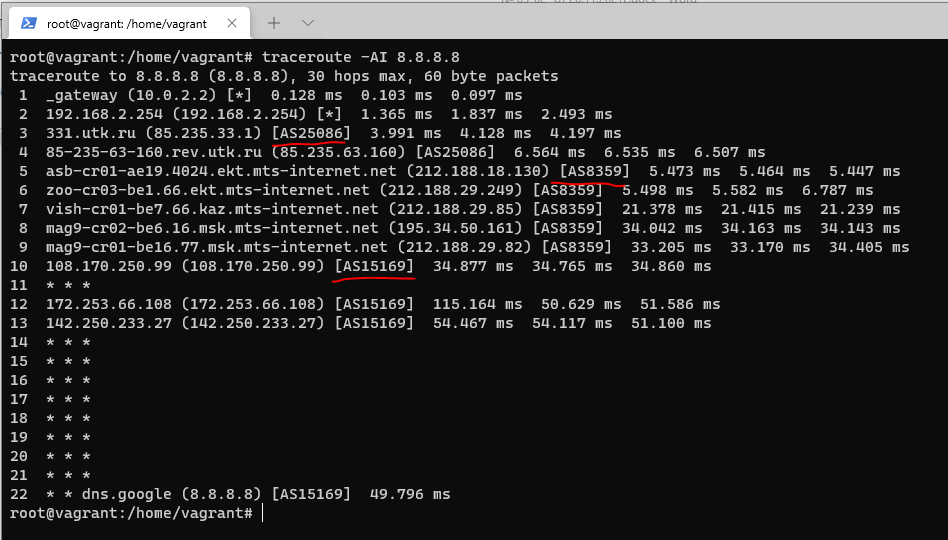

##### Вопрос 6: Повторите задание 5 в утилите mtr. На каком участке наибольшая задержка - delay?

Выполняем команду mtr -zn 8.8.8.8

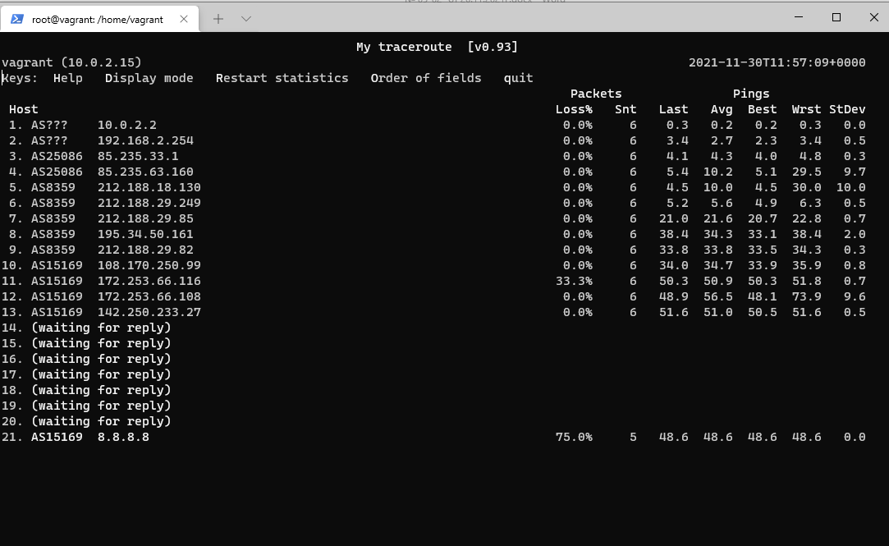

На 13 хосте больше задержки (delay) .

На 11 хосте больше потерь (loss).

##### Вопрос 7: Какие DNS сервера отвечают за доменное имя dns.google? Какие A записи? воспользуйтесь утилитой dig

Сервера отвечают за доменное имя dns.google:

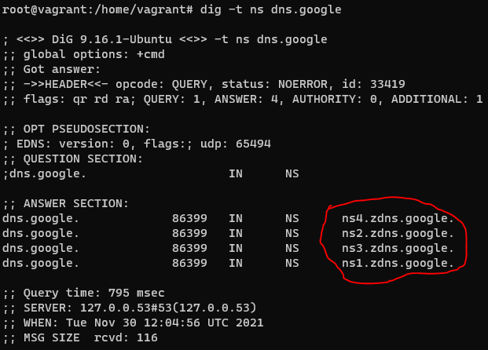

IP-cерверов отвечающие за A записи доменного имени dns.google:

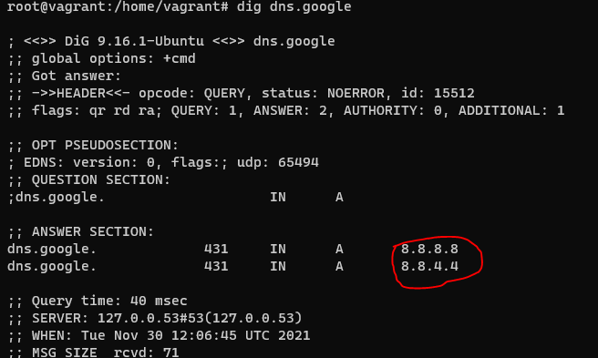

##### Вопрос 8: Проверьте PTR записи для IP адресов из задания 7. Какое доменное имя привязано к IP? воспользуйтесь утилитой dig

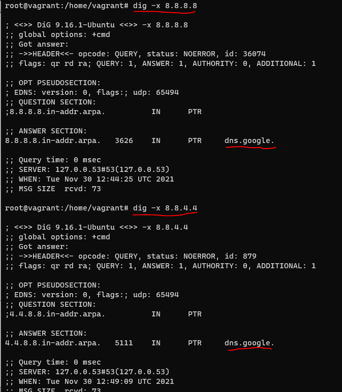
