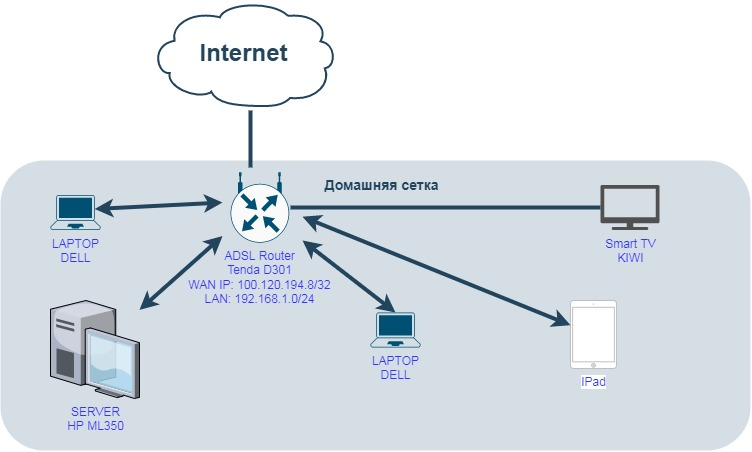

### Решение домашнего задания №13 (3.8. Компьютерные сети, лекция 3)

##### Вопрос 1: Подключитесь к публичному маршрутизатору в интернет. Найдите маршрут к вашему публичному IP

... 

##### Вопрос 2: Создайте dummy0 интерфейс в Ubuntu. Добавьте несколько статических маршрутов. Проверьте таблицу маршрутизации.

Создаем dummy0:

nano /etc/netplan/02-dummy.yaml

Добавляем:

systemctl enable systemd-networkd

systemctl restart systemd-networkd

##### Вопрос 3: Проверьте открытые TCP порты в Ubuntu, какие протоколы и приложения используют эти порты? Приведите несколько примеров.

Port 53 – это DNS

Port 22 – это SSH

Port 111 – это NFS client

##### Вопрос 4: Проверьте используемые UDP сокеты в Ubuntu, какие протоколы и приложения используют эти порты?

Port 53 – это DNS

Port 68 – это NTP

Port 111 – это NFS client

##### Вопрос 5: Используя diagrams.net, создайте L3 диаграмму вашей домашней сети или любой другой сети, с которой вы работали.

