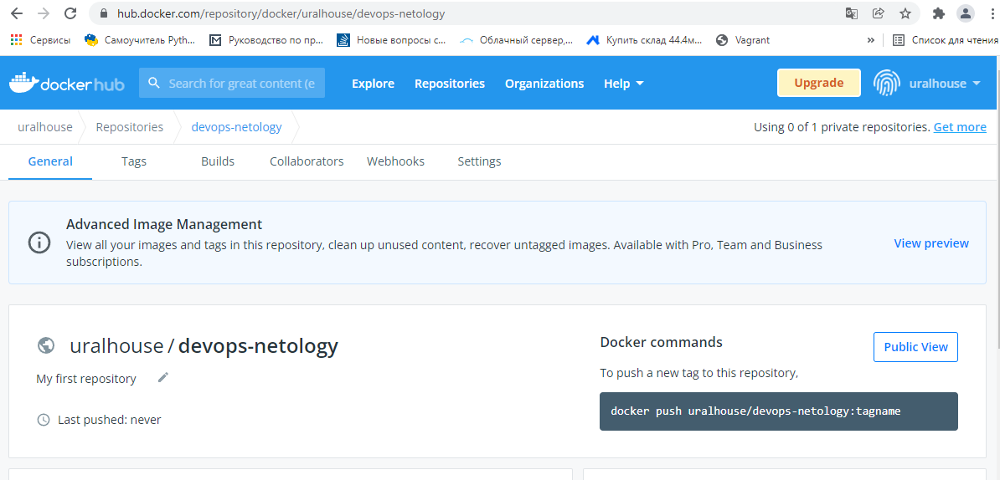
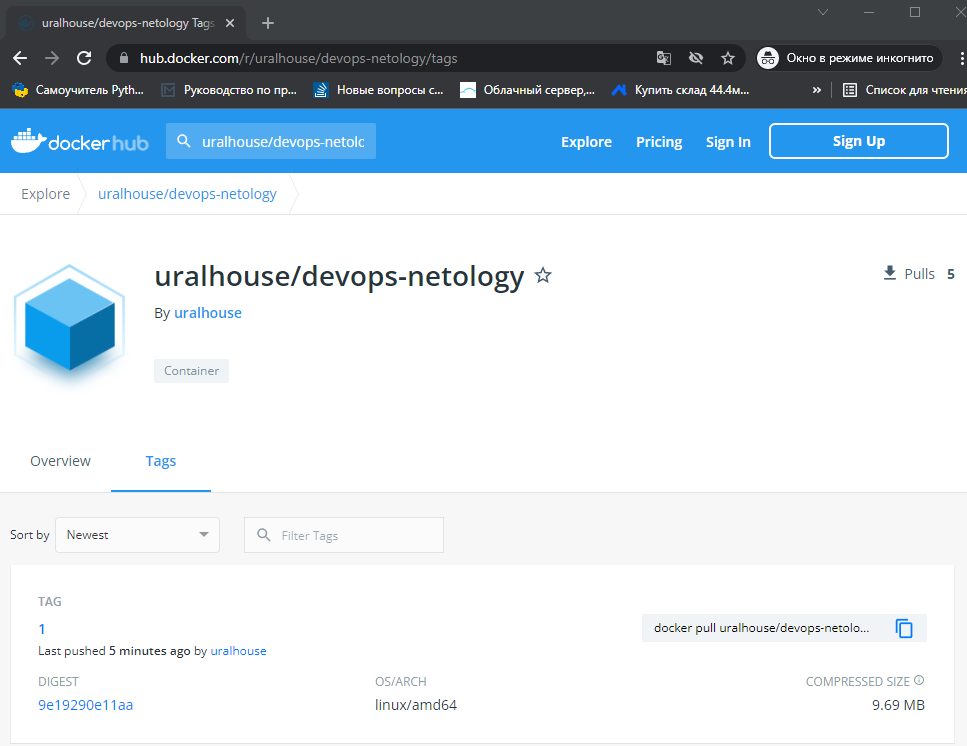

# Домашнее задание к занятию "5.3. Введение. Экосистема. Архитектура. Жизненный цикл Docker контейнера"

## Задача 1

Сценарий выполнения задачи:

- создайте свой репозиторий на https://hub.docker.com;
- выберете любой образ, который содержит веб-сервер Nginx;
- создайте свой fork образа;
- реализуйте функциональность:
запуск веб-сервера в фоне с индекс-страницей, содержащей HTML-код ниже:
```
<html>
<head>
Hey, Netology
</head>
<body>
<h1>I’m DevOps Engineer!</h1>
</body>
</html>
```
Опубликуйте созданный форк в своем репозитории и предоставьте ответ в виде ссылки на https://hub.docker.com/username_repo.


Регистрируемся на сайте https://hub.docker.com и создаем репозиторий:



Создаем файл Dockerfile (nano Docketfile) со следующим содержимым:

```
FROM nginx:1.21.6-alpine
COPY html/ /usr/share/nginx/html
EXPOSE 80
```


Создаем папку html в нем файл index.html со следующим содержимым:

```
<html>
<head>Hey, Netology</head>
<body>
<h1>I’m DevOps Engineer!</h1>
</body>
</html>
```

Собираем Docker образ, в котором будет выполняться Nginx:

```
uralhouse@HP:~/netology.devops/docker/05-virt-03-docker$ docker build -t nginx_server_iso .
Sending build context to Docker daemon  3.584kB
Step 1/3 : FROM nginx:1.21.6-alpine
1.21.6-alpine: Pulling from library/nginx
59bf1c3509f3: Pull complete
8d6ba530f648: Pull complete
5288d7ad7a7f: Pull complete
39e51c61c033: Pull complete
ee6f71c6f4a8: Pull complete
f2303c6c8865: Pull complete
Digest: sha256:da9c94bec1da829ebd52431a84502ec471c8e548ffb2cedbf36260fd9bd1d4d3
Status: Downloaded newer image for nginx:1.21.6-alpine
 ---> bef258acf10d
Step 2/3 : COPY html/ /usr/share/nginx/html
 ---> 770ec0820bfc
Step 3/3 : EXPOSE 80
 ---> Running in dcaee06302a9
Removing intermediate container dcaee06302a9
 ---> 5b8ece1f03c9
Successfully built 5b8ece1f03c9
Successfully tagged nginx_server_iso:latest
```

Запускаем контейнер с Nginx и пробрасываем порт 80 в Docker на хостовую машину 8080.

```
uralhouse@HP:~/netology.devops/docker/05-virt-03-docker$ docker run --name WEB_NGINX -d -p 8080:80 nginx_server_iso
1bbb98dc295074b4a7f650146328a2ab42fb64b4107bad314ffed9f10fc185bb
```

Проверяем запущенный контейнер:

```
uralhouse@HP:~/netology.devops/docker/05-virt-03-docker$ docker ps
CONTAINER ID   IMAGE              COMMAND                  CREATED          STATUS          PORTS                                   NAMES
1bbb98dc2950   nginx_server_iso   "/docker-entrypoint.…"   22 seconds ago   Up 20 seconds   0.0.0.0:8080->80/tcp, :::8080->80/tcp   WEB_NGINX
```

Проверяем работоспособность сервера Nging с хостовой машины:

```
uralhouse@HP:~/netology.devops/docker/05-virt-03-docker$ curl localhost:8080
<html>
<head>
Hey, Netology
</head>
<body>
<h1>I’m DevOps Engineer!</h1>
</body>
</html>
```

<u>Публикуем в моем репозитории https://hub.docker.com</u>

Выполняем вход на Docker

```
uralhouse@HP:~/netology.devops/docker/05-virt-03-docker$ docker login
Login with your Docker ID to push and pull images from Docker Hub. If you don't have a Docker ID, head over to https://hub.docker.com to create one.
Username: uralhouse
Password:
WARNING! Your password will be stored unencrypted in /home/uralhouse/.docker/config.json.
Configure a credential helper to remove this warning. See
https://docs.docker.com/engine/reference/commandline/login/#credentials-store

Login Succeeded
```

Делаем tag для нашего образа:

```
docker tag nginx_server_iso uralhouse/devops-netology:1
```

Пушим в hub.docker.com:

```
uralhouse@HP:~/netology.devops/docker/05-virt-03-docker$ docker push uralhouse/devops-netology:1                            The push refers to repository [docker.io/uralhouse/devops-netology]
c4767aa67ec8: Pushed
6fda88393b8b: Mounted from uralhouse/nginx
a770f8eba3cb: Mounted from uralhouse/nginx
318191938fd7: Mounted from uralhouse/nginx
89f4d03665ce: Mounted from uralhouse/nginx
67bae81de3dc: Mounted from uralhouse/nginx
8d3ac3489996: Mounted from uralhouse/nginx
1: digest: sha256:9e19290e11aacb04715b7cc12c2b3d8119b3af7aac8d5ed1e9c3ef5aeb60cfe2 size: 1775
uralhouse@HP:~/netology.devops/docker/05-virt-03-docker$
```

Результат:



Ссылка: 

https://hub.docker.com/r/uralhouse/devops-netology/tags

## Задача 2

Посмотрите на сценарий ниже и ответьте на вопрос:
"Подходит ли в этом сценарии использование Docker контейнеров или лучше подойдет виртуальная машина, физическая машина? Может быть возможны разные варианты?"

Детально опишите и обоснуйте свой выбор.

--

Сценарий:

- Высоконагруженное монолитное java веб-приложение;

  Необходима виртуальная машина. Так как необходимы производительные мощности напрямую, с учетом монолитности все работает в одной системе

- Nodejs веб-приложение;

  Идеально подойдет Docker. Простота развертывания данного приложения, требования и затрат к системе минимальны.

- Мобильное приложение c версиями для Android и iOS;

  Подойдет только виртуальная машина с графическим интерфейсом. Не требует мощностей от системы, но необходимо удобство отладки.

- Шина данных на базе Apache Kafka;

  С такими системами не встречался. Но в просторах интернета пишут что реализуется на Docker, что дает преимущество в простоте разработки и работоспособности.

- Elasticsearch кластер для реализации логирования продуктивного веб-приложения - три ноды elasticsearch, два logstash и две ноды kibana;

  С такими системами не встречался. Но на сайте https://hub.docker.com/_/elasticsearch/ есть официальные образы для развертывания.

- Мониторинг-стек на базе Prometheus и Grafana;

  С такими системами не встречался. Но в просторах интернета пишут что реализуется на Docker,  прекрасно масштабируется и работает.

- MongoDB, как основное хранилище данных для java-приложения;

  Можно выбрать 2 варианта: 1. Виртуалка, если не требует требования по нагрузке и БД не хранятся в системе контейнеризации. 2. Физическая машина, прекрасно справится, но повышает затраты.

- Gitlab сервер для реализации CI/CD процессов и приватный (закрытый) Docker Registry.

  С такими системами не встречался. Но в просторах интернета пишут что реализуется на Docker при помощи docker-compose. На следующем занятии узнаем про docker-compose подробнее .

## Задача 3

- Запустите первый контейнер из образа ***centos*** c любым тэгом в фоновом режиме, подключив папку ```/data``` из текущей рабочей директории на хостовой машине в ```/data``` контейнера;
- Запустите второй контейнер из образа ***debian*** в фоновом режиме, подключив папку ```/data``` из текущей рабочей директории на хостовой машине в ```/data``` контейнера;
- Подключитесь к первому контейнеру с помощью ```docker exec``` и создайте текстовый файл любого содержания в ```/data```;
- Добавьте еще один файл в папку ```/data``` на хостовой машине;
- Подключитесь во второй контейнер и отобразите листинг и содержание файлов в ```/data``` контейнера.

Запускаем Centos 8 в фоновом режиме:

```
uralhouse@HP:~/netology.devops/docker/05-virt-03-docker-1$ docker run -t -d -v /home/uralhouse/netology.devops/docker/05-virt-03-docker-1/data:/data centos:8
1a4a12bbf4f134f72a697e67283741f6ed63936ea4f48f37ba35ac52b6461ced
```

Запускаем Debian 11.2 в фоновом режиме:

```
uralhouse@HP:~/netology.devops/docker/05-virt-03-docker-1$ docker run -t -d -v /home/uralhouse/netology.devops/docker/05-virt-03-docker-1/data:/data debian:11.2
ee4d5a305f7a6794d17c83428f76e8a7eb123fd1699eda23a57fb3a9eae977ce
```

Смотрим их состояние и идентификаторы:

```
uralhouse@HP:~/netology.devops/docker/05-virt-03-docker-1$ docker ps
CONTAINER ID   IMAGE         COMMAND       CREATED          STATUS          PORTS     NAMES
ee4d5a305f7a   debian:11.2   "bash"        24 seconds ago   Up 21 seconds             jolly_maxwell
1a4a12bbf4f1   centos:8      "/bin/bash"   43 seconds ago   Up 40 seconds             modest_leakey
```

Подключаемся к первому контейнеру и создаем текстовый файл в ```/data```

```
uralhouse@HP:~/netology.devops/docker/05-virt-03-docker-1$ docker exec modest_leakey /bin/bash -c "echo Test from Centos > /data/test_centos.txt"
```

Добавляем файл из хостовой машины:

```
uralhouse@HP:~/netology.devops/docker/05-virt-03-docker-1$ echo 'Test from Host' >  /home/uralhouse/netology.devops/docker/05-virt-03-docker-1/data/test_host.txt
```

Подключаемся к второму контейнеру и отображаем листинг и содержание файлов в ```/data``` контейнера:

```
uralhouse@HP:~/netology.devops/docker/05-virt-03-docker-1/data$ docker exec jolly_maxwell /bin/bash -c "ls -l /data"
total 8
-rw-r--r-- 1 root root 17 Jan 27 10:43 test_centos.txt
-rw-rw-r-- 1 1000 1000 15 Jan 27 10:43 test_host.txt
uralhouse@HP:~/netology.devops/docker/05-virt-03-docker-1/data$ docker exec jolly_maxwell /bin/bash -c "cat /data/test_centos.txt"
Test from Centos
uralhouse@HP:~/netology.devops/docker/05-virt-03-docker-1/data$ docker exec jolly_maxwell /bin/bash -c "cat /data/test_host.txt"
Test from Host
```


## Задача 4 (*)

Воспроизвести практическую часть лекции самостоятельно.

Соберите Docker образ с Ansible, загрузите на Docker Hub и пришлите ссылку вместе с остальными ответами к задачам.


---


