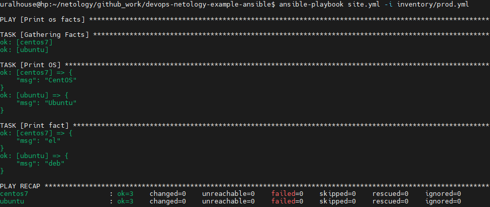

# Домашнее задание к занятию "08.01 Введение в Ansible"

## Подготовка к выполнению
1. Установите ansible версии 2.10 или выше.

   ```
   uralhouse@hp:~/netology/devops-netology/DZ_35_8.1$ ansible --version
   ansible 2.10.8
     config file = None
     configured module search path = ['/home/uralhouse/.ansible/plugins/modules', '/usr/share/ansible/plugins/modules']
     ansible python module location = /usr/lib/python3/dist-packages/ansible
     executable location = /usr/bin/ansible
     python version = 3.10.4 (main, Apr  2 2022, 09:04:19) [GCC 11.2.0]

2. Создайте свой собственный публичный репозиторий на github с произвольным именем.

3. Скачайте [playbook](./playbook/) из репозитория с домашним заданием и перенесите его в свой репозиторий.

   Ссылка на собственный [репозиторий в GitHub](https://github.com/uralhouse/devops-netology-example-ansible.git).

## Основная часть
1. Попробуйте запустить playbook на окружении из `test.yml`, зафиксируйте какое значение имеет факт `some_fact` для указанного хоста при выполнении playbook'a.

   

2. Найдите файл с переменными (group_vars) в котором задаётся найденное в первом пункте значение и поменяйте его на 'all default fact'.

   

3. Воспользуйтесь подготовленным (используется `docker`) или создайте собственное окружение для проведения дальнейших испытаний.

   ```
   $ docker run -it -d --name ubuntu ubuntu:latest /bin/bash
   821bfba377453e37344d354794ff5ad16beb2052954fc363cf16615a5fe594f5
   $ docker run -it -d --name centos7 centos:7 /bin/bash
   3d57a4e6ef6ad67d0232e4d1e6400324a7393d8928e000f20996421fa1aed186
   
   $ docker ps
   CONTAINER ID   IMAGE           COMMAND       CREATED         STATUS         PORTS     NAMES
   3d57a4e6ef6a   centos:7        "/bin/bash"   3 minutes ago   Up 3 minutes             centos7
   821bfba37745   ubuntu:latest   "/bin/bash"   4 minutes ago   Up 4 minutes             ubuntu
   
   
   $ docker exec -ti ubuntu bash
   root@821bfba37745:/# apt -y update && apt -y install python3
   ```

   

4. Проведите запуск playbook на окружении из `prod.yml`. Зафиксируйте полученные значения `some_fact` для каждого из `managed host`.

   ```
   $ ansible-playbook site.yml -i inventory/prod.yml
   ```

   

   

5. Добавьте факты в `group_vars` каждой из групп хостов так, чтобы для `some_fact` получились следующие значения: для `deb` - 'deb default fact', для `el` - 'el default fact'.

```
$ cat group_vars/deb/examp.yml
---
  some_fact: "deb default fact"
$ cat group_vars/el/examp.yml
---
  some_fact: "el default fact"
```

6. Повторите запуск playbook на окружении `prod.yml`. Убедитесь, что выдаются корректные значения для всех хостов.

   

   ```
   $ ansible-playbook site.yml -i inventory/prod.yml
   ```

   

7. При помощи `ansible-vault` зашифруйте факты в `group_vars/deb` и `group_vars/el` с паролем `netology`.

   ```
   $ ansible-vault encrypt group_vars/deb/examp.yml
   New Vault password:
   Confirm New Vault password:
   Encryption successful
   $ ansible-vault encrypt group_vars/el/examp.yml
   New Vault password:
   Confirm New Vault password:
   Encryption successful

8. Запустите playbook на окружении `prod.yml`. При запуске `ansible` должен запросить у вас пароль. Убедитесь в работоспособности.

   ```
   $ ansible-playbook site.yml -i inventory/prod.yml
   
   PLAY [Print os facts] **********************************************************************************************************************************************
   ERROR! Attempting to decrypt but no vault secrets found
   $ ansible-playbook -i inventory/prod.yml site.yml --ask-vault-pass
   ```

   

9. Посмотрите при помощи `ansible-doc` список плагинов для подключения. Выберите подходящий для работы на `control node`.

   ```
   $ ansible-doc --type=connection -l
   ansible.netcommon.httpapi      Use httpapi to run command on network appliances
   ansible.netcommon.libssh       (Tech preview) Run tasks using libssh for ssh connection
   ansible.netcommon.napalm       Provides persistent connection using NAPALM
   ansible.netcommon.netconf      Provides a persistent connection using the netconf protocol
   ansible.netcommon.network_cli  Use network_cli to run command on network appliances
   ansible.netcommon.persistent   Use a persistent unix socket for connection
   community.aws.aws_ssm          execute via AWS Systems Manager
   community.docker.docker        Run tasks in docker containers
   community.docker.docker_api    Run tasks in docker containers
   community.general.chroot       Interact with local chroot
   community.general.docker       Run tasks in docker containers
   community.general.funcd        Use funcd to connect to target
   community.general.iocage       Run tasks in iocage jails
   community.general.jail         Run tasks in jails
   community.general.lxc          Run tasks in lxc containers via lxc python library
   community.general.lxd          Run tasks in lxc containers via lxc CLI
   community.general.oc           Execute tasks in pods running on OpenShift
   community.general.qubes        Interact with an existing QubesOS AppVM
   community.general.saltstack    Allow ansible to piggyback on salt minions
   community.general.zone         Run tasks in a zone instance
   community.kubernetes.kubectl   Execute tasks in pods running on Kubernetes
   community.libvirt.libvirt_lxc  Run tasks in lxc containers via libvirt
   community.libvirt.libvirt_qemu Run tasks on libvirt/qemu virtual machines
   community.okd.oc               Execute tasks in pods running on OpenShift
   community.vmware.vmware_tools  Execute tasks inside a VM via VMware Tools
   containers.podman.buildah      Interact with an existing buildah container
   containers.podman.podman       Interact with an existing podman container
   local                          execute on controller
   paramiko_ssh                   Run tasks via python ssh (paramiko)
   psrp                           Run tasks over Microsoft PowerShell Remoting Protocol
   ssh                            connect via ssh client binary
   winrm                          Run tasks over Microsoft's WinRM
   uralhouse@hp:~/netology/github_work/devops-netology-example-ansible$ ansible-doc -t connection -l
   ansible.netcommon.httpapi      Use httpapi to run command on network appliances
   ansible.netcommon.libssh       (Tech preview) Run tasks using libssh for ssh connection
   ansible.netcommon.napalm       Provides persistent connection using NAPALM
   ansible.netcommon.netconf      Provides a persistent connection using the netconf protocol
   ansible.netcommon.network_cli  Use network_cli to run command on network appliances
   ansible.netcommon.persistent   Use a persistent unix socket for connection
   community.aws.aws_ssm          execute via AWS Systems Manager
   community.docker.docker        Run tasks in docker containers
   community.docker.docker_api    Run tasks in docker containers
   community.general.chroot       Interact with local chroot
   community.general.docker       Run tasks in docker containers
   community.general.funcd        Use funcd to connect to target
   community.general.iocage       Run tasks in iocage jails
   community.general.jail         Run tasks in jails
   community.general.lxc          Run tasks in lxc containers via lxc python library
   community.general.lxd          Run tasks in lxc containers via lxc CLI
   community.general.oc           Execute tasks in pods running on OpenShift
   community.general.qubes        Interact with an existing QubesOS AppVM
   community.general.saltstack    Allow ansible to piggyback on salt minions
   community.general.zone         Run tasks in a zone instance
   community.kubernetes.kubectl   Execute tasks in pods running on Kubernetes
   community.libvirt.libvirt_lxc  Run tasks in lxc containers via libvirt
   community.libvirt.libvirt_qemu Run tasks on libvirt/qemu virtual machines
   community.okd.oc               Execute tasks in pods running on OpenShift
   community.vmware.vmware_tools  Execute tasks inside a VM via VMware Tools
   containers.podman.buildah      Interact with an existing buildah container
   containers.podman.podman       Interact with an existing podman container
   local                          execute on controller
   paramiko_ssh                   Run tasks via python ssh (paramiko)
   psrp                           Run tasks over Microsoft PowerShell Remoting Protocol
   ssh                            connect via ssh client binary
   winrm                          Run tasks over Microsoft's WinRM
   
   $ ansible-doc -t connection local
   > ANSIBLE.BUILTIN.LOCAL    (/usr/lib/python3/dist-packages/ansible/plugins/connection/local.py)
   This connection plugin allows ansible to execute tasks on the Ansible 'controller' instead of on a remote host.
   NOTES:
         * The remote user is ignored, the user with which the ansible CLI was executed is used instead.
   AUTHOR: ansible (@core)
   VERSION_ADDED_COLLECTION: ansible.builtin

10. В `prod.yml` добавьте новую группу хостов с именем  `local`, в ней разместите localhost с необходимым типом подключения.

    Добавляем в файл inventory/prod.yml следующий код:

    ```
    ---
      el:
        hosts:
          centos7:
            ansible_connection: docker
      deb:
        hosts:
          ubuntu:
            ansible_connection: docker
      local:
        hosts:
          localhost:
            ansible_connection: local

11. Запустите playbook на окружении `prod.yml`. При запуске `ansible` должен запросить у вас пароль. Убедитесь что факты `some_fact` для каждого из хостов определены из верных `group_vars`.

    Запускаем команду:

    ```
    $ ansible-playbook -i inventory/prod.yml site.yml --ask-vault-pass
    ```

    

12. Заполните `README.md` ответами на вопросы. Сделайте `git push` в ветку `master`. В ответе отправьте ссылку на ваш открытый репозиторий с изменённым `playbook` и заполненным `README.md`.

    Ссылка на [README.md](https://github.com/uralhouse/devops-netology-example-ansible.git).
