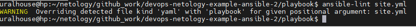

# Решение домашнего задания к занятию "08.02 Работа с Playbook"

## Подготовка к выполнению

1. Создайте свой собственный (или используйте старый) публичный репозиторий на github с произвольным именем.

   Ссылка на созданный [репозиторий GitHub.](https://github.com/uralhouse/devops-netology-example-ansible-2)

2. Скачайте [playbook](./playbook/) из репозитория с домашним заданием и перенесите его в свой репозиторий.

3. Подготовьте хосты в соответствии с группами из предподготовленного playbook.

   Подготовлена VM на базе Centos 7. IP: 10.0.2.6

## Основная часть

1. Приготовьте свой собственный inventory файл `prod.yml`.

2. Допишите playbook: нужно сделать ещё один play, который устанавливает и настраивает [vector](https://vector.dev).

3. При создании tasks рекомендую использовать модули: `get_url`, `template`, `unarchive`, `file`.

4. Tasks должны: скачать нужной версии дистрибутив, выполнить распаковку в выбранную директорию, установить vector.

   Файл site.yml:

   ```
   ---
   - name: Install Clickhouse
     hosts: clickhouse
     handlers:
       - name: Start clickhouse service
         become: true
         ansible.builtin.service:
           name: clickhouse-server
           state: restarted
     tasks:
       - block:
           - name: Get clickhouse distrib
             ansible.builtin.get_url:
               url: "https://packages.clickhouse.com/rpm/stable/{{ item }}-{{ clickhouse_version }}.noarch.rpm"
               dest: "./{{ item }}-{{ clickhouse_version }}.rpm"
             with_items: "{{ clickhouse_packages }}"
         rescue:
           - name: Get clickhouse distrib
             ansible.builtin.get_url:
               url: "https://packages.clickhouse.com/rpm/stable/clickhouse-common-static-{{ clickhouse_version }}.x86_64.rpm"
               dest: "./clickhouse-common-static-{{ clickhouse_version }}.rpm"
       - name: Install clickhouse packages
         become: true
         ansible.builtin.yum:
           name:
             - clickhouse-common-static-{{ clickhouse_version }}.rpm
             - clickhouse-client-{{ clickhouse_version }}.rpm
             - clickhouse-server-{{ clickhouse_version }}.rpm
         notify: Start clickhouse service
   
       - name: Force restart clickhouse service
         ansible.builtin.meta: flush_handlers
   
       - name: Create database
         ansible.builtin.command: "clickhouse-client -q 'create database logs;'"
         register: create_db
         failed_when: create_db.rc != 0 and create_db.rc !=82
         changed_when: create_db.rc == 0
   
   - name: Install Vector
     hosts: clickhouse
     handlers:
       - name: Start vector service
         become: true
         ansible.builtin.service:
           name: vector
           state: restarted
     tasks:
       - name: Get vector distrib
         ansible.builtin.get_url:
           url: "https://packages.timber.io/vector/0.22.0/vector-0.22.0-1.x86_64.rpm"
           dest: ./vector.rpm
       - name: Install vector packages
         become: true
         ansible.builtin.yum:
           name:
             - vector.rpm
         notify: Start vector service
   

5. Запустите `ansible-lint site.yml` и исправьте ошибки, если они есть.

   

6. Попробуйте запустить playbook на этом окружении с флагом `--check`.

   ```python
   $ ansible-playbook --check -i inventory/prod.yml site.yml
   
   PLAY [Install Clickhouse] ****************************************************************************************************************************************************
   
   TASK [Gathering Facts] *******************************************************************************************************************************************************
   ok: [clickhouse-01]
   
   TASK [Get clickhouse distrib] ************************************************************************************************************************************************
   ok: [clickhouse-01] => (item=clickhouse-client)
   ok: [clickhouse-01] => (item=clickhouse-server)
   failed: [clickhouse-01] (item=clickhouse-common-static) => {"ansible_loop_var": "item", "changed": false, "dest": "./clickhouse-common-static-22.3.3.44.rpm", "elapsed": 0, "gid": 0, "group": "root", "item": "clickhouse-common-static", "mode": "0644", "msg": "Request failed", "owner": "root", "response": "HTTP Error 404: Not Found", "secontext": "unconfined_u:object_r:admin_home_t:s0", "size": 246310036, "state": "file", "status_code": 404, "uid": 0, "url": "https://packages.clickhouse.com/rpm/stable/clickhouse-common-static-22.3.3.44.noarch.rpm"}
   
   TASK [Get clickhouse distrib] ************************************************************************************************************************************************
   ok: [clickhouse-01]
   
   TASK [Install clickhouse packages] *******************************************************************************************************************************************
   changed: [clickhouse-01]
   
   RUNNING HANDLER [Start clickhouse service] ***********************************************************************************************************************************
   fatal: [clickhouse-01]: FAILED! => {"changed": false, "msg": "Service is in unknown state", "status": {}}
   
   NO MORE HOSTS LEFT ***********************************************************************************************************************************************************
   
   PLAY RECAP *******************************************************************************************************************************************************************
   clickhouse-01              : ok=3    changed=1    unreachable=0    failed=1    skipped=0    rescued=1    ignored=0
   

7. Запустите playbook на `prod.yml` окружении с флагом `--diff`. Убедитесь, что изменения на системе произведены.

   ```python
   $ ansible-playbook -i inventory/prod.yml site.yml --diff
   
   PLAY [Install Clickhouse] ****************************************************************************************************************************************************
   
   TASK [Gathering Facts] *******************************************************************************************************************************************************
   ok: [clickhouse-01]
   
   TASK [Get clickhouse distrib] ************************************************************************************************************************************************
   ok: [clickhouse-01] => (item=clickhouse-client)
   ok: [clickhouse-01] => (item=clickhouse-server)
   failed: [clickhouse-01] (item=clickhouse-common-static) => {"ansible_loop_var": "item", "changed": false, "dest": "./clickhouse-common-static-22.3.3.44.rpm", "elapsed": 0, "gid": 0, "group": "root", "item": "clickhouse-common-static", "mode": "0644", "msg": "Request failed", "owner": "root", "response": "HTTP Error 404: Not Found", "secontext": "unconfined_u:object_r:admin_home_t:s0", "size": 246310036, "state": "file", "status_code": 404, "uid": 0, "url": "https://packages.clickhouse.com/rpm/stable/clickhouse-common-static-22.3.3.44.noarch.rpm"}
   
   TASK [Get clickhouse distrib] ************************************************************************************************************************************************
   ok: [clickhouse-01]
   
   TASK [Install clickhouse packages] *******************************************************************************************************************************************
   changed: [clickhouse-01]
   
   RUNNING HANDLER [Start clickhouse service] ***********************************************************************************************************************************
   changed: [clickhouse-01]
   
   TASK [Create database] *******************************************************************************************************************************************************
   fatal: [clickhouse-01]: FAILED! => {"changed": false, "cmd": ["clickhouse-client", "-q", "create database logs;"], "delta": "0:00:01.819636", "end": "2022-06-08 04:45:14.256934", "failed_when_result": true, "msg": "non-zero return code", "rc": 210, "start": "2022-06-08 04:45:12.437298", "stderr": "Code: 210. DB::NetException: Connection refused (localhost:9000). (NETWORK_ERROR)", "stderr_lines": ["Code: 210. DB::NetException: Connection refused (localhost:9000). (NETWORK_ERROR)"], "stdout": "", "stdout_lines": []}
   
   PLAY RECAP *******************************************************************************************************************************************************************
   clickhouse-01              : ok=4    changed=2    unreachable=0    failed=1    skipped=0    rescued=1    ignored=0
   

8. Повторно запустите playbook с флагом `--diff` и убедитесь, что playbook идемпотентен.

   ```
   ansible-playbook -i inventory/prod.yml site.yml --diff
   
   PLAY [Install Clickhouse] ****************************************************************************************************************************************************
   
   TASK [Gathering Facts] *******************************************************************************************************************************************************
   ok: [clickhouse-01]
   
   TASK [Get clickhouse distrib] ************************************************************************************************************************************************
   ok: [clickhouse-01] => (item=clickhouse-client)
   ok: [clickhouse-01] => (item=clickhouse-server)
   failed: [clickhouse-01] (item=clickhouse-common-static) => {"ansible_loop_var": "item", "changed": false, "dest": "./clickhouse-common-static-22.3.3.44.rpm", "elapsed": 0, "gid": 0, "group": "root", "item": "clickhouse-common-static", "mode": "0644", "msg": "Request failed", "owner": "root", "response": "HTTP Error 404: Not Found", "secontext": "unconfined_u:object_r:admin_home_t:s0", "size": 246310036, "state": "file", "status_code": 404, "uid": 0, "url": "https://packages.clickhouse.com/rpm/stable/clickhouse-common-static-22.3.3.44.noarch.rpm"}
   
   TASK [Get clickhouse distrib] ************************************************************************************************************************************************
   ok: [clickhouse-01]
   
   TASK [Install clickhouse packages] *******************************************************************************************************************************************
   ok: [clickhouse-01]
   
   TASK [Create database] *******************************************************************************************************************************************************
   ok: [clickhouse-01]
   
   PLAY [Install Vector] ********************************************************************************************************************************************************
   
   TASK [Gathering Facts] *******************************************************************************************************************************************************
   ok: [clickhouse-01]
   
   TASK [Get vector distrib] ****************************************************************************************************************************************************
   ok: [clickhouse-01]
   
   TASK [Install vector packages] ***********************************************************************************************************************************************
   changed: [clickhouse-01]
   
   RUNNING HANDLER [Start vector service] ***************************************************************************************************************************************
   changed: [clickhouse-01]
   
   PLAY RECAP *******************************************************************************************************************************************************************
   clickhouse-01              : ok=8    changed=2    unreachable=0    failed=0    skipped=0    rescued=1    ignored=0
   
   

9. Подготовьте README.md файл по своему playbook. В нём должно быть описано: что делает playbook, какие у него есть параметры и теги.

   Ссылка на [README.md](https://github.com/uralhouse/devops-netology-example-ansible-2/README.md) по моему playbook.

10. Готовый playbook выложите в свой репозиторий, поставьте тег `08-ansible-02-playbook` на фиксирующий коммит, в ответ предоставьте ссылку на него.

    Ссылка на [репозиторий GitHub](https://github.com/uralhouse/devops-netology-example-ansible-2). 
