# Решение домашнего задания к занятию "09.03 Jenkins"

## Подготовка к выполнению

1. Установить jenkins по любой из [инструкций](https://www.jenkins.io/download/)

   Устанавливаем с официального сайта:

   ```
   sudo wget -O /etc/yum.repos.d/jenkins.repo https://pkg.jenkins.io/redhat-stable/jenkins.repo
   sudo rpm --import https://pkg.jenkins.io/redhat-stable/jenkins.io.key
   yum install fontconfig java-11-openjdk
   yum install jenkins

2. Запустить и проверить работоспособность

   ```
   # jenkins --version
   2.332.3
   ```

   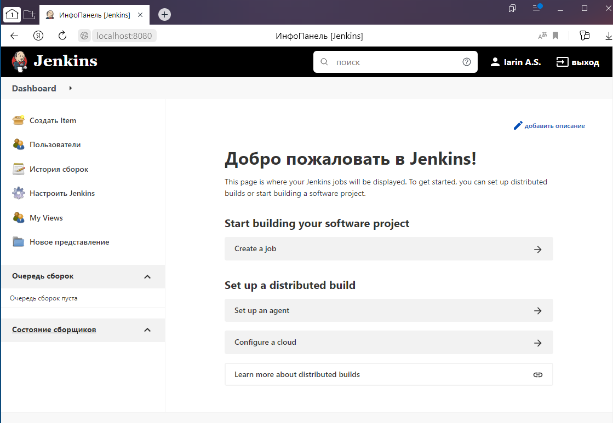

3. Сделать первоначальную настройку

4. Настроить под свои нужды

5. Поднять отдельный cloud

   Выполним команду:

   ```
   $ chmod 777 /var/run/docker.sock
   ```

   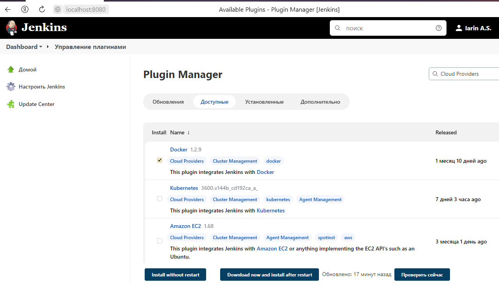

6. Для динамических агентов можно использовать [образ](https://hub.docker.com/repository/docker/aragast/agent)

   Выполним команду: 

   ```
   # docker pull aragast/agent:7
   7: Pulling from aragast/agent
   ab5ef0e58194: Pull complete
   1e72a26aff50: Pull complete
   f77543c42f4c: Pull complete
   7422d683f4c6: Pull complete
   e71ed7ae47d2: Pull complete
   Digest: sha256:ebf0a78bcb580c8497efdc256c8b9a9b8293e50adc1e05a7549e7d861c93edf8
   Status: Downloaded newer image for aragast/agent:7
   docker.io/aragast/agent:7

7. Обязательный параметр: поставить label для динамических агентов: `ansible_docker`

   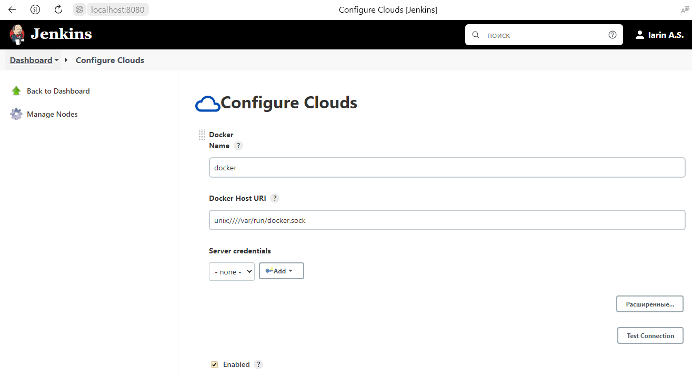

   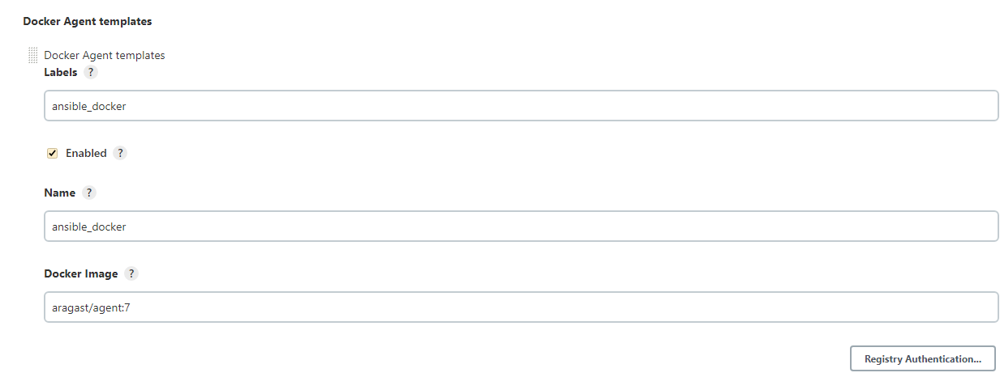

8.  Сделать форк репозитория с [playbook](https://github.com/aragastmatb/example-playbook)

Форк выполнен с небольшими правками.

Ссылка на [репозиторий GitHub](https://github.com/uralhouse/example-playbook)

## Основная часть

1. Сделать Freestyle Job, который будет запускать `ansible-playbook` из форка репозитория

   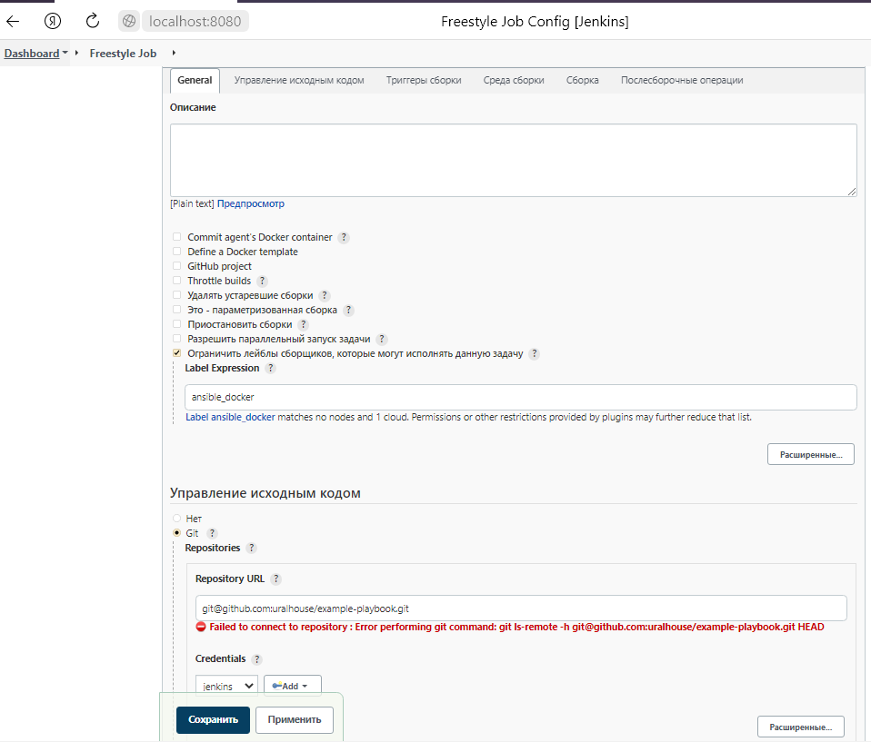

   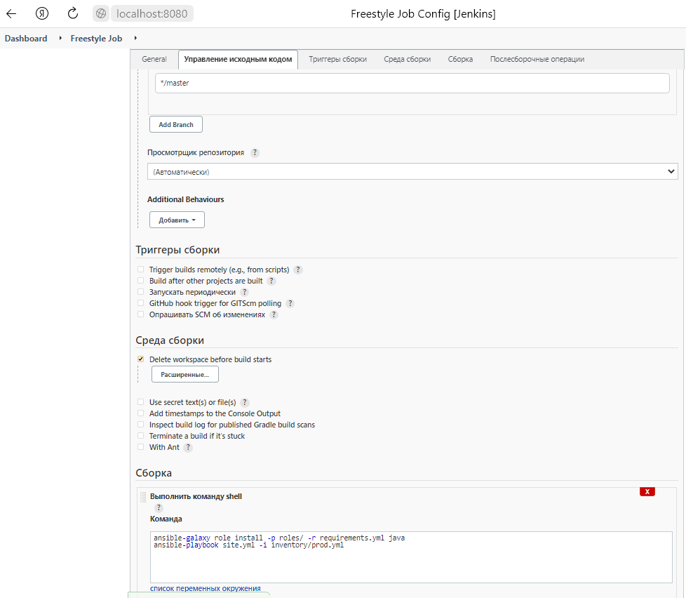

   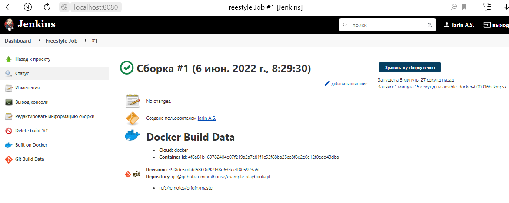

   Лог данной сборки:

   ```
   Started by user Iarin A.S.
   Running as SYSTEM
   Building remotely on ansible_docker-000016hckmpsx on docker (ansible_docker) in workspace /workspace/Freestyle Job
   [WS-CLEANUP] Deleting project workspace...
   [WS-CLEANUP] Deferred wipeout is used...
   The recommended git tool is: NONE
   using credential git
   Cloning the remote Git repository
   Cloning repository git@github.com:uralhouse/example-playbook.git
    > git init /workspace/Freestyle Job # timeout=10
   Fetching upstream changes from git@github.com:uralhouse/example-playbook.git
    > git --version # timeout=10
    > git --version # 'git version 1.8.3.1'
   using GIT_SSH to set credentials git
   [INFO] Currently running in a labeled security context
    > /usr/bin/chcon --type=ssh_home_t /workspace/Freestyle Job@tmp/jenkins-gitclient-ssh756563113324741200.key
    > git fetch --tags --progress git@github.com:uralhouse/example-playbook.git +refs/heads/*:refs/remotes/origin/* # timeout=10
    > git config remote.origin.url git@github.com:uralhouse/example-playbook.git # timeout=10
    > git config --add remote.origin.fetch +refs/heads/*:refs/remotes/origin/* # timeout=10
   Avoid second fetch
    > git rev-parse refs/remotes/origin/master^{commit} # timeout=10
   Checking out Revision c49f8dc6cdabf58b0d92938d634eeff805923a6f (refs/remotes/origin/master)
    > git config core.sparsecheckout # timeout=10
    > git checkout -f c49f8dc6cdabf58b0d92938d634eeff805923a6f # timeout=10
   Commit message: "Update requirements.yml"
   First time build. Skipping changelog.
   [Freestyle Job] $ /bin/sh -xe /tmp/jenkins544373570551996288.sh
   + ansible-galaxy role install -p roles/ -r requirements.yml java
   Starting galaxy role install process
   - extracting java to /workspace/Freestyle Job/roles/java
   - java (1.0.1) was installed successfully
   + ansible-playbook site.yml -i inventory/prod.yml
   
   PLAY [Install Java] ************************************************************
   
   TASK [Gathering Facts] *********************************************************
   ok: [localhost]
   
   TASK [java : Upload .tar.gz file containing binaries from local storage] *******
   skipping: [localhost]
   
   TASK [java : Upload .tar.gz file conaining binaries from remote storage] *******
   changed: [localhost]
   
   TASK [java : Ensure installation dir exists] ***********************************
   changed: [localhost]
   
   TASK [java : Extract java in the installation directory] ***********************
   changed: [localhost]
   
   TASK [java : Export environment variables] *************************************
   changed: [localhost]
   
   PLAY RECAP *********************************************************************
   localhost                  : ok=5    changed=4    unreachable=0    failed=0    skipped=1    rescued=0    ignored=0   
   
   Finished: SUCCESS
   
2. Сделать Declarative Pipeline, который будет выкачивать репозиторий с плейбукой и запускать её

   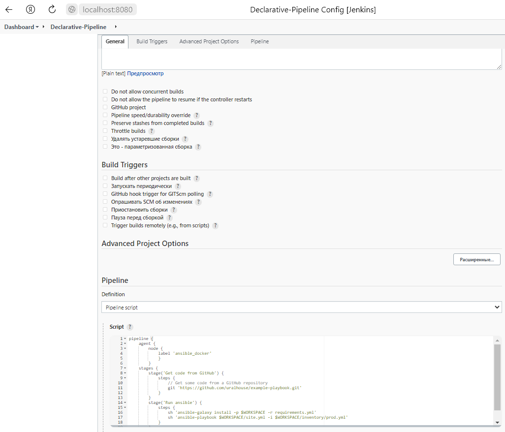

   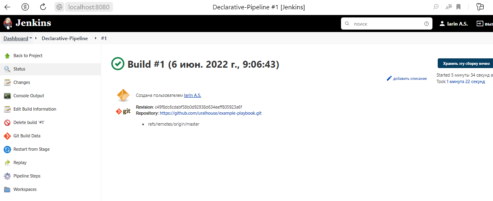

   Лог pipeline:

   ```
   Started by user Iarin A.S.
   [Pipeline] Start of Pipeline
   [Pipeline] node
   Running on ansible_docker-00001z7p3kknh on docker in /workspace/Declarative-Pipeline
   [Pipeline] {
   [Pipeline] stage
   [Pipeline] { (Get code from GitHub)
   [Pipeline] git
   The recommended git tool is: NONE
   No credentials specified
   Cloning the remote Git repository
   Cloning repository https://github.com/uralhouse/example-playbook.git
    > git init /workspace/Declarative-Pipeline # timeout=10
   Fetching upstream changes from https://github.com/uralhouse/example-playbook.git
    > git --version # timeout=10
    > git --version # 'git version 1.8.3.1'
    > git fetch --tags --progress https://github.com/uralhouse/example-playbook.git +refs/heads/*:refs/remotes/origin/* # timeout=10
   Avoid second fetch
   Checking out Revision c49f8dc6cdabf58b0d92938d634eeff805923a6f (refs/remotes/origin/master)
    > git config remote.origin.url https://github.com/uralhouse/example-playbook.git # timeout=10
    > git config --add remote.origin.fetch +refs/heads/*:refs/remotes/origin/* # timeout=10
    > git rev-parse refs/remotes/origin/master^{commit} # timeout=10
    > git config core.sparsecheckout # timeout=10
    > git checkout -f c49f8dc6cdabf58b0d92938d634eeff805923a6f # timeout=10
    > git branch -a -v --no-abbrev # timeout=10
    > git checkout -b master c49f8dc6cdabf58b0d92938d634eeff805923a6f # timeout=10
   Commit message: "Update requirements.yml"
   First time build. Skipping changelog.
   [Pipeline] }
   [Pipeline] // stage
   [Pipeline] stage
   [Pipeline] { (Run ansible)
   [Pipeline] sh
   + ansible-galaxy install -p /workspace/Declarative-Pipeline -r requirements.yml
   Starting galaxy role install process
   - extracting java to /workspace/Declarative-Pipeline/java
   - java (1.0.1) was installed successfully
   [Pipeline] sh
   + ansible-playbook /workspace/Declarative-Pipeline/site.yml -i /workspace/Declarative-Pipeline/inventory/prod.yml
   
   PLAY [Install Java] ************************************************************
   
   TASK [Gathering Facts] *********************************************************
   ok: [localhost]
   
   TASK [java : Upload .tar.gz file containing binaries from local storage] *******
   skipping: [localhost]
   
   TASK [java : Upload .tar.gz file conaining binaries from remote storage] *******
   changed: [localhost]
   
   TASK [java : Ensure installation dir exists] ***********************************
   changed: [localhost]
   
   TASK [java : Extract java in the installation directory] ***********************
   changed: [localhost]
   
   TASK [java : Export environment variables] *************************************
   changed: [localhost]
   
   PLAY RECAP *********************************************************************
   localhost                  : ok=5    changed=4    unreachable=0    failed=0    skipped=1    rescued=0    ignored=0   
   
   [Pipeline] }
   [Pipeline] // stage
   [Pipeline] }
   [Pipeline] // node
   [Pipeline] End of Pipeline
   Finished: SUCCESS

3. Перенести Declarative Pipeline в репозиторий в файл `Jenkinsfile`

   [Файл Jenkinsfile](https://raw.githubusercontent.com/uralhouse/example-playbook/master/Jenkinsfile) на репозитории GitHub

4. Перенастроить Job на использование `Jenkinsfile` из репозитория

   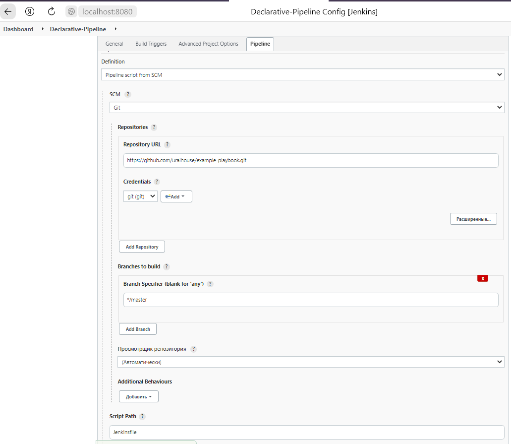

   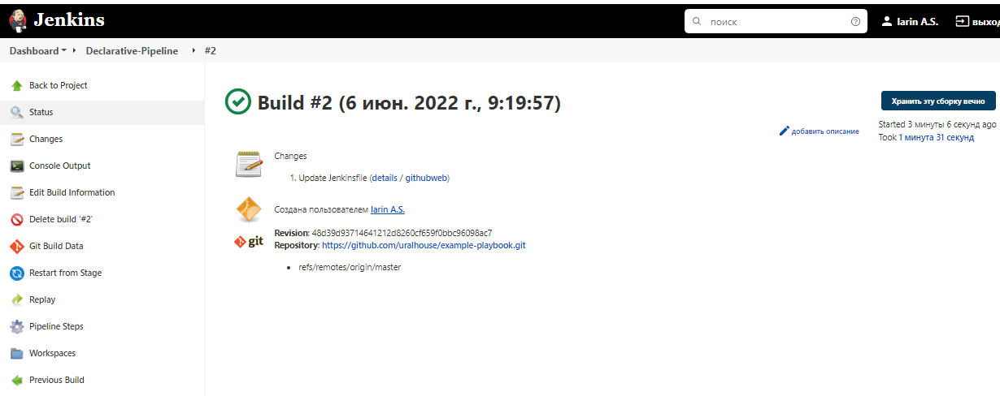

   Вывод на консоль:

   ```
   Started by user Iarin A.S.
   Obtained Jenkinsfile from git https://github.com/uralhouse/example-playbook.git
   [Pipeline] Start of Pipeline
   [Pipeline] node
   Running on ansible_docker-000029el9b9u5 on docker in /workspace/Declarative-Pipeline
   [Pipeline] {
   [Pipeline] stage
   [Pipeline] { (Declarative: Checkout SCM)
   [Pipeline] checkout
   Selected Git installation does not exist. Using Default
   The recommended git tool is: NONE
   using credential git
   Cloning the remote Git repository
   Cloning repository https://github.com/uralhouse/example-playbook.git
    > git init /workspace/Declarative-Pipeline # timeout=10
   Fetching upstream changes from https://github.com/uralhouse/example-playbook.git
    > git --version # timeout=10
    > git --version # 'git version 1.8.3.1'
   using GIT_SSH to set credentials git
   [INFO] Currently running in a labeled security context
    > /usr/bin/chcon --type=ssh_home_t /workspace/Declarative-Pipeline@tmp/jenkins-gitclient-ssh3340713955597971475.key
    > git fetch --tags --progress https://github.com/uralhouse/example-playbook.git +refs/heads/*:refs/remotes/origin/* # timeout=10
   Avoid second fetch
   Checking out Revision 48d39d93714641212d8260cf659f0bbc96098ac7 (refs/remotes/origin/master)
    > git config remote.origin.url https://github.com/uralhouse/example-playbook.git # timeout=10
    > git config --add remote.origin.fetch +refs/heads/*:refs/remotes/origin/* # timeout=10
    > git rev-parse refs/remotes/origin/master^{commit} # timeout=10
    > git config core.sparsecheckout # timeout=10
    > git checkout -f 48d39d93714641212d8260cf659f0bbc96098ac7 # timeout=10
   Commit message: "Update Jenkinsfile"
    > git rev-list --no-walk c49f8dc6cdabf58b0d92938d634eeff805923a6f # timeout=10
   [Pipeline] }
   [Pipeline] // stage
   [Pipeline] withEnv
   [Pipeline] {
   [Pipeline] stage
   [Pipeline] { (Get code from GitHub)
   [Pipeline] git
   Selected Git installation does not exist. Using Default
   The recommended git tool is: NONE
   No credentials specified
   Fetching changes from the remote Git repository
   Checking out Revision 48d39d93714641212d8260cf659f0bbc96098ac7 (refs/remotes/origin/master)
   Commit message: "Update Jenkinsfile"
   [Pipeline] }
   [Pipeline] // stage
    > git rev-parse --resolve-git-dir /workspace/Declarative-Pipeline/.git # timeout=10
    > git config remote.origin.url https://github.com/uralhouse/example-playbook.git # timeout=10
   Fetching upstream changes from https://github.com/uralhouse/example-playbook.git
    > git --version # timeout=10
    > git --version # 'git version 1.8.3.1'
    > git fetch --tags --progress https://github.com/uralhouse/example-playbook.git +refs/heads/*:refs/remotes/origin/* # timeout=10
    > git rev-parse refs/remotes/origin/master^{commit} # timeout=10
    > git config core.sparsecheckout # timeout=10
    > git checkout -f 48d39d93714641212d8260cf659f0bbc96098ac7 # timeout=10
    > git branch -a -v --no-abbrev # timeout=10
    > git checkout -b master 48d39d93714641212d8260cf659f0bbc96098ac7 # timeout=10
   [Pipeline] stage
   [Pipeline] { (Run ansible)
   [Pipeline] sh
   + ansible-galaxy install -p /workspace/Declarative-Pipeline -r requirements.yml
   Starting galaxy role install process
   - extracting java to /workspace/Declarative-Pipeline/java
   - java (1.0.1) was installed successfully
   [Pipeline] sh
   + ansible-playbook /workspace/Declarative-Pipeline/site.yml -i /workspace/Declarative-Pipeline/inventory/prod.yml
   PLAY [Install Java] ************************************************************
   
   TASK [Gathering Facts] *********************************************************
   ok: [localhost]
   
   TASK [java : Upload .tar.gz file containing binaries from local storage] *******
   skipping: [localhost]
   
   TASK [java : Upload .tar.gz file conaining binaries from remote storage] *******
   changed: [localhost]
   
   TASK [java : Ensure installation dir exists] ***********************************
   changed: [localhost]
   
   TASK [java : Extract java in the installation directory] ***********************
   changed: [localhost]
   
   TASK [java : Export environment variables] *************************************
   changed: [localhost]
   
   PLAY RECAP *********************************************************************
   localhost                  : ok=5    changed=4    unreachable=0    failed=0    skipped=1    rescued=0    ignored=0   
   
   [Pipeline] }
   [Pipeline] // stage
   [Pipeline] }
   [Pipeline] // withEnv
   [Pipeline] }
   [Pipeline] // node
   [Pipeline] End of Pipeline
   Finished: SUCCESS

5. Создать Scripted Pipeline, наполнить его скриптом из [pipeline](./pipeline)

   Создан.

6. Заменить credentialsId на свой собственный

   Заменен на собственный CredentialsId

   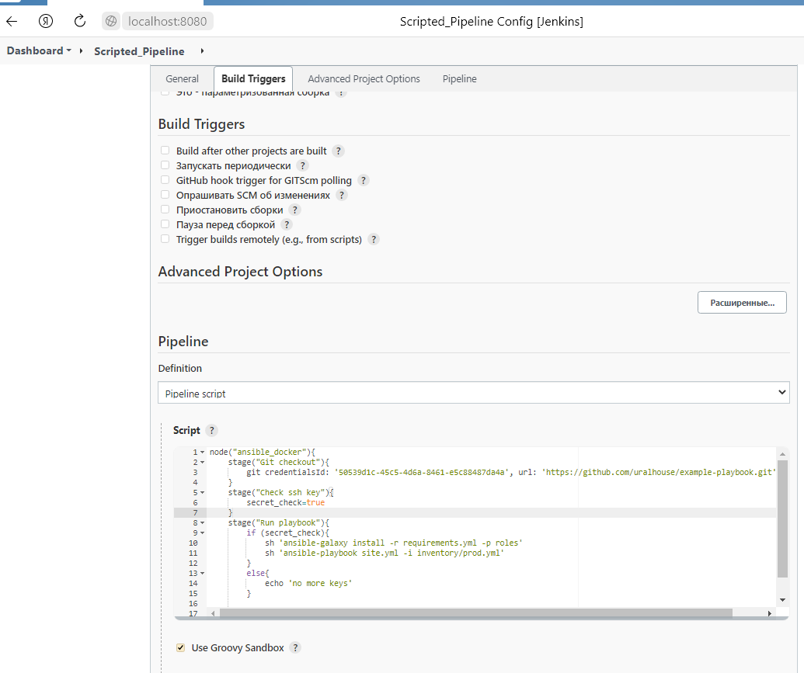

7. Проверить работоспособность, исправить ошибки, исправленный Pipeline вложить в репозиторий в файл `ScriptedJenkinsfile`

   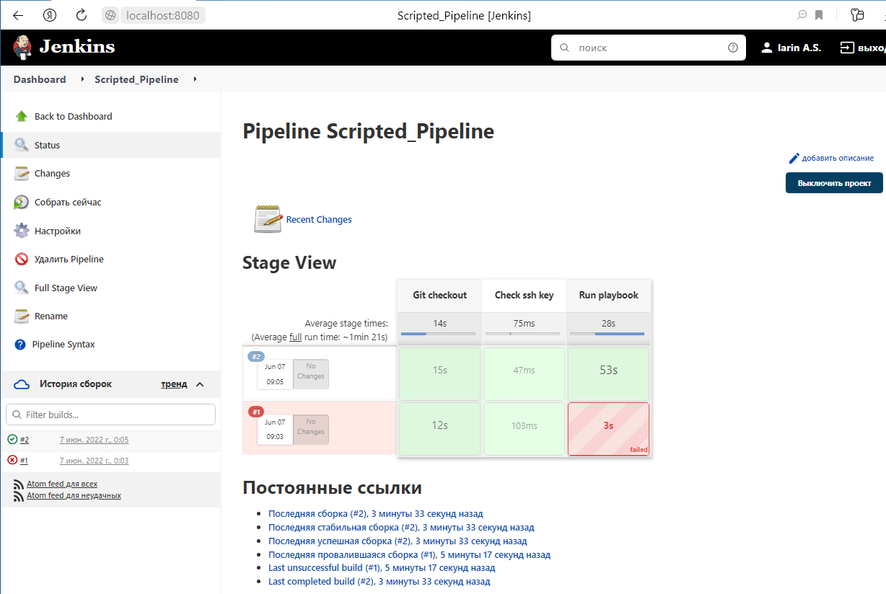

   Вывод на консоль:

   ```
   Started by user Iarin A.S.
   [Pipeline] Start of Pipeline
   [Pipeline] node
   Running on ansible_docker-0000l3i8a54ns on docker in /workspace/Scripted_Pipeline
   [Pipeline] {
   [Pipeline] stage
   [Pipeline] { (Git checkout)
   [Pipeline] git
   Selected Git installation does not exist. Using Default
   The recommended git tool is: NONE
   using credential 50539d1c-45c5-4d6a-8461-e5c88487da4a
   Cloning the remote Git repository
   Cloning repository https://github.com/uralhouse/example-playbook.git
    > git init /workspace/Scripted_Pipeline # timeout=10
   Fetching upstream changes from https://github.com/uralhouse/example-playbook.git
    > git --version # timeout=10
    > git --version # 'git version 1.8.3.1'
   using GIT_SSH to set credentials 
   [INFO] Currently running in a labeled security context
    > /usr/bin/chcon --type=ssh_home_t /workspace/Scripted_Pipeline@tmp/jenkins-gitclient-ssh6183402371223361872.key
    > git fetch --tags --progress https://github.com/uralhouse/example-playbook.git +refs/heads/*:refs/remotes/origin/* # timeout=10
   Avoid second fetch
   Checking out Revision 48d39d93714641212d8260cf659f0bbc96098ac7 (refs/remotes/origin/master)
    > git config remote.origin.url https://github.com/uralhouse/example-playbook.git # timeout=10
    > git config --add remote.origin.fetch +refs/heads/*:refs/remotes/origin/* # timeout=10
    > git rev-parse refs/remotes/origin/master^{commit} # timeout=10
    > git config core.sparsecheckout # timeout=10
    > git checkout -f 48d39d93714641212d8260cf659f0bbc96098ac7 # timeout=10
    > git branch -a -v --no-abbrev # timeout=10
    > git checkout -b master 48d39d93714641212d8260cf659f0bbc96098ac7 # timeout=10
   Commit message: "Update Jenkinsfile"
    > git rev-list --no-walk 48d39d93714641212d8260cf659f0bbc96098ac7 # timeout=10
   [Pipeline] }
   [Pipeline] // stage
   [Pipeline] stage
   [Pipeline] { (Check ssh key)
   [Pipeline] }
   [Pipeline] // stage
   [Pipeline] stage
   [Pipeline] { (Run playbook)
   [Pipeline] sh
   + ansible-galaxy install -r requirements.yml -p roles
   Starting galaxy role install process
   - extracting java to /workspace/Scripted_Pipeline/roles/java
   - java (1.0.1) was installed successfully
   [Pipeline] sh
   + ansible-playbook site.yml -i inventory/prod.yml
   PLAY [Install Java] ************************************************************
   
   TASK [Gathering Facts] *********************************************************
   ok: [localhost]
   
   TASK [java : Upload .tar.gz file containing binaries from local storage] *******
   skipping: [localhost]
   
   TASK [java : Upload .tar.gz file conaining binaries from remote storage] *******
   changed: [localhost]
   
   TASK [java : Ensure installation dir exists] ***********************************
   changed: [localhost]
   
   TASK [java : Extract java in the installation directory] ***********************
   changed: [localhost]
   
   TASK [java : Export environment variables] *************************************
   changed: [localhost]
   
   PLAY RECAP *********************************************************************
   localhost                  : ok=5    changed=4    unreachable=0    failed=0    skipped=1    rescued=0    ignored=0   
   
   [Pipeline] }
   [Pipeline] // stage
   [Pipeline] }
   [Pipeline] // node
   [Pipeline] End of Pipeline
   Finished: SUCCESS

8. Отправить ссылку на репозиторий в ответе

   [Ссылка на репозиторий GitHub.](https://github.com/uralhouse/example-playbook)

