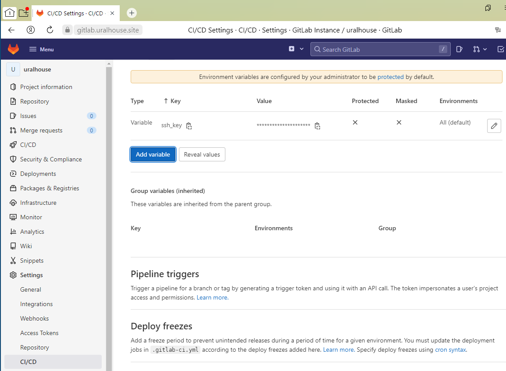
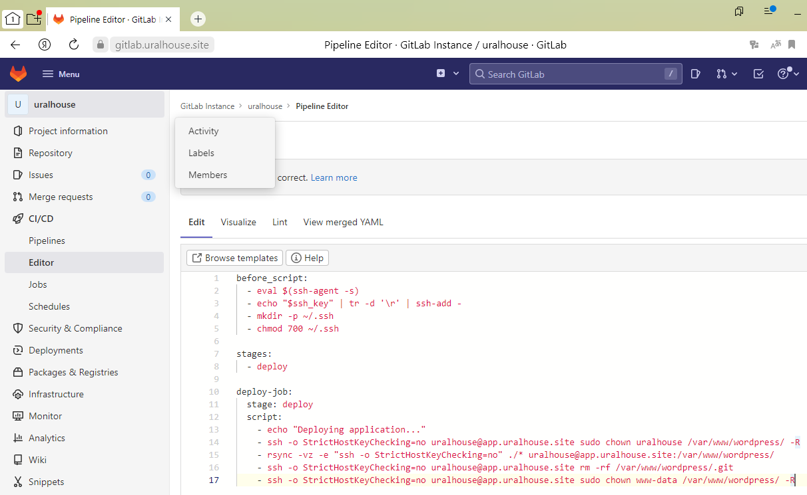

# Дипломная работа по курсу "DevOps-инженер"

Выполнил: Ярин Алексей Сергеевич

E-mail: uralhouse@mail.ru

[Задание диплома](DIPLOM.md)

## Цели:

1. Зарегистрировать доменное имя (любое на ваш выбор в любой доменной зоне).
2. Подготовить инфраструктуру с помощью Terraform на базе облачного провайдера YandexCloud.
3. Настроить внешний Reverse Proxy на основе Nginx и LetsEncrypt.
4. Настроить кластер MySQL.
5. Установить WordPress.
6. Развернуть Gitlab CE и Gitlab Runner.
7. Настроить CI/CD для автоматического развёртывания приложения.
8. Настроить мониторинг инфраструктуры с помощью стека: Prometheus, Alert Manager и Grafana.

---
## Этапы выполнения:

### Регистрация доменного имени

На [reg.ru](https://reg.ru) зарегистрирован домен `uralhouse.site`.

Настроены DNS:


### Создание инфраструктуры

Для развертывания инфраструктуры:
- Создать облако. ID облака - в переменную `cloud_id` в файле `variables.tf` 
- Создать каталог в облаке. ID каталога - в переменную `folder_id` в файле `variables.tf`
- Создать Object Storage (bucket). Добавить имя бакета в файл `backend.conf` `bucket     = <your-bucket-name>`
- Создать сервисный аккаунт с ролью `editor`. Сгенерировать статический ключ доступа для этого аккаунта. ID и секрет ключа записать в соответствующие параметры в файл `backend.conf`: `access_key = <your-access-key>` `secret_key = <your-secret-key>`
- Указать зарезервированный IP адрес - в переменную `yc_dedicated_ip`в файле `variables.tf`
- Указать имя зарегистрированного домена - в переменную `domain_name`в файле `variables.tf`
- Получить OAuth токен по инструкции [здесь](https://cloud.yandex.ru/docs/iam/concepts/authorization/oauth-token) 
- Запуск происходит в workspace `stage`

Выполняемые команды:

```
$ export TF_VAR_token=<ваш OAuth токен>
$ cd terraform
$ terraform workspace new stage
$ terraform workspace select stage 
$ terraform init -backend-config=backend.conf
$ terraform plan
$ terraform apply
```


Создан S3 bucket в YC.


## Description

В файле `inventory/inventory.yml` находится inventory для playbook и переменные для ansible ssh proxy.
	
В каталоге [ansible](src/ansible) находятся необходимые роли. Установка разделена по сервисам и выполняется в следующем порядке:
	

- nginx.yml (Nginx, LetsEncrypt, службу Proxy, Node_Exporter)
- mysql.yml (установка и настройка MySQL кластера)
- wordpress.yml (Nginx, Memcached, php5, Wordpress)
- gitlab.yml (установка Gitlab)
- runner.yml (установка Runner Gitlab)
- node_exporter.yml (установка NodeExporter на все хосты)
- monitoring.yml (разворачивание мониторинга)
	
	

Для переключения между stage и prod запросами сертификатов следует отредактировать tasks с именем Create letsencrypt certificate в файле [ansible/roles/nginx_letsencrypt/tasks/main.yml](src/ansible/roles/nginx_letsencrypt/tasks/main.yml), добавив или удалив в них флаг '--staging' :

```
- name: Create letsencrypt certificate front
  shell: letsencrypt certonly -n --webroot --staging -w /var/www/letsencrypt -m {{ letsencrypt_email }} --agree-tos -d {{ domain_name }}
  args:
    creates: /etc/letsencrypt/live/{{ domain_name }}
```
___


### Установка Nginx и LetsEncrypt

`ansible-playbook nginx.yml -i inventory/inventory.yml`

___


### Установка кластера MySQL

`ansible-playbook mysql.yml -i inventory/inventory.yml`


Проверка репликации


### Установка WordPress

`ansible-playbook wordpress.yml -i inventory/inventory.yml`


### Установка Gitlab CE и Gitlab Runner

`ansible-playbook gitlab.yml -i inventory/inventory.yml`


После выполнения playbook выводятся пароль для root доступа в gitlab, а также токен ключ для привязки  Gitlab Runner. 

Если необходимо сбросить пароль root, необходимо подключиться по ssh на gitlab.uralhouse.site и запускаем команду: `sudo gitlab-rake "gitlab:password:reset[root]"`

Если необходимо получить токен ключ для привязки Gitlab Runner, необходимо подключиться по ssh на gitlab.uralhouse.site и запустить команду: `sudo gitlab-rails runner -e production "puts Gitlab::CurrentSettings.current_application_settings.runners_registration_token"`


Перед установкой Gitlab Runner в файле [ansible/roles/gitlab-runner/defaults/main.yml](src/ansible/roles/gitlab-runner/defaults/main.yml) указываем gitlab_runner_coordinator_url и gitlab_runner_registration_token.

`ansible-playbook runner.yml -i inventory/inventory.yml`


Для выполнения автоматического деплой на сервер `app.uralhouse.site` при коммите в репозиторий с WordPress была разработана следующая job:

```
before_script:
  - eval $(ssh-agent -s)
  - echo "$ssh_key" | tr -d '\r' | ssh-add -
  - mkdir -p ~/.ssh
  - chmod 700 ~/.ssh

stages:         
  - deploy

deploy-job:      
  stage: deploy
  script:
    - echo "Deploying application..." 
    - ssh -o StrictHostKeyChecking=no uralhouse@app.uralhouse.site sudo chown uralhouse /var/www/wordpress/ -R
    - rsync -vz -e "ssh -o StrictHostKeyChecking=no" ./* uralhouse@app.uralhouse.site:/var/www/wordpress/
    - ssh -o StrictHostKeyChecking=no uralhouse@app.uralhouse.site rm -rf /var/www/wordpress/.git
    - ssh -o StrictHostKeyChecking=no uralhouse@app.uralhouse.site sudo chown www-data /var/www/wordpress/ -R
```


Настроим CI/CD систему для автоматического развертывания приложения при изменении кода.

Создаем переменную с ключом для доступа к серверу.






Проверяем работу.


### Установка Prometheus, Alert Manager, Node Exporter и Grafana

`ansible-playbook node_exporter.yml -i inventory/inventory.yml`


`ansible-playbook monitoring.yml -i inventory/inventory.yml`


- Grafana
  Данные для входа в Grafana admin/admin.


Настраиваем Data Sources и импортируем шаблоны из [templates_grafana](src/templates_grafana).


- Prometheus


- Alert Manager


Остановим VM Gitlab:


