### Решение домашнего задания №6

##### Вопрос 1. Установите средство виртуализации Oracle VirtualBox.

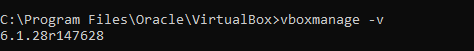

##### Вопрос 2. Установите средство автоматизации Hashicorp Vagrant.

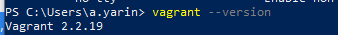

##### Вопрос 3. В вашем основном окружении подготовьте удобный для дальнейшей работы терминал. 

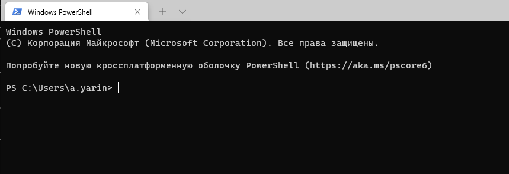

##### Вопрос 4. С помощью базового файла конфигурации запустите Ubuntu 20.04 в VirtualBox посредством Vagrant.

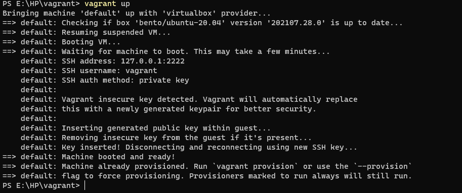

##### Вопрос 5. Ознакомьтесь с графическим интерфейсом VirtualBox, посмотрите как выглядит виртуальная машина, которую создал для вас Vagrant, какие аппаратные ресурсы ей выделены. Какие ресурсы выделены по-умолчанию? 

Выделены ресурсы.
<<<<<<< HEAD
C:\Program Files\Oracle\VirtualBox>**vboxmanage list runningvms**  
"VAGRANT_default_1636643437597_49186" {ce78aceb-4033-4dd8-8416-7eaaf47c699c}

C:\Program Files\Oracle\VirtualBox>**vboxmanage showvminfo** "VAGRANT_default_1636643437597_49186"  
Name: VAGRANT_default_1636643437597_49186  
Groups: /  
Guest OS: Ubuntu (64-bit)  
UUID: ce78aceb-4033-4dd8-8416-7eaaf47c699c  
Config file:                 C:\Users\a.yarin\VirtualBox VMs\VAGRANT_default_1636643437597_49186\VAGRANT_default_1636643437597_49186.vbox  
Snapshot folder:             C:\Users\a.yarin\VirtualBox VMs\VAGRANT_default_1636643437597_49186\Snapshots  
Log folder:                  C:\Users\a.yarin\VirtualBox VMs\VAGRANT_default_1636643437597_49186\Logs  
Hardware UUID:               ce78aceb-4033-4dd8-8416-7eaaf47c699c  
Memory size:                 1024MB  
Page Fusion:                 disabled  
VRAM size:                   4MB  
CPU exec cap:                100%  
HPET:                        disabled  
CPUProfile:                  host  
Chipset:                     piix3  
Firmware:                    BIOS  
Number of CPUs:              2  
PAE:                         enabled  
Long Mode:                   enabled  
Triple Fault Reset:          disabled  
APIC:                        enabled  
X2APIC:                      enabled  
Nested VT-x/AMD-V:           disabled  
CPUID Portability Level:     0  
CPUID overrides:             None  
=======
C:\Program Files\Oracle\VirtualBox>**vboxmanage list runningvms**
"VAGRANT_default_1636643437597_49186" {ce78aceb-4033-4dd8-8416-7eaaf47c699c}

C:\Program Files\Oracle\VirtualBox>**vboxmanage showvminfo** "VAGRANT_default_1636643437597_49186"
Name:                        VAGRANT_default_1636643437597_49186
Groups:                      /
Guest OS:                    Ubuntu (64-bit)
UUID:                        ce78aceb-4033-4dd8-8416-7eaaf47c699c
Config file:                 C:\Users\a.yarin\VirtualBox VMs\VAGRANT_default_1636643437597_49186\VAGRANT_default_1636643437597_49186.vbox
Snapshot folder:             C:\Users\a.yarin\VirtualBox VMs\VAGRANT_default_1636643437597_49186\Snapshots
Log folder:                  C:\Users\a.yarin\VirtualBox VMs\VAGRANT_default_1636643437597_49186\Logs
Hardware UUID:               ce78aceb-4033-4dd8-8416-7eaaf47c699c
Memory size:                 1024MB
Page Fusion:                 disabled
VRAM size:                   4MB
CPU exec cap:                100%
HPET:                        disabled
CPUProfile:                  host
Chipset:                     piix3
Firmware:                    BIOS
Number of CPUs:              2
PAE:                         enabled
Long Mode:                   enabled
Triple Fault Reset:          disabled
APIC:                        enabled
X2APIC:                      enabled
Nested VT-x/AMD-V:           disabled
CPUID Portability Level:     0
CPUID overrides:             None
Boot menu mode:              message and menu
Boot Device 1:               HardDisk
Boot Device 2:               DVD
Boot Device 3:               Not Assigned
Boot Device 4:               Not Assigned
ACPI:                        enabled
IOAPIC:                      enabled
BIOS APIC mode:              APIC
Time offset:                 0ms
RTC:                         UTC
Hardware Virtualization:     enabled
Nested Paging:               enabled
Large Pages:                 enabled
VT-x VPID:                   enabled
VT-x Unrestricted Exec.:     enabled
Paravirt. Provider:          Default
Effective Paravirt. Prov.:   KVM
State:                       running (since 2021-11-12T09:59:17.177000000)
Graphics Controller:         VBoxVGA
Monitor count:               1
3D Acceleration:             disabled
2D Video Acceleration:       disabled
Teleporter Enabled:          disabled
Teleporter Port:             0
Teleporter Address:
Teleporter Password:
Tracing Enabled:             disabled
Allow Tracing to Access VM:  disabled
Tracing Configuration:
Autostart Enabled:           disabled
Autostart Delay:             0
Default Frontend:
VM process priority:         default
Storage Controller Name (0):            IDE Controller
Storage Controller Type (0):            PIIX4
Storage Controller Instance Number (0): 0
Storage Controller Max Port Count (0):  2
Storage Controller Port Count (0):      2
Storage Controller Bootable (0):        on
Storage Controller Name (1):            SATA Controller
Storage Controller Type (1):            IntelAhci
Storage Controller Instance Number (1): 0
Storage Controller Max Port Count (1):  30
Storage Controller Port Count (1):      1
Storage Controller Bootable (1):        on
SATA Controller (0, 0): C:\Users\a.yarin\VirtualBox VMs\VAGRANT_default_1636643437597_49186\ubuntu-20.04-amd64-disk001.vmdk (UUID: ce80beee-86f7-48e1-aa7b-3c186f956fa7)
NIC 1:                       MAC: 0800277360CF, Attachment: NAT, Cable connected: on, Trace: off (file: none), Type: 82540EM, Reported speed: 0 Mbps, Boot priority: 0, Promisc Policy: deny, Bandwidth group: none
NIC 1 Settings:  MTU: 0, Socket (send: 64, receive: 64), TCP Window (send:64, receive: 64)
NIC 1 Rule(0):   name = ssh, protocol = tcp, host ip = 127.0.0.1, host port = 2222, guest ip = , guest port = 22
NIC 2:                       disabled
NIC 3:                       disabled
NIC 4:                       disabled
NIC 5:                       disabled
NIC 6:                       disabled
NIC 7:                       disabled
NIC 8:                       disabled
Pointing Device:             PS/2 Mouse
Keyboard Device:             PS/2 Keyboard
UART 1:                      disabled
UART 2:                      disabled
UART 3:                      disabled
UART 4:                      disabled
LPT 1:                       disabled
LPT 2:                       disabled
Audio:                       disabled
Audio playback:              disabled
Audio capture:               disabled
Clipboard Mode:              disabled
Drag and drop Mode:          disabled
Session name:                headless
Video mode:                  800x600x32 at 0,0 enabled
VRDE:                        enabled (Address 127.0.0.1, Ports 5996, MultiConn: off, ReuseSingleConn: off, Authentication type: null)
Video redirection:           disabled
OHCI USB:                    disabled
EHCI USB:                    disabled
xHCI USB:                    disabled

USB Device Filters:
<none>

Available remote USB devices:
<none>

Currently Attached USB Devices:
<none>

Bandwidth groups:  <none>

Shared folders:

Name: 'vagrant', Host path: '\\?\E:\HP\VAGRANT' (machine mapping), writable

VRDE Connection:             not active
Clients so far:              0

Capturing:                   not active
Capture audio:               not active
Capture screens:             0
Capture file:                C:\Users\a.yarin\VirtualBox VMs\ubuntu-20.04-amd64_1636643416829_7606\ubuntu-20.04-amd64_1636643416829_7606.webm
Capture dimensions:          1024x768
Capture rate:                512kbps
Capture FPS:                 25kbps
Capture options:

Guest:

Configured memory balloon size: 0MB
OS type:                     Linux26_64
Additions run level:         2
Additions version:           6.1.24 r145751

Guest Facilities:

Facility "VirtualBox Base Driver": active/running (last update: 2021/11/11 15:10:50 UTC)
Facility "VirtualBox System Service": active/running (last update: 2021/11/11 15:10:53 UTC)
Facility "Seamless Mode": not active (last update: 2021/11/12 09:59:17 UTC)
Facility "Graphics Mode": not active (last update: 2021/11/12 09:59:17 UTC)
>>>>>>> eede8eaed01482f7cade51b7e182044128eeec9a

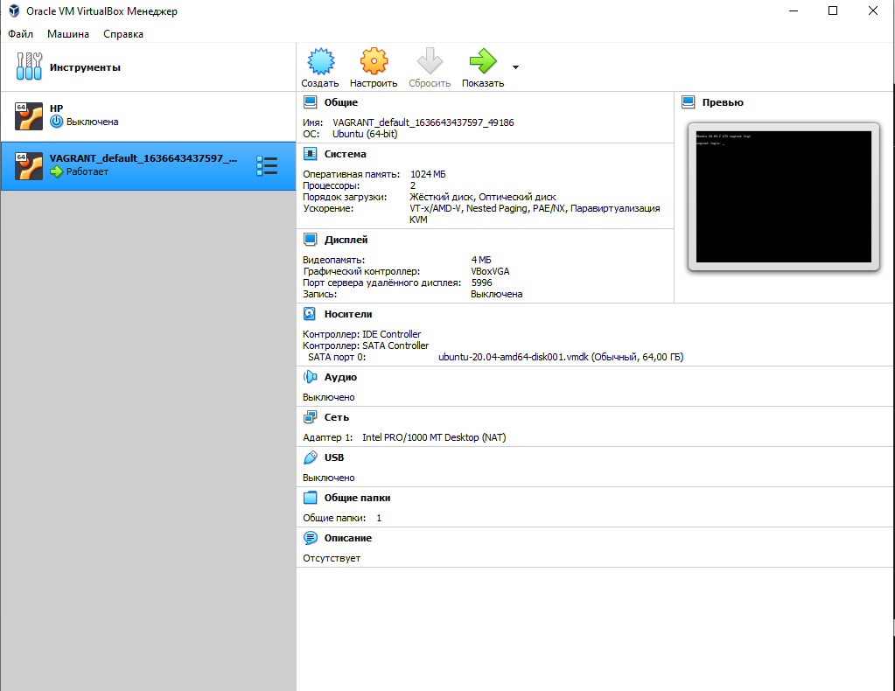

##### Вопрос 6. Ознакомьтесь с возможностями конфигурации VirtualBox через Vagrantfile: документация. Как добавить оперативной памяти или ресурсов процессора виртуальной машине?

Дополняем Vagrantfile следующими строчками

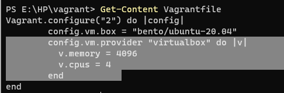

Получаем результат:

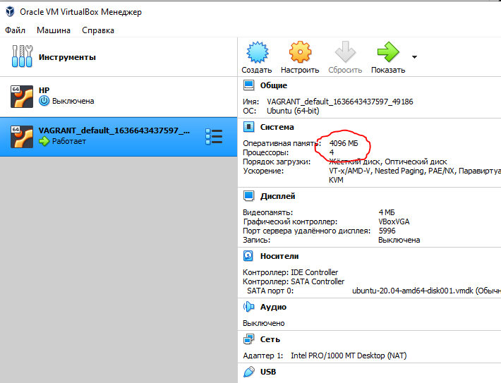

##### Вопрос 7. Команда vagrant ssh из директории, в которой содержится Vagrantfile, позволит вам оказаться внутри виртуальной машины без каких-либо дополнительных настроек. Попрактикуйтесь в выполнении обсуждаемых команд в терминале Ubuntu.

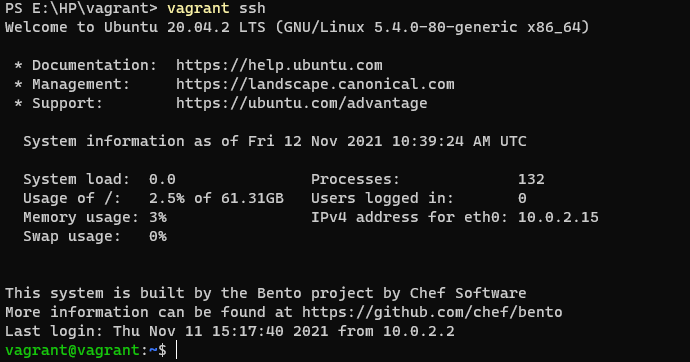

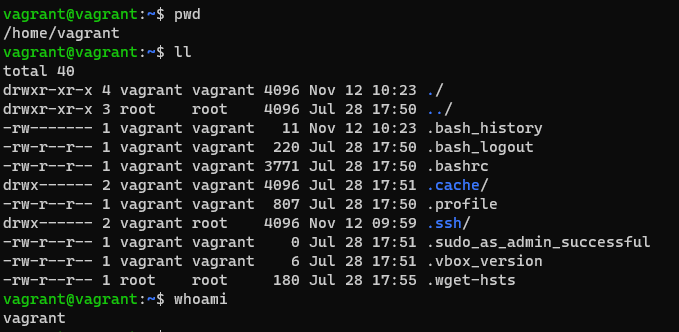

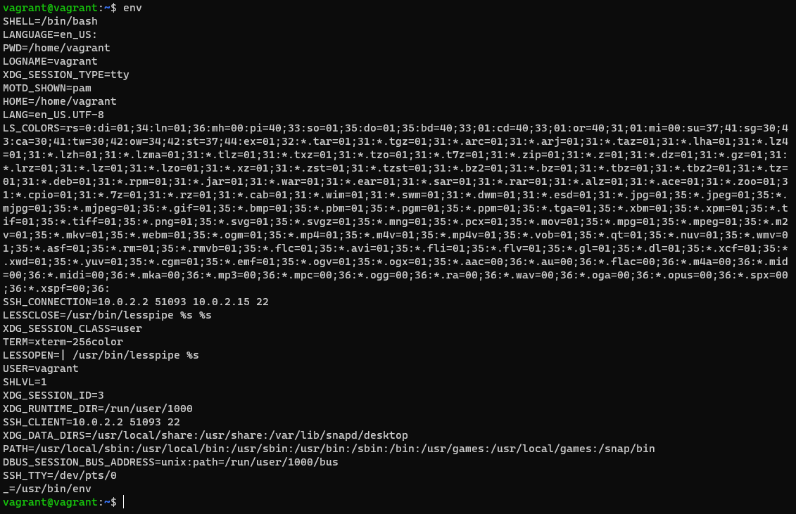

##### Вопрос 8. Ознакомиться с разделами man bash, почитать о настройках самого bash:

- ##### Какой переменной можно задать длину журнала history, и на какой строчке manual это описывается?

  Длину журнала history можно задать переменной HISTFILESIZE.
  Информацию по данной переменной можно узнать в man bash - line 805

- ##### Что делает директива ignoreboth в bash?

  Директива ignoreboth устанавливается в переменной HISTCONTROL (правила, что должно быть записано в историю, а что игнорировать). Директива ignoreboth учитывает две директивы: ignoredups - не писать строку после команды дублирования строки, ignorespace - не писать строки, начинающиеся с одного или нескольких пробелов в истории.  

  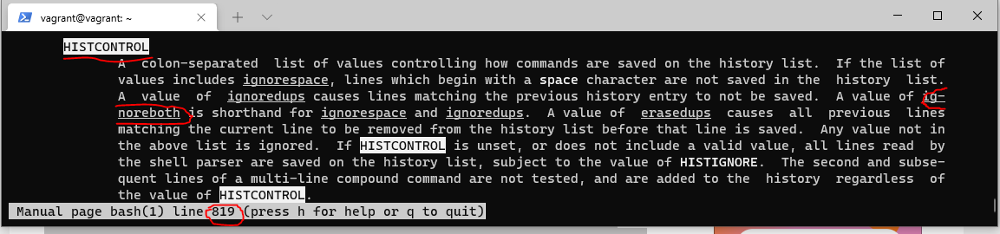

- ##### В каких сценариях использования применимы скобки {} и на какой строчке man bash это описано?

  Выполняется список команд (list) в текущей среде оболочки.
  Информацию об использовании  данной скобки {} можно узнать в man bash - line 249.

##### Вопрос 9. В каких сценариях использования применимы скобки {} и на какой строчке man bash это описано?

Выполняется список команд (list) в текущей среде оболочки.
Информацию об использовании  данной скобки {} можно узнать в man bash - line 249.

##### Вопрос 10. С учётом ответа на предыдущий вопрос, как создать однократным вызовом touch 100000 файлов? 

Выполняем команду **touch test{00000..99999}**

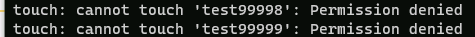

Получится ли аналогичным образом создать 300000? Если нет, то почему?
Выполняем команду **touch test{00000..299999}**

Это ограничение на длину команды накладывается операционной системой. 

Выполняем **getconf ARG_MAX**

##### 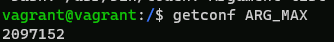

##### Вопрос 11. В man bash поищите по /\[\[. Что делает конструкция [[ -d /tmp ]]

Конструкция [[ -d /tmp ]] выдаёт истину (True) при существовании каталога /tmp.

##### Вопрос 12. Основываясь на знаниях о просмотре текущих (например, PATH) и установке новых переменных; командах, которые мы рассматривали, добейтесь в выводе type -a bash в виртуальной машине наличия первым пунктом в списке:

bash is /tmp/new_path_directory/bash
bash is /usr/local/bin/bash
bash is /bin/bash

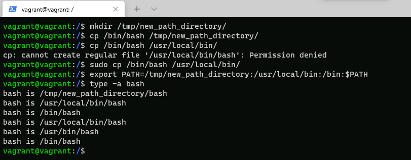

##### Вопрос 13. Чем отличается планирование команд с помощью batch и at?

Команда at используется для назначения одноразового задания на заданное время.

Команда batch — для назначения одноразовых задач, которые должны выполняться, когда загрузка системы становится меньше 0,8.

##### Вопрос 14. Завершите работу виртуальной машины чтобы не расходовать ресурсы компьютера и/или батарею ноутбука.

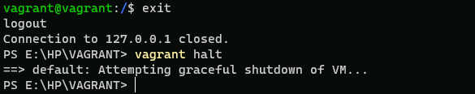