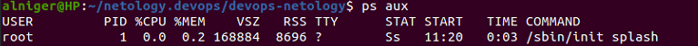
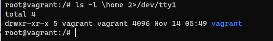
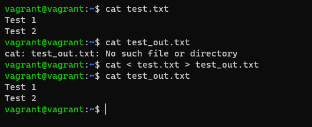
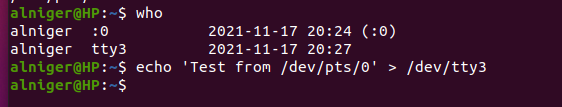
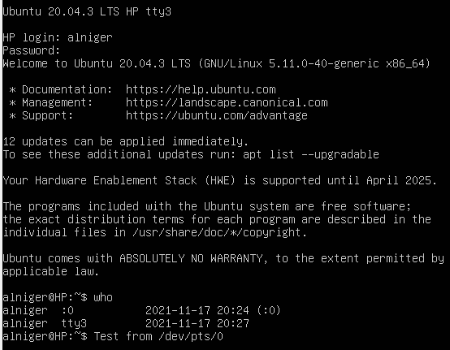
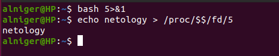
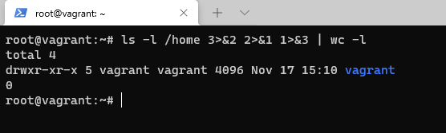
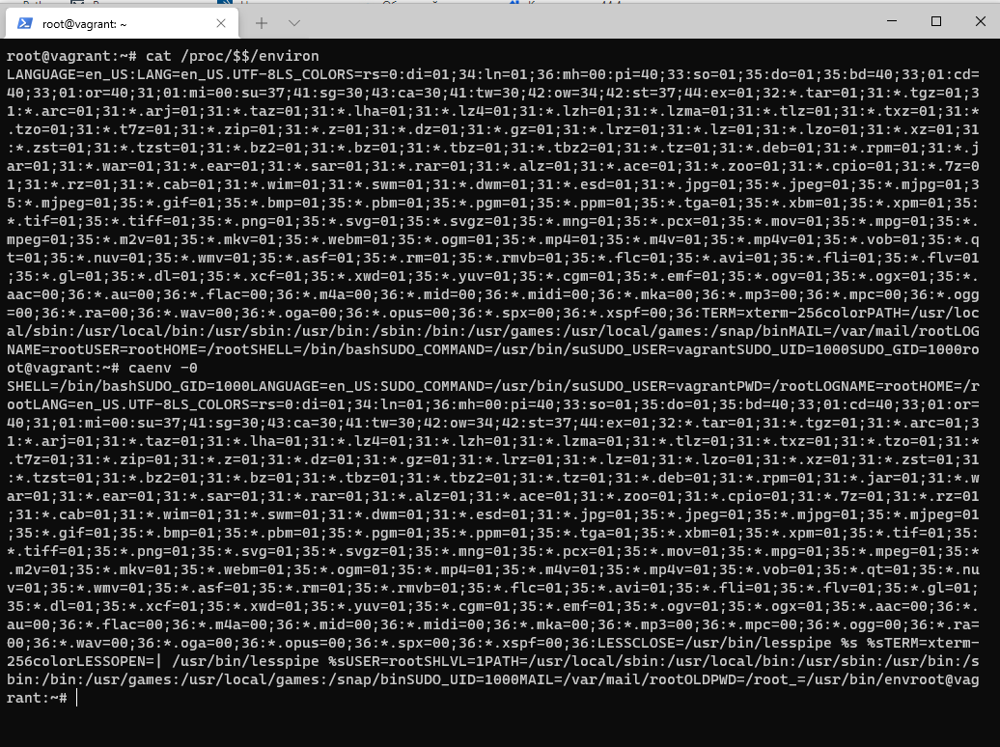
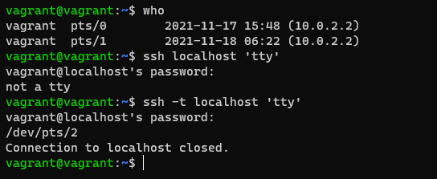

### Решение домашнего задания №6

##### Вопрос 1. Какого типа команда cd? Попробуйте объяснить, почему она именно такого типа; опишите ход своих мыслей, если считаете что она могла бы быть другого типа.

Ответ: Команда cd – это команда оболочки командной строки, используемую для изменения текущего рабочего каталога в различных операционных системах.
Команда cd - Built-in Shell Commands, т.е. реализована внутри оболочки.
$ **type cd**
cd is a shell builtin
Данная команда является встроенной функцией Bash. Команда сама по себе не меняет каталог, а передает новый каталог процессу оболочки.

##### Вопрос 2: Какая альтернатива без pipe команде grep <some_string> <some_file> | wc -l? man grep поможет в ответе на этот вопрос. Ознакомьтесь с документом о других подобных некорректных вариантах использования pipe.

Выполняется следующей командой: grep --count <some_string> <some_file>

##### Вопрос 3: Какой процесс с PID 1 является родителем для всех процессов в вашей виртуальной машине Ubuntu 20.04?

PID 1 процесс называется - /sbin/init

Родитель – systemd

##### Вопрос 4: Как будет выглядеть команда, которая перенаправит вывод stderr ls на другую сессию терминала?

##### Вопрос 5: Получится ли одновременно передать команде файл на stdin и вывести ее stdout в другой файл? Приведите работающий пример.

##### Вопрос 6: Получится ли находясь в графическом режиме, вывести данные из PTY в какой-либо из эмуляторов TTY? Сможете ли вы наблюдать выводимые данные?

##### Вопрос 7: Выполните команду bash 5>&1. К чему она приведет? Что будет, если вы выполните echo netology > /proc/$$/fd/5? Почему так происходит?

bash 5>&1 создает дескриптор №5 и направит в stdout
echo netology > /proc/$$/fd/5 – передаем текс в файл с дескриптором №5, который был перенаправлен в stdout, получаем вывод netology

##### Вопрос 8: Получится ли в качестве входного потока для pipe использовать только stderr команды, не потеряв при этом отображение stdout на pty? Напоминаем: по умолчанию через pipe передается только stdout команды слева от | на stdin команды справа. Это можно сделать, поменяв стандартные потоки местами через промежуточный новый дескриптор, который вы научились создавать в предыдущем вопросе.

##### Вопрос 9: Что выведет команда cat /proc/$$/environ? Как еще можно получить аналогичный по содержанию вывод?

Команда выводит переменные пользовательского окружения.

Аналог команды env -0

##### Вопрос 10: Используя man, опишите что доступно по адресам  /proc/<PID>/cmdline, /proc/<PID>/exe.

Запускаем man procfs
/cmdlline
**Line 236:   /proc/[pid]/cmdline**
 This read-only file holds the complete command line for the process, unless the  process  is  a zombie.   In  the latter case, there is nothing in this file: that is, a read on this file will return 0 characters.  The command-line arguments appear in this file as a set of strings  separated by null bytes ('\0'), with a further null byte after the last string.
Файл с атрибутом только для чтения, содержит полную командную строку процесса, если gроцесс не является зомби. В последнем случае этот файл пуст, поэтому чтение из него вернёт 0 символов. Аргументы командной строки в этом файле представлены в виде набора строк, разделённых байтами null ('\0') и байтом null после последней строки.

**Line 291:  /proc/[pid]/exe**
Under  Linux  2.2 and later, this file is a symbolic link containing the actual pathname of the
executed command.  This symbolic link can be dereferenced normally; attempting to open it  will open  the  executable.   You can even type /proc/[pid]/exe to run another copy of the same exe-utable that is being run by process [pid].  If the pathname has been  unlinked,  the  symbolic
link will contain the string '(deleted)' appended to the original pathname.  In a multithreaded
process, the contents of this symbolic link are not available if the main  thread  has  already
  terminated (typically by calling pthread_exit(3)).

В Linux 2.2 и новее этот файл является символьной ссылкой, содержащей актуальный путь выполняемой команды. Данная символьная
ссылка может обрабатываться обычным образом; попытка её открытия приведёт к открытию исполняемого файла. Вы даже можете
ввести /proc/[pid]/exe для запуска другой копии того же исполняемого файла, который выполняется процессом [pid]. Если путь
был удалён, то символьная ссылка будет содержать строку '(deleted)', добавленную к оригинальному пути. В многонитевом
процессе содержимое этой символьной ссылки недоступно, если основная нить уже завершилась (обычно вызовом pthread_exit(3)).

##### Вопрос 11: Узнайте, какую наиболее старшую версию набора инструкций SSE поддерживает ваш процессор с помощью /proc/cpuinfo.

Выполняем из консоли: grep sse /proc/cpuinfo
Получается SSE 4_2 (4.2)

##### Вопрос 12: При открытии нового окна терминала и vagrant ssh создается новая сессия и выделяется pty. Это можно подтвердить командой tty, которая упоминалась в лекции 3.2. Однако: vagrant@netology1:~$ ssh localhost 'tty' not a tty
Почитайте, почему так происходит, и как изменить поведение.

Необходимо добавить параметр к команде ssh –t, тогда команда исполняется c принудительным созданием псевдо-терминала

##### Вопрос 13: Бывает, что есть необходимость переместить запущенный процесс из одной сессии в другую. Попробуйте сделать это, воспользовавшись reptyr. Например, так можно перенести в screen процесс, который вы запустили по ошибке в обычной SSH-сессии.

Вначале необходимо выполнить установку reptyr:

sudo apt update

sudo apt install reptyr

Далее выполняем: reptyr –T 3261

##### Вопрос 14: sudo echo string > /root/new_file не даст выполнить перенаправление под обычным пользователем, так как перенаправлением занимается процесс shell'а, который запущен без sudo под вашим пользователем. Для решения данной проблемы можно использовать конструкцию echo string | sudo tee /root/new_file. Узнайте что делает команда tee и почему в отличие от sudo echo команда с sudo tee будет работать.

Команда tee считывает данные из stdin, через pipe выводит их в stdout и указанный файл. Так как команда запущена от sudo, то имеет необходимые права на запись в указанный файл.

