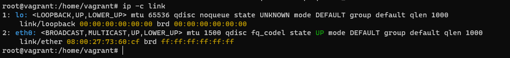
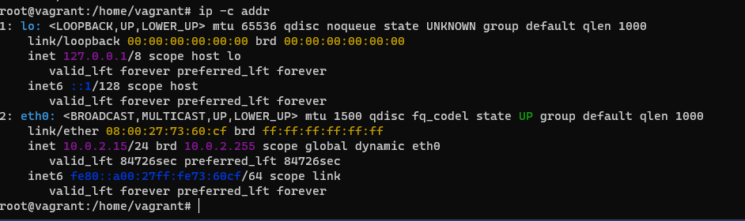
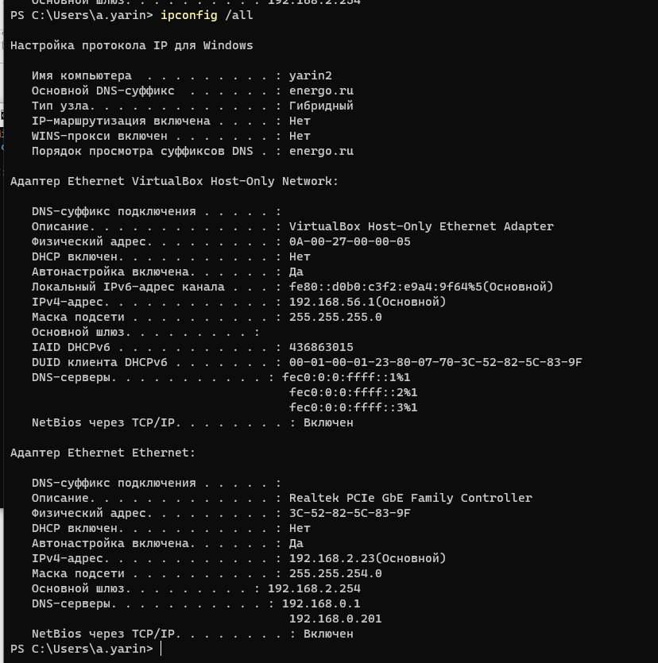
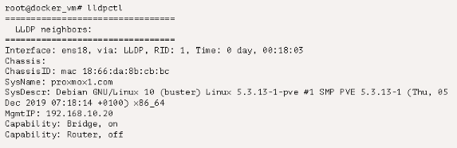
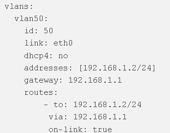
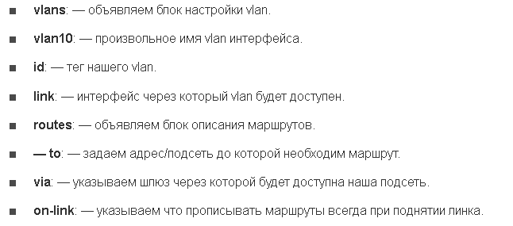
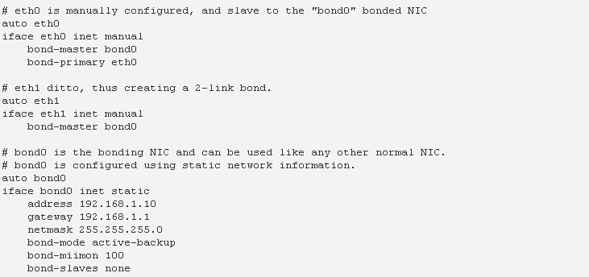
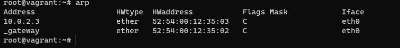
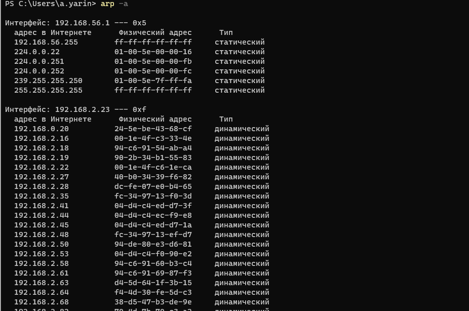
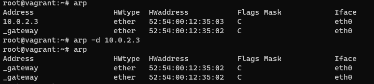

### Решение домашнего задания №12 (3.7. Компьютерные сети, лекция 2)

##### Вопрос 1: Проверьте список доступных сетевых интерфейсов на вашем компьютере. Какие команды есть для этого в Linux и в Windows?

В Linux:

В Windows:

##### Вопрос 2: Какой протокол используется для распознавания соседа по сетевому интерфейсу? Какой пакет и команды есть в Linux для этого?

LLDP – протокол для обмена информацией между соседними устройствами, позволяет определить к какому порту коммутатора подключен сервер.

К сожалению, физически нет соседей.
Вот пример из презентации:

##### Вопрос 3: Какая технология используется для разделения L2 коммутатора на несколько виртуальных сетей? Какой пакет и команды есть в Linux для этого? Приведите пример конфига.

VLAN – виртуальное разделение коммутатор.

Конфигурация VLAN в Debian и Ubuntu:
Открываем файл /etc/network/interfaces любым редактором и прописываем кофиг:

\`##vlan с ID-100 для интерфейса eth0 with ID - 100 в Debian/Ubuntu Linux##`

`auto eth0.100`

`iface eth0.100 inet static`

`address 192.168.1.200`

`netmask 255.255.255.0`

`vlan-raw-device eth0`

Сохраняем и перезапускаем:  systemctl restart network

Для Ubuntu 20.04 (версия свыше 17.04) настраивается через утилиту Netplan.

Она позволяет настроить сетевой интерфейс с использованием абстракции YAML.

Утилита считывает сетевую конфигурацию, описанную в файле конфигурации /etc/netplan/*.yaml.

Также включает в себя настройку vlan:

Где:

Далее выполняем netplan apply.

##### Вопрос 4: Какие типы агрегации интерфейсов есть в Linux? Какие опции есть для балансировки нагрузки? Приведите пример конфига.

LAG – агрегация портов. LAG в Linux – бондинг.

Имеются следующие опции (bond_mode):

*mode=0 (balance-rr)*

При этом методе объединения трафик распределяется по принципу «карусели»: пакеты по очереди направляются на сетевые карты объединённого интерфейса. Например, если у нас есть физические интерфейсы eth0, eth1, and eth2, объединенные в bond0, первый пакет будет отправляться через eth0, второй — через eth1, третий — через eth2, а четвертый снова через eth0 и т.д.

*mode=1 (active-backup)*

Когда используется этот метод, активен только один физический интерфейс, а остальные работают как резервные на случай отказа основного.

*mode=2 (balance-xor)*

В данном случае объединенный интерфейс определяет, через какую физическую сетевую карту отправить пакеты, в зависимости от MAC-адресов источника и получателя.

*mode=3 (broadcast)* 

Широковещательный режим, все пакеты отправляются через каждый интерфейс. Имеет ограниченное применение, но обеспечивает значительную отказоустойчивость.

*mode=4 (802.3ad)*

Особый режим объединения. Для него требуется специально настраивать коммутатор, к которому подключен объединенный интерфейс. Реализует стандарты объединения каналов IEEE и обеспечивает как увеличение пропускной способности, так и отказоустойчивость.

*mode=5 (balance-tlb)*

Распределение нагрузки при передаче. Входящий трафик обрабатывается в обычном режиме, а при передаче интерфейс определяется на основе данных о загруженности.

*mode=6 (balance-alb)*

Адаптивное распределение нагрузки. Аналогично предыдущему режиму, но с возможностью балансировать также входящую нагрузку.

Конфиг на Ubuntu /etc/network/interfaces:

##### Вопрос 5: Сколько IP адресов в сети с маской /29 ? Сколько /29 подсетей можно получить из сети с маской /24. Приведите несколько примеров /29 подсетей внутри сети 10.10.10.0/24.

В сети с маской /29 – 8 доступных IP (6 рабочих адресов для хостов).

32 шт. /29 подсетей можно получить из сети с маской /24.

10.10.10.0/29

10.10.10.8/29

10.10.10.16/29

10.10.10.24/29

…

10.10.10.248/29

##### Вопрос 6: Задача: вас попросили организовать стык между 2-мя организациями. Диапазоны 10.0.0.0/8, 172.16.0.0/12, 192.168.0.0/16 уже заняты. Из какой подсети допустимо взять частные IP адреса? Маску выберите из расчета максимум 40-50 хостов внутри подсети.

100.64.0.0/26

Количество доступных адресов - 64

Количество рабочих адресов для хостов - 62

##### Вопрос 7: Как проверить ARP таблицу в Linux, Windows? Как очистить ARP кеш полностью? Как из ARP таблицы удалить только один нужный IP?

Таблица ARP в Linux:

Таблица ARP в Windows:

Очистить ARP кеш полностью:

`ip link set arp off dev eth0 ; ip link set arp on dev eth0`

Удаление из ARP таблицы только один нужный IP:

