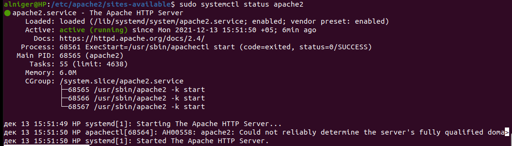

### Решение домашнего задания №14 (3.9. Элементы безопасности информационных систем)

##### Вопрос 1: Установите Bitwarden плагин для браузера. Зарегестрируйтесь и сохраните несколько паролей.

##### Вопрос 2: Установите Google authenticator на мобильный телефон. Настройте вход в Bitwarden акаунт через Google authenticator OTP.

Установил Google authenticator.

Настроил двухфакторную аутентификацию в Bitwarden акаунте.

При запуске запрашивает код:

В приложении Google authenticator приходит код (Причем скриншот на телефоне не делает!!!)

Выполнен вход в Bitwarden

##### Вопрос 3: Установите apache2, сгенерируйте самоподписанный сертификат, настройте тестовый сайт для работы по HTTPS.

Выполняем:

##### Вопрос 4: Проверьте на TLS уязвимости произвольный сайт в интернете (кроме сайтов МВД, ФСБ, МинОбр, НацБанк, РосКосмос, РосАтом, РосНАНО и любых госкомпаний, объектов КИИ, ВПК ... и тому подобное).

Проверил на TLS уязвимости собственный сервер:

##### Вопрос 5: Установите на Ubuntu ssh сервер, сгенерируйте новый приватный ключ. Скопируйте свой публичный ключ на другой сервер. Подключитесь к серверу по SSH-ключу.

Поднимаем 2 машины на Vagrant:

Устанавливаем SSH:

$sudo apt-get install openssh-server

Генерируем ключ и копируем с одной на вторую машину:

Выполняем вход:

##### Вопрос 6: Переименуйте файлы ключей из задания 5. Настройте файл конфигурации SSH клиента, так чтобы вход на удаленный сервер осуществлялся по имени сервера.

Прописываем данные в config:

Коннектимся:

##### Вопрос 7: Соберите дамп трафика утилитой tcpdump в формате pcap, 100 пакетов. Откройте файл pcap в Wireshark.

