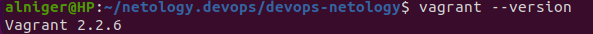
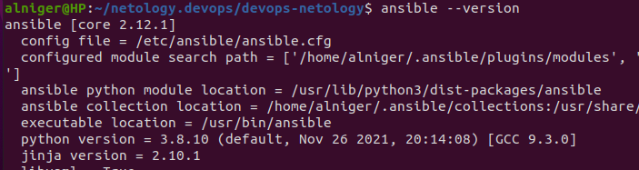

# Решение домашнего задания к занятию "5.2. Применение принципов IaaC в работе с виртуальными машинами"

---

## Задача 1

- <u>Опишите своими словами основные преимущества применения на практике IaaC паттернов.</u>

Удобность масштабирования системы и автоматизации, а также выполнение развертывания

Высокая скорость и безопасность

Возможность внесение всех изменений, отслежтвание история изменений и восстановления

Отслеживаение всего жизненного цикла с возможностью выявления причин 

- <u>Какой из принципов IaaC является основополагающим?</u>

Этот принцип называется идемпотентность. Возможность описать желаемое состояние того, что  конфигурируется, с определённой гарантией что оно будет достигнуто.

## Задача 2

- Чем Ansible выгодно отличается от других систем управление конфигурациями?

Скорость - бустрый старт на текущей SSH инфраструктуре;

Проста - декларативный метод написания конфигурации. Синтаксис playbook на языке Yaml

Расширяемость - легкое подключение кастомных ролей и модулей

- Какой, на ваш взгляд, метод работы систем конфигурации более надёжный push или pull?

По моему надежнее Push ввиду своей предсказуемости.

## Задача 3

Установить на личный компьютер:

- VirtualBox
- Vagrant
- Ansible

*Приложить вывод команд установленных версий каждой из программ, оформленный в markdown.*

VirtualBox

Vagrant

Ansible

