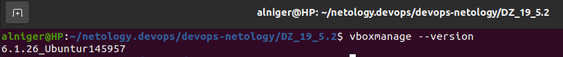
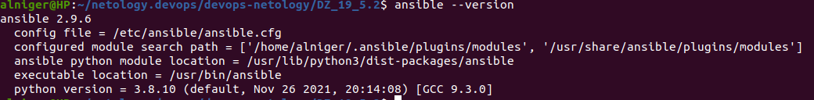

# Решение домашнего задания к занятию "5.2. Применение принципов IaaC в работе с виртуальными машинами"

---

## Задача 1

- <u>Опишите своими словами основные преимущества применения на практике IaaC паттернов.</u>

Удобность масштабирования системы и автоматизации, а также выполнение развертывания

Высокая скорость и безопасность

Возможность внесение всех изменений, отслежтвание история изменений и восстановления

Отслеживаение всего жизненного цикла с возможностью выявления причин 

- <u>Какой из принципов IaaC является основополагающим?</u>

Этот принцип называется идемпотентность. Возможность описать желаемое состояние того, что  конфигурируется, с определённой гарантией что оно будет достигнуто.

## Задача 2

- Чем Ansible выгодно отличается от других систем управление конфигурациями?

Скорость - бустрый старт на текущей SSH инфраструктуре;

Проста - декларативный метод написания конфигурации. Синтаксис playbook на языке Yaml

Расширяемость - легкое подключение кастомных ролей и модулей

- Какой, на ваш взгляд, метод работы систем конфигурации более надёжный push или pull?

По моему надежнее Push ввиду своей предсказуемости.

## Задача 3

Установить на личный компьютер:

- VirtualBox
- Vagrant
- Ansible

*Приложить вывод команд установленных версий каждой из программ, оформленный в markdown.*

VirtualBox



Vagrant


Ansible



## Задача 4 (*)

Воспроизвести практическую часть лекции самостоятельно.

- Создать виртуальную машину.
- Зайти внутрь ВМ, убедиться, что Docker установлен с помощью команды
```
docker ps
```


Задаем провайдер по умолчанию:

```
alniger@HP:~/netology.devops/05/vagrant$ export VAGRANT_DEFAULT_PROVIDER=virtualbox
```

Загружаем образ виртуальной машины:

```
alniger@HP:~/netology.devops/05/vagrant$ vagrant box add bento/ubuntu-20.04 --provider=virtualbox --force
==> box: Loading metadata for box 'bento/ubuntu-20.04'
    box: URL: https://vagrantcloud.com/bento/ubuntu-20.04
==> box: Adding box 'bento/ubuntu-20.04' (v202112.19.0) for provider: virtualbox
    box: Downloading: https://vagrantcloud.com/bento/boxes/ubuntu-20.04/versions/202112.19.0/providers/virtualbox.box
    box: Download redirected to host: vagrantcloud-files-production.s3-accelerate.amazonaws.com
==> box: Successfully added box 'bento/ubuntu-20.04' (v202112.19.0) for 'virtualbox'!
```

Проверяем доступные нам образы ОС:

```
alniger@HP:~/netology.devops/05/vagrant$ vagrant box list
bento/ubuntu-20.04 (virtualbox, 202112.19.0)
```

Запускаем Vagrant:

```
```
