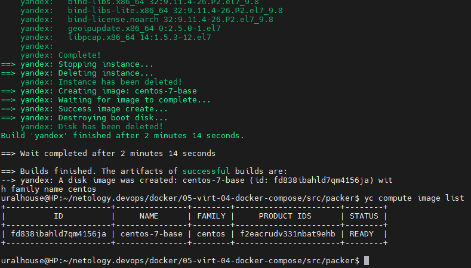
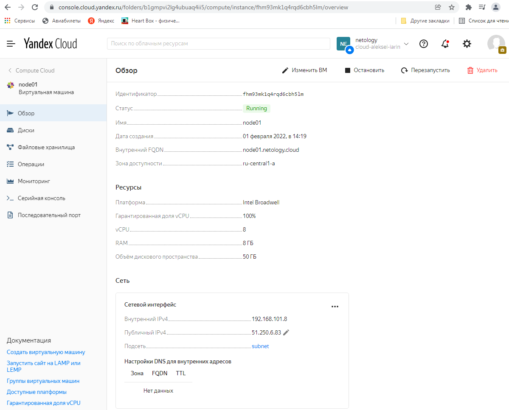
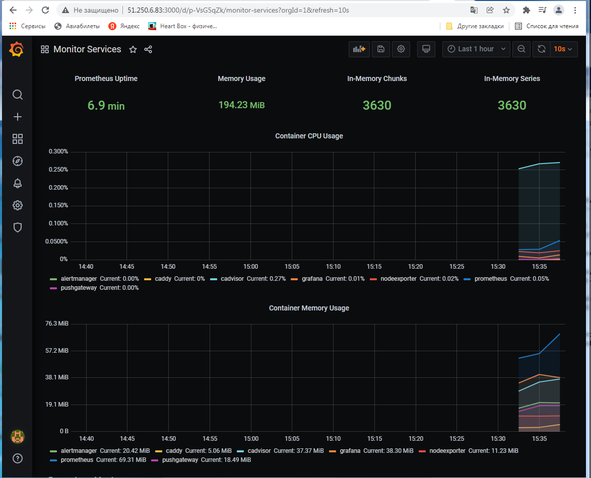

# Домашнее задание к занятию "5.4. Оркестрация группой Docker контейнеров на примере Docker Compose"

## Как сдавать задания

Обязательными к выполнению являются задачи без указания звездочки. Их выполнение необходимо для получения зачета и диплома о профессиональной переподготовке.

Задачи со звездочкой (*) являются дополнительными задачами и/или задачами повышенной сложности. Они не являются обязательными к выполнению, но помогут вам глубже понять тему.

Домашнее задание выполните в файле readme.md в github репозитории. В личном кабинете отправьте на проверку ссылку на .md-файл в вашем репозитории.

Любые вопросы по решению задач задавайте в чате учебной группы.

---

## Задача 1

Создать собственный образ операционной системы с помощью Packer.

## Задача 2

Создать вашу первую виртуальную машину в Яндекс.Облаке.

## Задача 3

Создать ваш первый готовый к боевой эксплуатации компонент мониторинга, состоящий из стека микросервисов.

- Скриншот работающего веб-интерфейса Grafana с текущими метриками

  

