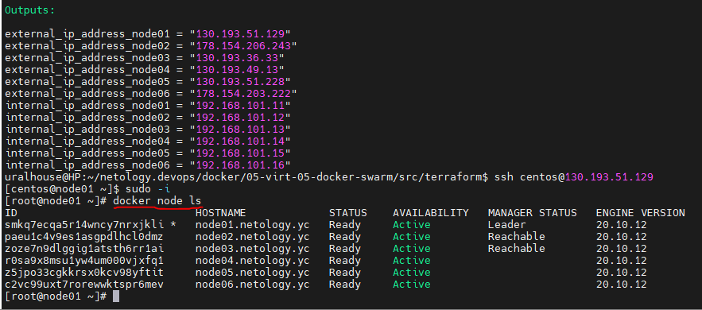
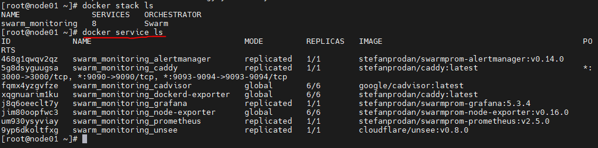
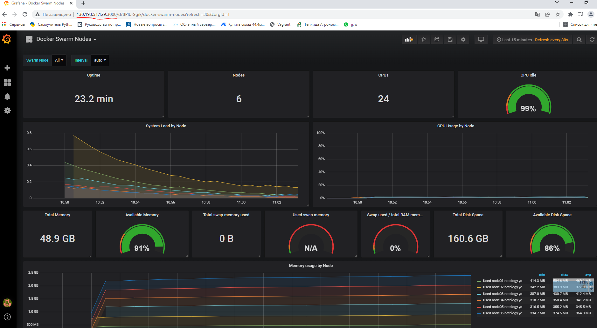
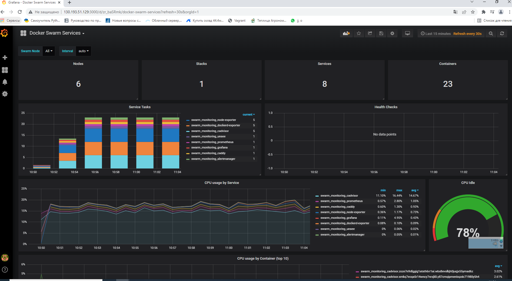

# Решение домашнего задания к занятию "5.5. Оркестрация кластером Docker контейнеров на примере Docker Swarm"


---

## Задача 1

Дайте письменные ответы на следующие вопросы:

- В чём отличие режимов работы сервисов в Docker Swarm кластере: replication и global?

  **Режим replication**: сервисы будут реплецированы до того количества экземпляров, которые мы задали (при помощи команды docker service update)

  **Режим global**: сервисы запускаются на всех нодах в кластере сразу 

- Какой алгоритм выбора лидера используется в Docker Swarm кластере?

  Лидер нода выбирается из управляючих нод путем Raft согласованного алгоритма.

- Что такое Overlay Network?

  Overlay-сети используется в кластере (Docker Swarm). Это виртуальная сеть (единое пространство DNS имен), которую используют контейнеры, связывая несколько физических хостов, на которых запущен Docker.

## Задача 2

Создать ваш первый Docker Swarm кластер в Яндекс.Облаке

Для получения зачета, вам необходимо предоставить скриншот из терминала (консоли), с выводом команды:
```
docker node ls
```

Скриншот из терминала:




## Задача 3

Создать ваш первый, готовый к боевой эксплуатации кластер мониторинга, состоящий из стека микросервисов.

Для получения зачета, вам необходимо предоставить скриншот из терминала (консоли), с выводом команды:
```
docker service ls
```




Пробуем зайти через браузер по IP в Grafana:




