# Решение домашнего задания к занятию "09.02 CI\CD"

## Знакомство с SonarQube

### Подготовка к выполнению

1. Выполняем `docker pull sonarqube:8.7-community`

   ```
   uralhouse@hp:~/netology$ sudo docker pull sonarqube:8.7-community
   [sudo] password for uralhouse:
   8.7-community: Pulling from library/sonarqube
   22599d3e9e25: Pull complete
   00bb4d95f2aa: Pull complete
   3ef8cf8a60c8: Pull complete
   928990dd1bda: Pull complete
   07cca701c22e: Pull complete
   Digest: sha256:70496f44067bea15514f0a275ee898a7e4a3fedaaa6766e7874d24a39be336dc
   Status: Downloaded newer image for sonarqube:8.7-community
   docker.io/library/sonarqube:8.7-community

2. Выполняем `docker run -d --name sonarqube -e SONAR_ES_BOOTSTRAP_CHECKS_DISABLE=true -p 9000:9000 sonarqube:8.7-community`

   ```
   uralhouse@hp:~/netology$ sudo docker run -d --name sonarqube -e SONAR_ES_BOOTSTRAP_CHECKS_DISABLE=true -p 9000:9000 sonarqube:8.7-community
   f7428b766b3ccb9668bf863707896b1cfed92cedf15b0295a89b45177137c3f2

3. Ждём запуск, смотрим логи через `docker logs -f sonarqube`

   ```
   uralhouse@hp:~/netology$ sudo docker logs -f sonarqube
   2022.05.05 08:51:14 INFO  app[][o.s.a.AppFileSystem] Cleaning or creating temp directory /opt/sonarqube/temp
   2022.05.05 08:51:14 INFO  app[][o.s.a.es.EsSettings] Elasticsearch listening on [HTTP: 127.0.0.1:9001, TCP: 127.0.0.1:32789]
   2022.05.05 08:51:14 INFO  app[][o.s.a.ProcessLauncherImpl] Launch process[[key='es', ipcIndex=1, logFilenamePrefix=es]] from [/opt/sonarqube/elasticsearch]: /opt/sonarqube/elasticsearch/bin/elasticsearch
   2022.05.05 08:51:14 INFO  app[][o.s.a.SchedulerImpl] Waiting for Elasticsearch to be up and running
   ...
   2022.05.05 08:53:26 INFO  ce[][o.s.c.t.CeWorkerImpl] worker AYCTbIYuYvYJlPmfVNAW found no pending task (including indexat                                                                              ion task). Disabling indexation task lookup for this worker until next SonarQube restart.

4. Проверяем готовность сервиса через [браузер](http://localhost:9000)

   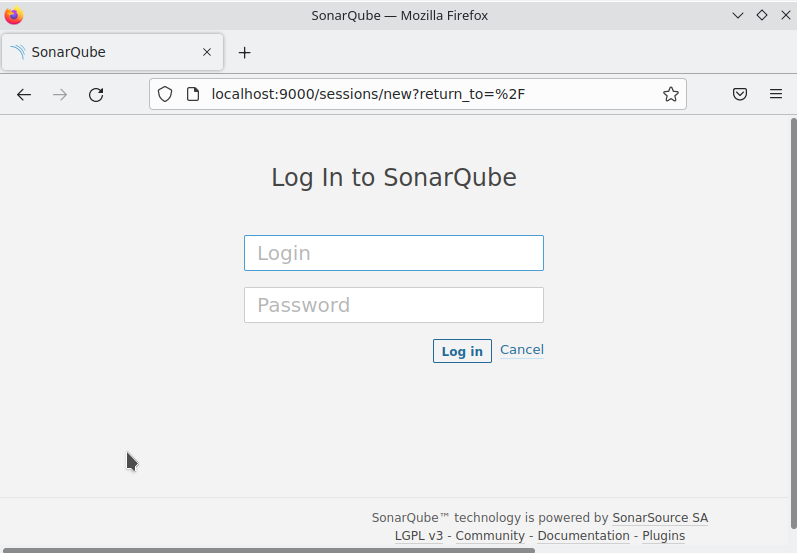

5. Заходим под admin\admin, меняем пароль на свой

   

### Основная часть

1. Создаём новый проект, название произвольное

   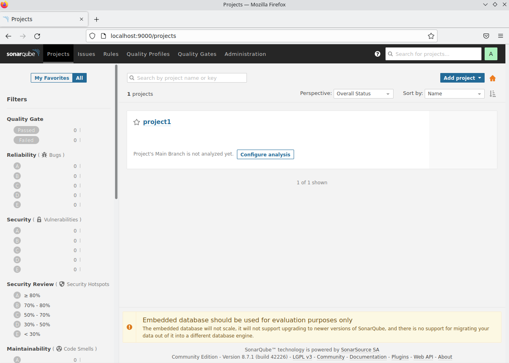

2. Скачиваем пакет sonar-scanner, который нам предлагает скачать сам sonarqube

   ```
   uralhouse@hp:~/netology/devops-netology/DZ_31_9.2$ wget https://binaries.sonarsource.com/Distribution/sonar-scanner-cli/sonar-scanner-cli-4.7.0.2747-linux.zip
   uralhouse@hp:~/netology/devops-netology/DZ_31_9.2$ unzip sonar-scanner-cli-4.7.0.2747-linux.zip
   uralhouse@hp:~/netology/devops-netology/DZ_31_9.2$ sudo mv sonar-scanner-4.7.0.2747-linux /var/lib

3. Делаем так, чтобы binary был доступен через вызов в shell (или меняем переменную PATH или любой другой удобный вам способ)

   ```
   export PATH=$PATH:/var/lib/sonar-scanner-4.7.0.2747-linux/bin

4. Проверяем `sonar-scanner --version`

   ```
   uralhouse@hp:~/netology/devops-netology/DZ_31_9.2$ sonar-scanner --version
   INFO: Scanner configuration file: /var/lib/sonar-scanner-4.7.0.2747-linux/conf/sonar-scanner.properties
   INFO: Project root configuration file: NONE
   INFO: SonarScanner 4.7.0.2747
   INFO: Java 11.0.14.1 Eclipse Adoptium (64-bit)
   INFO: Linux 5.15.0-27-generic amd64

5. Запускаем анализатор против кода из директории [example](./example) с дополнительным ключом `-Dsonar.coverage.exclusions=fail.py`

   ```
   uralhouse@hp:~/netology/devops-netology/DZ_31_9.2$ sonar-scanner \
   -Dsonar.projectKey=project1 \
   -Dsonar.sources=. \
   -Dsonar.host.url=http://localhost:9000 \
   -Dsonar.login=5347f4c701125bb8c9c253e65cb7df12dad0a169 \
   -Dsonar.coverage.exclusions=fail.py
   ```

   Смотрим результат в интерфейсе

   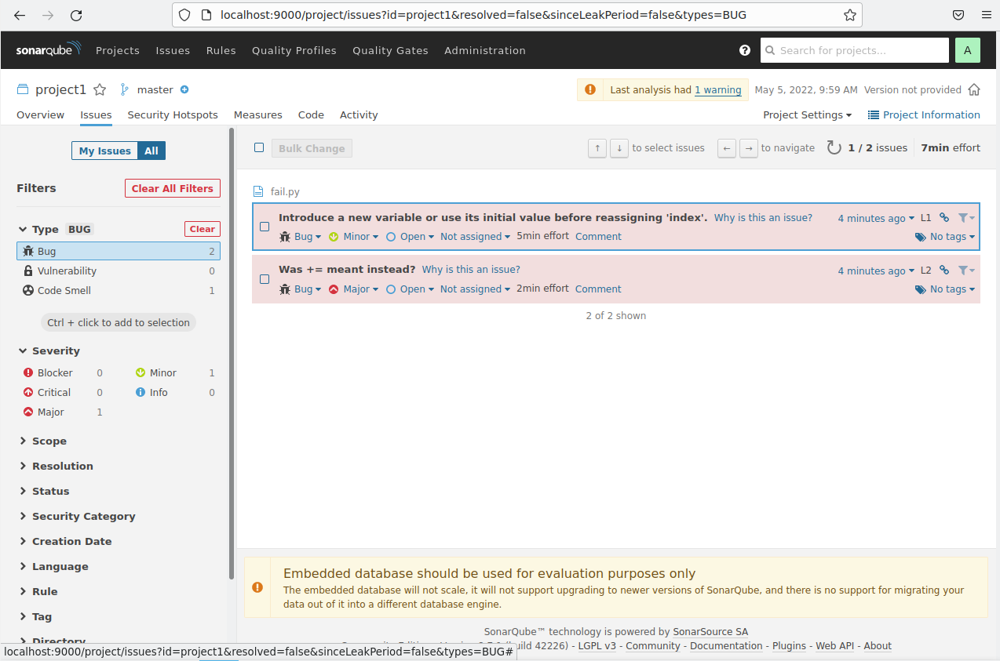

6. Исправляем ошибки, которые он выявил(включая warnings)

7. Запускаем анализатор повторно - проверяем, что QG пройдены успешно

8. Делаем скриншот успешного прохождения анализа, прикладываем к решению ДЗ

   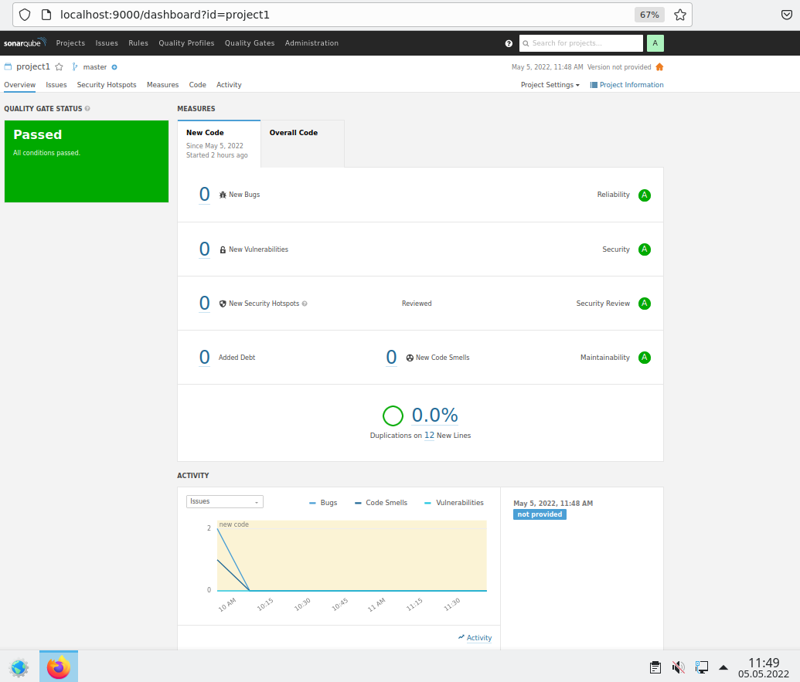

## Знакомство с Nexus

### Подготовка к выполнению

1. Выполняем `docker pull sonatype/nexus3`

   ```
   uralhouse@hp:~/netology/devops-netology/DZ_31_9.2$ sudo docker pull sonatype/nexus3
   [sudo] password for uralhouse:
   Using default tag: latest
   latest: Pulling from sonatype/nexus3
   3de00bb8554b: Pull complete
   c530010fb61c: Pull complete
   7702e8da5f17: Pull complete
   17eb9ed9829d: Pull complete
   43371288717f: Pull complete
   Digest: sha256:66fe12b1eb3e97bae72eb3c2c4e436499d41ff144cdfd1dcd0718df738304732
   Status: Downloaded newer image for sonatype/nexus3:latest
   docker.io/sonatype/nexus3:latest

2. Выполняем `docker run -d -p 8081:8081 --name nexus sonatype/nexus3`

   ```
   uralhouse@hp:~/netology/devops-netology/DZ_31_9.2$ sudo docker run -d -p 8081:8081 --name nexus sonatype/nexus3
   8df8cbe5c1c7a6e99382e28ce00275a830de466c2dac3d51b6c4668e4e503f8f

3. Ждём запуск, смотрим логи через `docker logs -f nexus`

   ```
   uralhouse@hp:~/netology/devops-netology/DZ_31_9.2$ sudo docker run -d -p 8081:8081 --name nexus sonatype/nexus3
   8df8cbe5c1c7a6e99382e28ce00275a830de466c2dac3d51b6c4668e4e503f8f
   uralhouse@hp:~/netology/devops-netology/DZ_31_9.2$ sudo docker logs -f nexus
   2022-05-05 10:21:59,700+0000 INFO  [FelixStartLevel] *SYSTEM org.sonatype.nexus.pax.logging.NexusLogActivator - start
   ...
   2022-05-05 10:24:46,611+0000 INFO  [jetty-main-1] *SYSTEM org.sonatype.nexus.extender.NexusBundleTracker - ACTIVATED org.sonatype.nexus.swagger [3.38.1.01]
   2022-05-05 10:24:46,647+0000 INFO  [jetty-main-1] *SYSTEM org.sonatype.nexus.extender.NexusBundleTracker - ACTIVATING org.sonatype.nexus.rapture [3.38.1.01]

4. Проверяем готовность сервиса через [бразуер](http://localhost:8081)

   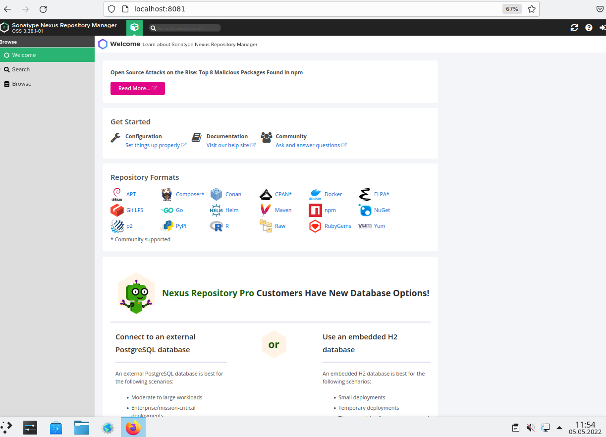

5. Узнаём пароль от admin через `docker exec -it nexus /bin/bash`

   ```
   uralhouse@hp:~/netology/devops-netology/DZ_31_9.2$ sudo docker exec -it nexus /bin/bash
   [sudo] password for uralhouse:
   bash-4.4$ vi nexus-data/admin.password
   
   3a18691d-a416-4c1f-ae36-c30948d13d30

6. Подключаемся под админом, меняем пароль, сохраняем анонимный доступ

   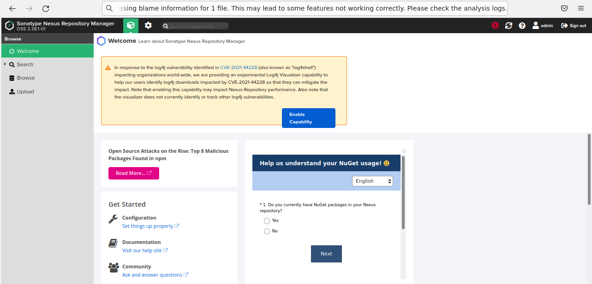

### Основная часть

1. В репозиторий `maven-public` загружаем артефакт с GAV параметрами:
   1. groupId: netology
   
   2. artifactId: java
   
   3. version: 8_282
   
   4. classifier: distrib
   
   5. type: tar.gz
   
      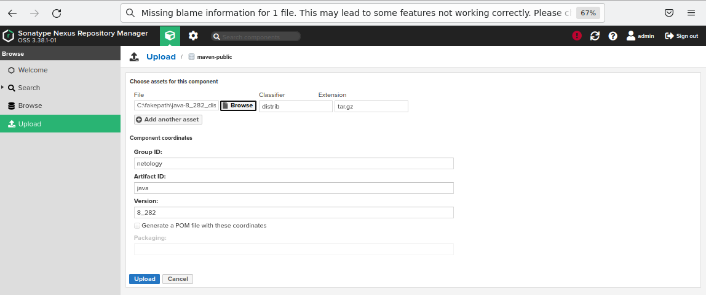
   
2. В него же загружаем такой же артефакт, но с version: 8_102

   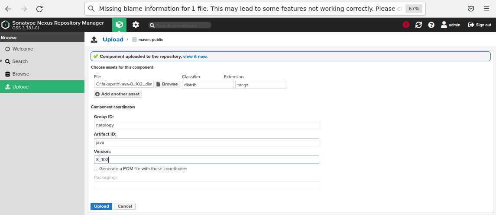

3. Проверяем, что все файлы загрузились успешно

   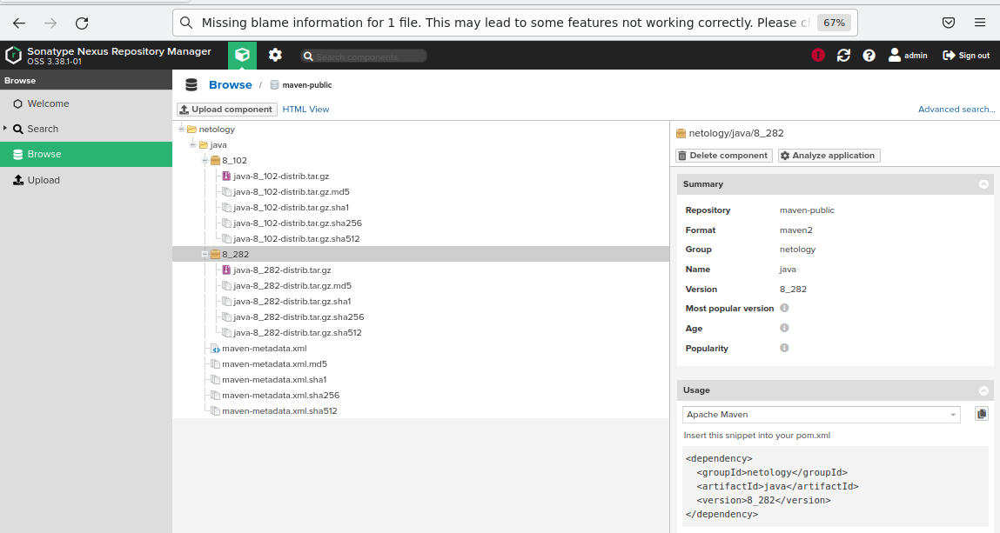

4. В ответе присылаем файл `maven-metadata.xml` для этого артефекта

   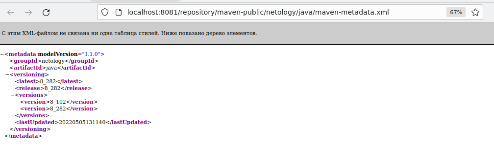Ссылка на файл: [maven-metadata.xml]()

### Знакомство с Maven

### Подготовка к выполнению

1. Скачиваем дистрибутив с [maven](https://maven.apache.org/download.cgi)

   ```
   uralhouse@hp:~/netology/devops-netology/DZ_31_9.2$ wget https://dlcdn.apache.org/maven/maven-3/3.8.5/binaries/apache-maven-3.8.5-bin.zip

2. Разархивируем, делаем так, чтобы binary был доступен через вызов в shell (или меняем переменную PATH или любой другой удобный вам способ)

   ```
   uralhouse@hp:~/netology/devops-netology/DZ_31_9.2$ unzip apache-maven-3.8.5-bin.zip
   uralhouse@hp:~/netology/devops-netology/DZ_31_9.2$ sudo mv apache-maven-3.8.5 /var/lib
   uralhouse@hp:~/netology/devops-netology/DZ_31_9.2$ export PATH=$PATH:/var/lib/apache-maven-3.8.5/bin

3. Проверяем `mvn --version`

   ```
   uralhouse@hp:~/netology/devops-netology/DZ_31_9.2$ mvn --version
   Apache Maven 3.8.5 (3599d3414f046de2324203b78ddcf9b5e4388aa0)
   Maven home: /var/lib/apache-maven-3.8.5
   Java version: 17.0.3, vendor: Private Build, runtime: /usr/lib/jvm/java-17-openjdk-amd64
   Default locale: ru_RU, platform encoding: UTF-8
   OS name: "linux", version: "5.15.0-27-generic", arch: "amd64", family: "unix"

4. Забираем директорию [mvn](./mvn) с pom

### Основная часть

1. Меняем в `pom.xml` блок с зависимостями под наш артефакт из первого пункта задания для Nexus (java с версией 8_282)

2. Запускаем команду `mvn package` в директории с `pom.xml`, ожидаем успешного окончания

   ```
   uralhouse@hp:~/netology/devops-netology/DZ_31_9.2/mvn$ mvn package
   [INFO] Scanning for projects...
   [INFO]
   [INFO] --------------------< com.netology.app:simple-app >---------------------
   [INFO] Building simple-app 1.0-SNAPSHOT
   [INFO] --------------------------------[ jar ]---------------------------------
   ...
   [INFO] Building jar: /home/uralhouse/netology/devops-netology/DZ_31_9.2/mvn/target/simple-app-1.0-SNAPSHOT.jar
   [INFO] ------------------------------------------------------------------------
   [INFO] BUILD SUCCESS
   [INFO] ------------------------------------------------------------------------
   [INFO] Total time:  01:00 min
   [INFO] Finished at: 2022-05-05T15:27:46Z
   [INFO] ------------------------------------------------------------------------

3. Проверяем директорию `~/.m2/repository/`, находим наш артефакт

   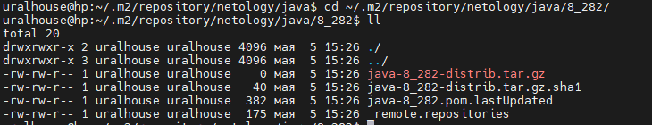

4. В ответе присылаем исправленный файл `pom.xml`

   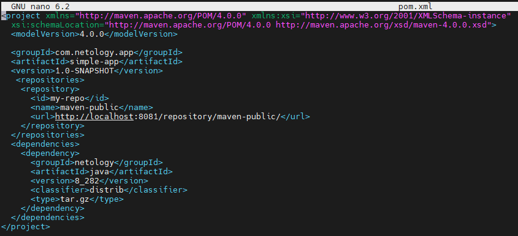

   Ссылка на файл: [pom.xml]()

---

