# Домашнее задание к занятию "09.04 Teamcity"

## Подготовка к выполнению

1. Поднимите инфраструктуру [teamcity](./teamcity/docker-compose.yml)

   Вносим дополнения в файл [docker-compose.yml](docker-compose.yml):

   ```
   
   version: "3"
   services:
     teamcity:
       image: jetbrains/teamcity-server
       volumes:
         - type: volume
           source: data
           target: /data/teamcity_server/datadir
         - type: volume
           source: data
           target: /opt/teamcity/logs
       ports:
         - 8111:8111
     teamcity-agent:
       image: jetbrains/teamcity-agent
       depends_on:
         - teamcity
       volumes:
         - type: volume
           source : data
           target: /data/teamcity_agent/conf
       environment:
         SERVER_URL: "http://teamcity:8111"
   volumes:
       data:
       logs:
       agent:
   ```

   И запускаем командой sudo docker-compose up:

   ```
   uralhouse@hp:~/netology/devops-netology/DZ_33_9.4$ sudo docker-compose up
   [sudo] password for uralhouse:
   Creating network "dz_33_94_default" with the default driver
   Creating volume "dz_33_94_data" with default driver
   Creating volume "dz_33_94_logs" with default driver
   Creating volume "dz_33_94_agent" with default driver
   Pulling teamcity (jetbrains/teamcity-server:)...
   latest: Pulling from jetbrains/teamcity-server
   8e5c1b329fe3: Pull complete
   64dee48628f0: Pull complete
   5a2d719b40dc: Pull complete
   ca2e8e6655af: Pull complete
   4c008ffb7caf: Pull complete
   175900217477: Pull complete
   975c3a4cd854: Pull complete
   2f5d07f4b386: Pull complete
   ae346c1c7409: Pull complete
   00688a883120: Pull complete
   3e7bbae24930: Pull complete
   9cee82ded787: Pull complete
   Digest: sha256:b4d2a754120e5127c7cf25a7fa2f7a5d6e1fb29c8ceebd23f15617973f34ea9b
   Status: Downloaded newer image for jetbrains/teamcity-server:latest
   Pulling teamcity-agent (jetbrains/teamcity-agent:)...
   latest: Pulling from jetbrains/teamcity-agent
   8e5c1b329fe3: Already exists
   ...

2. Если хочется, можете создать свою собственную инфраструктуру на основе той технологии, которая нравится. Инструкция по установке из [документации](https://www.jetbrains.com/help/teamcity/installing-and-configuring-the-teamcity-server.html)

3. Дождитесь запуска teamcity, выполните первоначальную настройку

   ```
   uralhouse@hp:~/netology/devops-netology/DZ_33_9.4$ sudo docker ps
   [sudo] password for uralhouse:
   CONTAINER ID   IMAGE                       COMMAND              CREATED         STATUS              PORTS                                       NAMES
   663834a276d3   jetbrains/teamcity-agent    "/run-services.sh"   2 minutes ago   Up About a minute                                               dz_33_94_teamcity-agent_1
   e3a846720ee4   jetbrains/teamcity-server   "/run-services.sh"   2 minutes ago   Up 2 minutes        0.0.0.0:8111->8111/tcp, :::8111->8111/tcp   dz_33_94_teamcity_1
   ```

4. Авторизуйте агент

   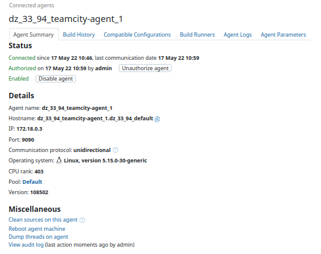

5. Сделайте fork [репозитория](https://github.com/aragastmatb/example-teamcity)

   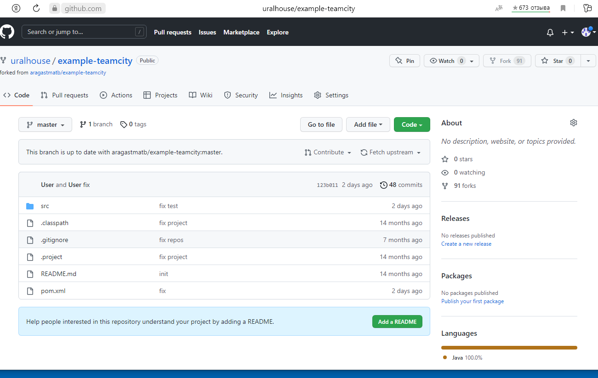

## Основная часть

1. Создайте новый проект в teamcity на основе fork

2. Сделайте autodetect конфигурации

   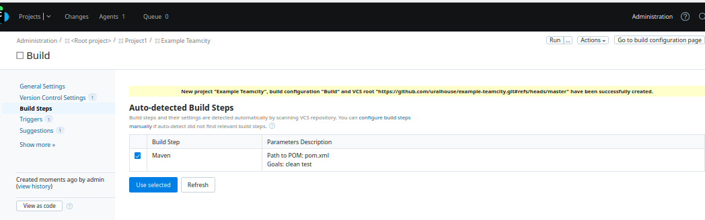

3. Сохраните необходимые шаги, запустите первую сборку master'a

   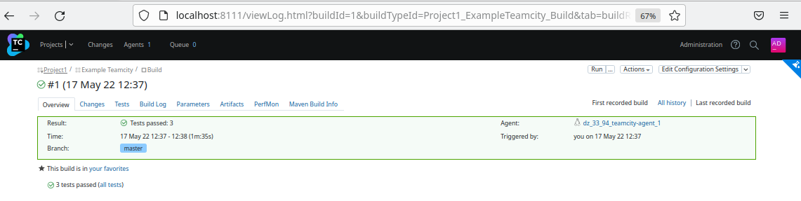

4. Поменяйте условия сборки: если сборка по ветке `master`, то должен происходит `mvn clean package`, иначе `mvn clean test`

   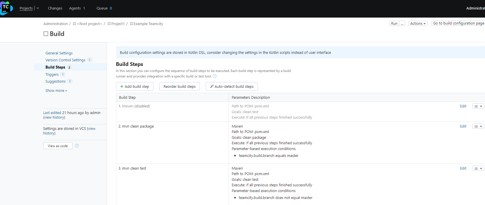

5. Мигрируйте `build configuration` в репозиторий

   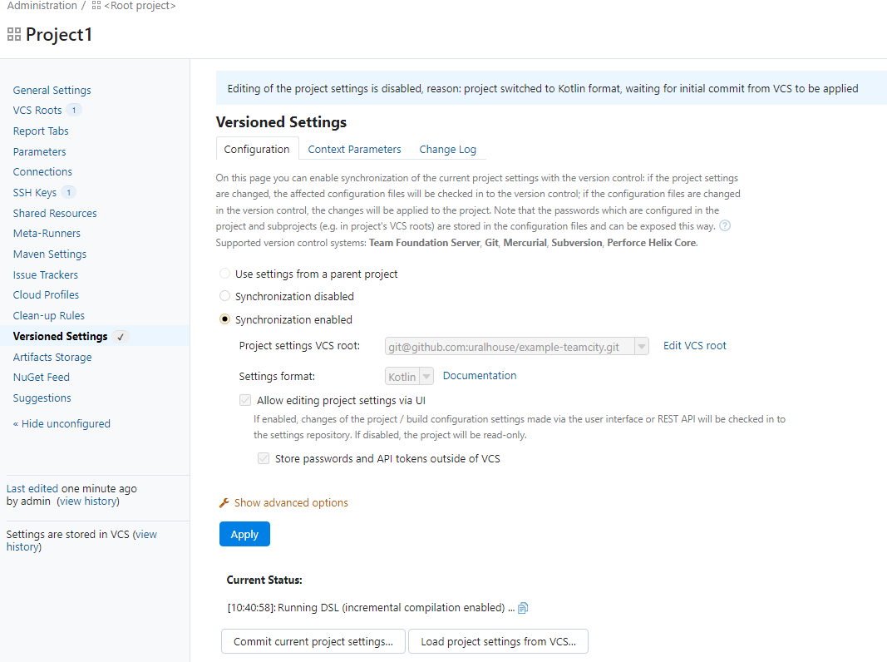

6. Создайте отдельную ветку `feature/add_reply` в репозитории

   ```
   uralhouse@hp:~/netology/github_work/example-teamcity$ git branch
   * master
   uralhouse@hp:~/netology/github_work/example-teamcity$ git checkout -b feature/add_reply
   uralhouse@hp:~/netology/github_work/example-teamcity$ git branch
   * feature/add_reply
     master
   ```

7. Напишите новый метод для класса Welcomer: метод должен возвращать произвольную реплику, содержащую слово `hunter`

   ```
           public String sayProject1() {
                   return "Project1 :hunter";
           }

8. Дополните тест для нового метода на поиск слова `hunter` в новой реплике

   ```
                   assertThat(welcomer.sayProject1(), containsString("hunter"));

9. Сделайте push всех изменений в новую ветку в репозиторий

   ```
   uralhouse@hp:~/netology/github_work/example-teamcity$ git status
   On branch feature/add_reply
   Changes not staged for commit:
     (use "git add <file>..." to update what will be committed)
     (use "git restore <file>..." to discard changes in working directory)
           modified:   src/main/java/plaindoll/Welcomer.java
           modified:   src/test/java/plaindoll/WelcomerTest.java
   
   no changes added to commit (use "git add" and/or "git commit -a")
   uralhouse@hp:~/netology/github_work/example-teamcity$ git add .
   uralhouse@hp:~/netology/github_work/example-teamcity$ git commit -m 'Add a new replica: hunter'
   [feature/add_reply 94c1e6d] Add a new replica: hunter
    2 files changed, 7 insertions(+), 1 deletion(-)
   uralhouse@hp:~/netology/github_work/example-teamcity$ git push --set-upstream origin feature/add_reply
   Enumerating objects: 20, done.
   Counting objects: 100% (20/20), done.
   Delta compression using up to 2 threads
   Compressing objects: 100% (6/6), done.
   Writing objects: 100% (11/11), 805 bytes | 805.00 KiB/s, done.
   Total 11 (delta 3), reused 0 (delta 0), pack-reused 0
   remote: Resolving deltas: 100% (3/3), completed with 3 local objects.
   remote:
   remote: Create a pull request for 'feature/add_reply' on GitHub by visiting:
   remote:      https://github.com/uralhouse/example-teamcity/pull/new/feature/add_reply
   remote:
   To github.com:uralhouse/example-teamcity.git
    * [new branch]      feature/add_reply -> feature/add_reply
   Branch 'feature/add_reply' set up to track remote branch 'feature/add_reply' from 'origin'.

10. Убедитесь что сборка самостоятельно запустилась, тесты прошли успешно

    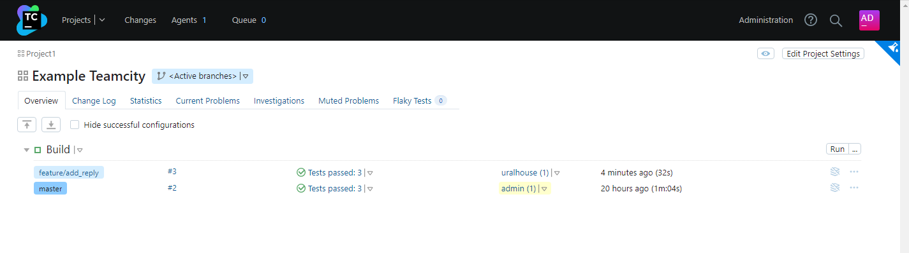

11. Внесите изменения из произвольной ветки `feature/add_reply` в `master` через `Merge`

    ```
    uralhouse@hp:~/netology/github_work/example-teamcity$ git merge feature/add_reply
    Updating 26709ba..94c1e6d
    Fast-forward
     src/main/java/plaindoll/Welcomer.java     | 5 +++++
     src/test/java/plaindoll/WelcomerTest.java | 3 ++-
     2 files changed, 7 insertions(+), 1 deletion(-)
    uralhouse@hp:~/netology/github_work/example-teamcity$ git push
    Warning: Permanently added 'github.com' (ED25519) to the list of known hosts.
    Total 0 (delta 0), reused 0 (delta 0), pack-reused 0
    To github.com:uralhouse/example-teamcity.git
       26709ba..94c1e6d  master -> master
    uralhouse@hp:~/netology/github_work/example-teamcity$ git log
    commit 94c1e6dfba62840fed39293d53528e8a559ed860 (HEAD -> master, origin/master, origin/feature/add_reply, origin/HEAD, feature/add_reply)
    Author: Aleksei <uralhouse@mail.ru>
    Date:   Thu May 19 06:00:28 2022 +0000
    
     Add a new replica: hunter
    ```

    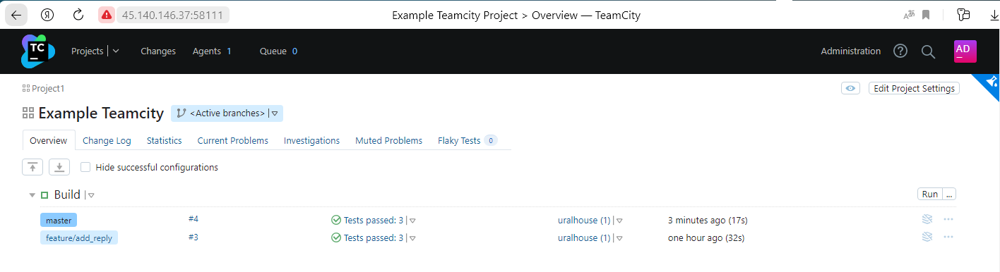

12. Убедитесь, что нет собранного артефакта в сборке по ветке `master`

    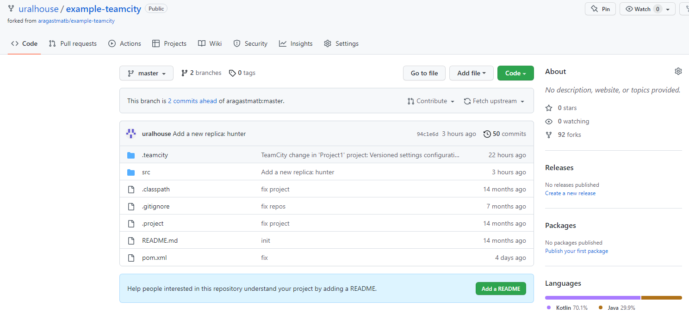

13. Настройте конфигурацию так, чтобы она собирала `.jar` в артефакты сборки

    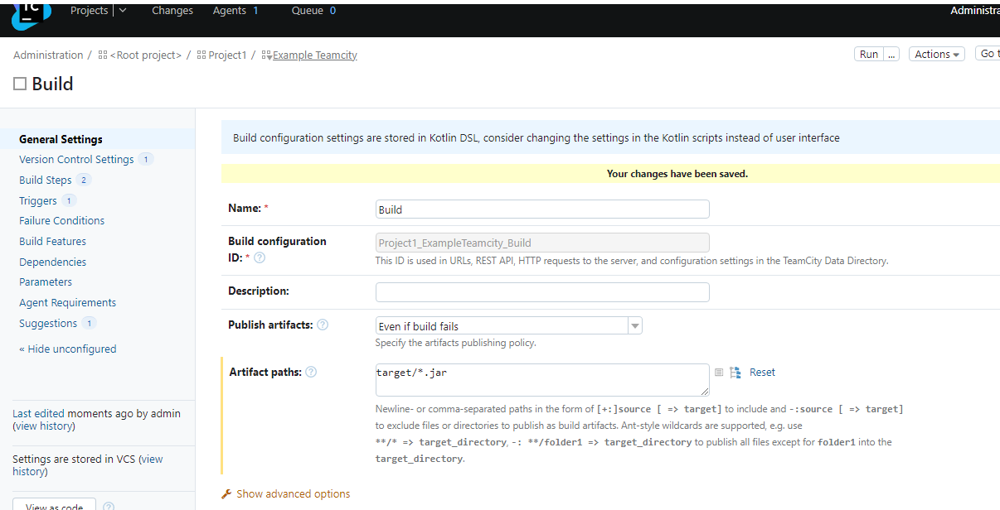

14. Проведите повторную сборку мастера, убедитесь, что сбора прошла успешно и артефакты собраны

    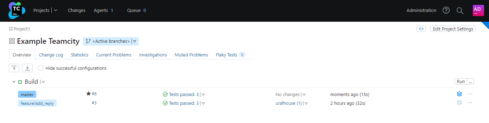

    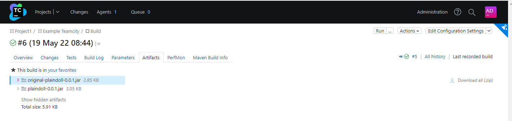

15. Проверьте, что конфигурация в репозитории содержит все настройки конфигурации из teamcity

    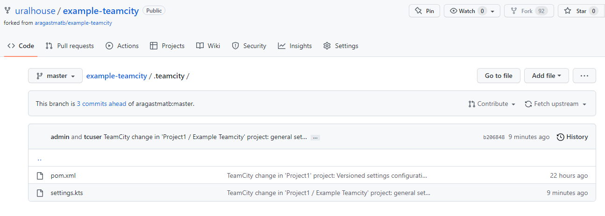

    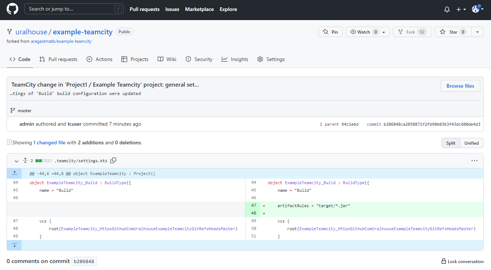

16. В ответ предоставьте ссылку на репозиторий

    https://github.com/uralhouse/example-teamcity
