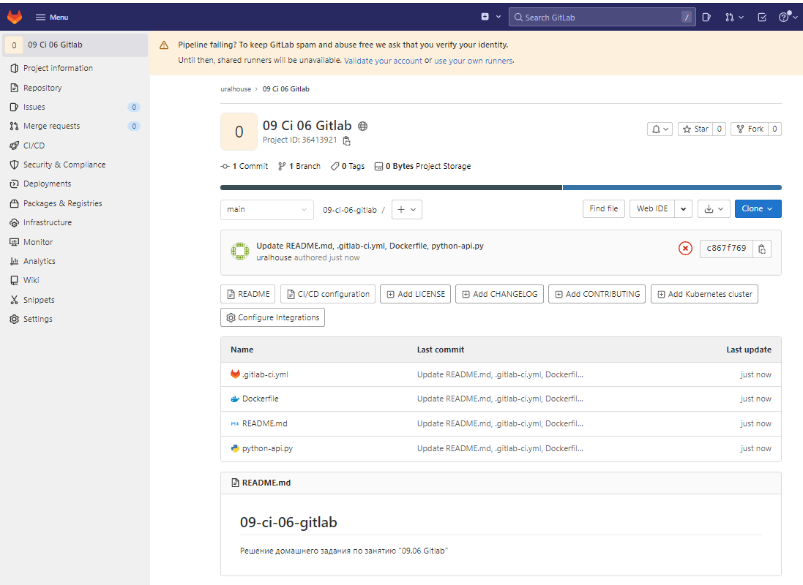
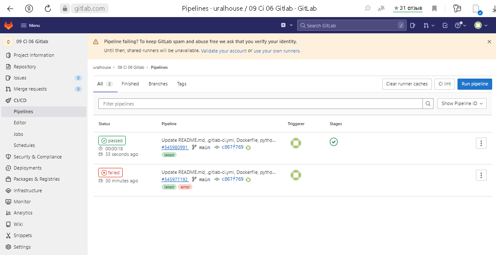
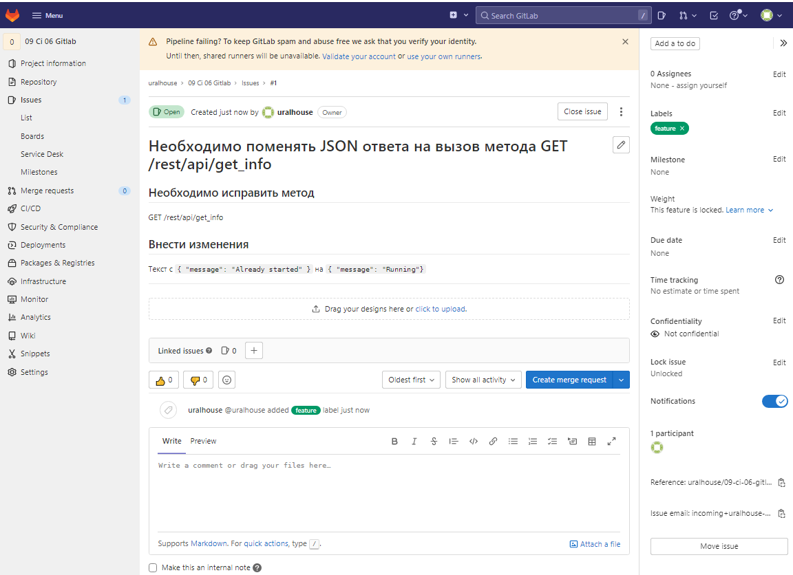
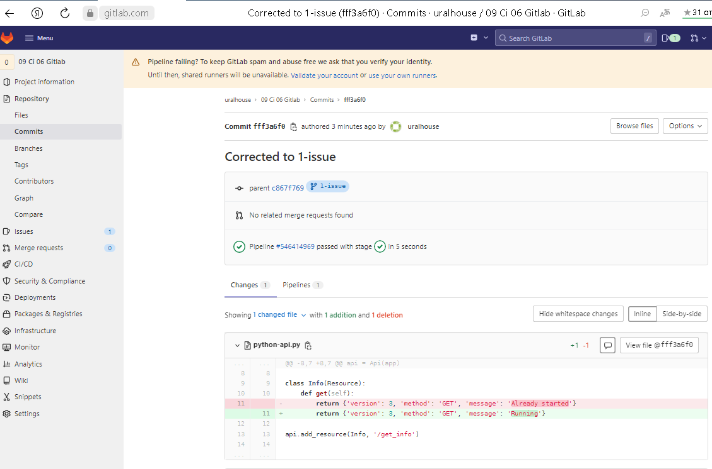
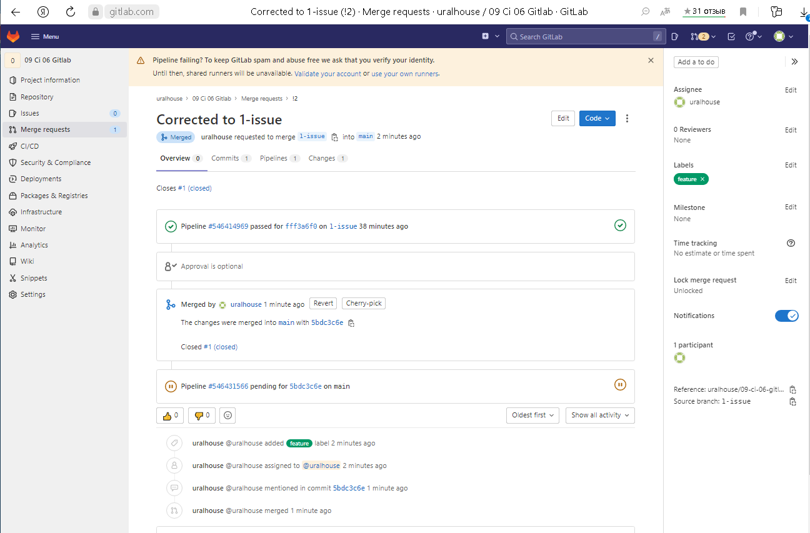
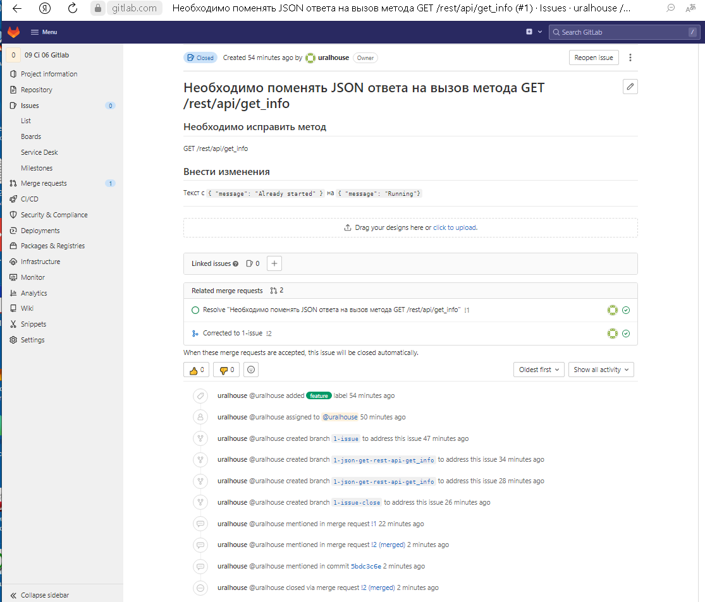
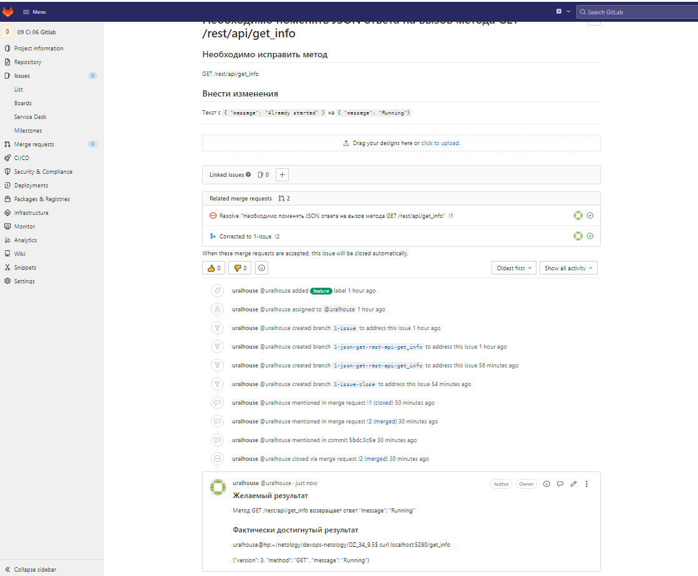

# Домашнее задание к занятию "09.06 Gitlab"

## Подготовка к выполнению

1. Необходимо [зарегистрироваться](https://about.gitlab.com/free-trial/)

2. Создайте свой новый проект

3. Создайте новый репозиторий в gitlab, наполните его [файлами](./repository)

4. Проект должен быть публичным, остальные настройки по желанию

   

## Основная часть

### DevOps

В репозитории содержится код проекта на python. Проект - RESTful API сервис. Ваша задача автоматизировать сборку образа с выполнением python-скрипта:
1. Образ собирается на основе [centos:7](https://hub.docker.com/_/centos?tab=tags&page=1&ordering=last_updated)

2. Python версии не ниже 3.7

3. Установлены зависимости: `flask` `flask-jsonpify` `flask-restful`

4. Создана директория `/python_api`

5. Скрипт из репозитория размещён в /python_api

6. Точка вызова: запуск скрипта

7. Если сборка происходит на ветке `master`: Образ должен пушится в docker registry вашего gitlab `python-api:latest`, иначе этот шаг нужно пропустить

   

Сссылка на файлы [репозитория GitLab](https://gitlab.com/uralhouse/09-ci-06-gitlab/-/tree/main).

Проверяем работоспособность:

```
uralhouse@hp:~/netology/devops-netology/DZ_34_9.5$ docker pull registry.gitlab.com/uralhouse/09-ci-06-gitlab/python-api:latest
latest: Pulling from uralhouse/09-ci-06-gitlab/python-api
Digest: sha256:c7e1f0177cf0bea4983f6ce81215d2f0d483012555b92140bcdb1b0823cc78df
Status: Image is up to date for registry.gitlab.com/uralhouse/09-ci-06-gitlab/python-api:latest
registry.gitlab.com/uralhouse/09-ci-06-gitlab/python-api:latest

uralhouse@hp:~/netology/devops-netology/DZ_34_9.5$ docker run -d --name python-api -p 5290:5290 registry.gitlab.com/uralhouse/09-ci-06-gitlab/python-api:latest
3d85bba8ca7038bb88e741b30d79a39cfa266c8f3bf0ad8640360b7210b130c7

uralhouse@hp:~/netology/devops-netology/DZ_34_9.5$ curl localhost:5290/get_info
{"version": 3, "method": "GET", "message": "Already started"}
```

### Product Owner

Вашему проекту нужна бизнесовая доработка: необходимо поменять JSON ответа на вызов метода GET `/rest/api/get_info`, необходимо создать Issue в котором указать:
1. Какой метод необходимо исправить

2. Текст с `{ "message": "Already started" }` на `{ "message": "Running"}`

3. Issue поставить label: feature

   

### Developer

Вам пришел новый Issue на доработку, вам необходимо:
1. Создать отдельную ветку, связанную с этим issue

2. Внести изменения по тексту из задания

   

3. Подготовить Merge Requst, влить необходимые изменения в `master`, проверить, что сборка прошла успешно

   

   


### Tester

Разработчики выполнили новый Issue, необходимо проверить валидность изменений:
1. Поднять докер-контейнер с образом `python-api:latest` и проверить возврат метода на корректность

   ```
   uralhouse@hp:~/netology/devops-netology/DZ_34_9.5$ docker pull registry.gitlab.com/uralhouse/09-ci-06-gitlab/python-api:latest
   latest: Pulling from uralhouse/09-ci-06-gitlab/python-api
   Digest: sha256:349bc17314b1eef3931843beafa1921bb1c71a289d1cbfb613872457ca4df8a5
   Status: Downloaded newer image for registry.gitlab.com/uralhouse/09-ci-06-gitlab/python-api:latest
   registry.gitlab.com/uralhouse/09-ci-06-gitlab/python-api:latest
   uralhouse@hp:~/netology/devops-netology/DZ_34_9.5$ docker run -d --name python-api -p 5290:5290 registry.gitlab.com/uralhouse/09-ci-06-gitlab/python-api:latest
   214694ae4f509d3adb9b3cbf16840c4ba569c9afa0fbf9f962a208dcb3225439
   
   uralhouse@hp:~/netology/devops-netology/DZ_34_9.5$ curl localhost:5290/get_info
   {"version": 3, "method": "GET", "message": "Running"}

2. Закрыть Issue с комментарием об успешности прохождения, указав желаемый результат и фактически достигнутый



## Итог

После успешного прохождения всех ролей - отправьте ссылку на ваш проект в гитлаб, как решение домашнего задания

Ссылка на репозиторий на [проект GitLab](https://gitlab.com/uralhouse/09-ci-06-gitlab.git).

