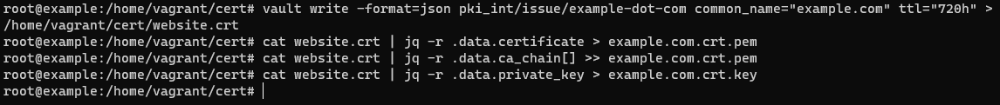
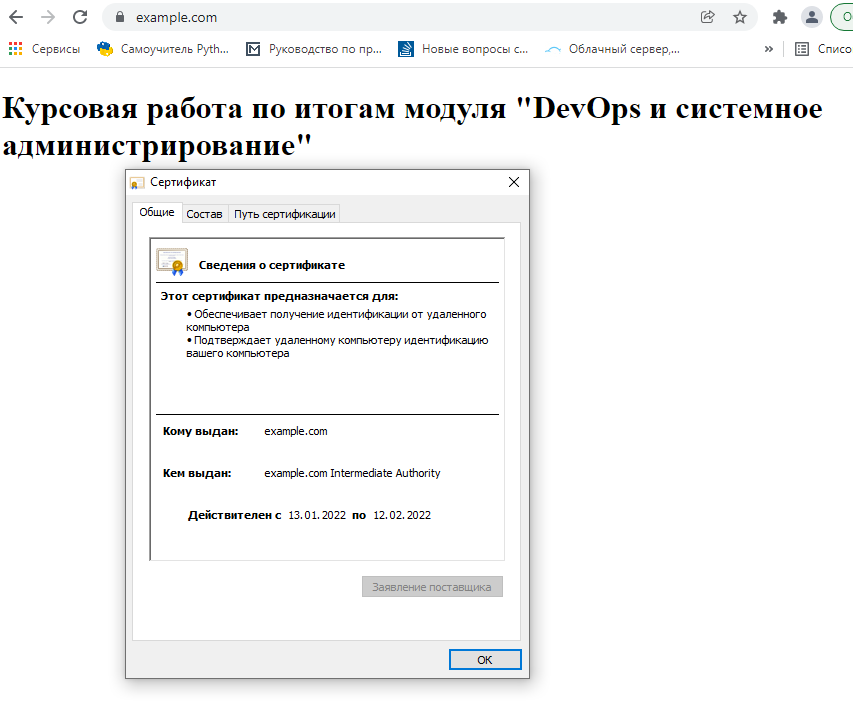

# Решение курсовой работы по итогам модуля "DevOps и системное администрирование"


## Задание 1

##### Создайте виртуальную машину Linux.

Создана виртуальная машина Ubuntu 20.04 (Vagrant).


## Задание 2

##### Установите ufw и разрешите к этой машине сессии на порты 22 и 443, при этом трафик на интерфейсе localhost (lo) должен ходить свободно на все порты.

Ufw установлен в Ubuntu по-умолчанию.

Выполним обновление по последней версии:

```
root@vagrant:/home/vagrant# apt-get install ufw
root@vagrant:/home/vagrant# ufw --version
ufw 0.36
```

Открываем порты 22 и 443: 

```
root@vagrant:/home/vagrant# ufw allow 22
Rules updated
Rules updated (v6)
root@vagrant:/home/vagrant# ufw allow 443
Rules updated
Rules updated (v6)
```

Разрешаем localhost ходить свободно на все порты:

```
root@vagrant:/home/vagrant# ufw allow from 127.0.0.1
Rules updated
```

Включаем ufw и просматриваем существующие правила:

```
root@vagrant:/home/vagrant# ufw enable
Command may disrupt existing ssh connections. Proceed with operation (y|n)? y
Firewall is active and enabled on system startup
root@vagrant:/home/vagrant# ufw status
Status: active

To                         Action      From
--                         ------      ----
22                         ALLOW       Anywhere
443                        ALLOW       Anywhere
Anywhere                   ALLOW       127.0.0.1
22 (v6)                    ALLOW       Anywhere (v6)
443 (v6)                   ALLOW       Anywhere (v6)
```

На данной виртуальной машине открыты 22 и 443, трафик на интерфейсе localhost ходит свободно на все порты.

## Задание 3

##### Установите hashicorp vault


**Установка Vault**

Выполняем команды:

```
curl -fsSL https://apt.releases.hashicorp.com/gpg | sudo apt-key add -
sudo apt-add-repository "deb [arch=amd64] https://apt.releases.hashicorp.com $(lsb_release -cs) main"
sudo apt-get update && sudo apt-get install vault
```

Проверяем версию Vault:


**Корректировка конфигурационных файлов**

Выполним корректировку конфигурационного файла nano /etc/vault.d/vault.hcl

```# Full configuration options can be found at https://www.vaultproject.io/docs/configuration
# Full configuration options can be found at https://www.vaultproject.io/docs/configuration

ui = true

#mlock = true
#disable_mlock = true

storage "file" {
  path = "/opt/vault/data"
}

#storage "consul" {
#  address = "127.0.0.1:8500"
#  path    = "vault"
#}

# HTTP listener
#listener "tcp" {
#  address = "127.0.0.1:8200"
#  tls_disable = 1
#}

# HTTPS listener
listener "tcp" {
  address       = "127.0.0.0:8200"
  tls_cert_file = "/opt/vault/tls/tls.crt"
```

****


**Запуск Vault**

```
root@vagrant:/home/vagrant# systemctl enable vault
root@vagrant:/home/vagrant# systemctl start vault
root@vagrant:/home/vagrant# systemctl status vault
```

Результат:


## Задание 4

##### Cоздайте центр сертификации по инструкции и выпустите сертификат для использования его в настройке веб-сервера nginx (срок жизни сертификата - месяц).


**Запуск сервера Vault**

Открываем второй терминал и запускаем команду:

vagrant@vagrant:~$ vault server -dev -dev-root-token-id root


Во втором терминале больше ничего не выполняем.

Далее все команды выполняем в первом терминале.

Экспортируем переменные среды для Vault:

```
export VAULT_ADDR=http://127.0.0.1:8200
export VAULT_TOKEN=root
```

**Генерируем корневой сертификат **

Выполняем следующие команды:

```vault secrets enable pki
vault secrets enable pki
vault secrets tune -max-lease-ttl=87600h pki
vault write -field=certificate pki/root/generate/internal common_name=example.com ttl=87600h > CA_cert.crt
vault write pki/config/urls issuing_certificates="$VAULT_ADDR/v1/pki/ca" crl_distribution_points="$VAULT_ADDR/v1/pki/crl"
```

Получаем результат создания корневого сертификата:


**Генерируем промежуточный сертификат **

В начале устанавливаем приложение JQ:

```
apt-get install jq
```

Далее выполняем следующие команды:

```
vault secrets enable -path=pki_int pki
vault secrets tune -max-lease-ttl=43800h pki_int
vault write -format=json pki_int/intermediate/generate/internal \
     common_name="example.com Intermediate Authority" \
     | jq -r '.data.csr' > pki_intermediate.csr
vault write -format=json pki/root/sign-intermediate csr=@pki_intermediate.csr \
     format=pem_bundle ttl="43800h" \
     | jq -r '.data.certificate' > intermediate.cert.pem
vault write pki_int/intermediate/set-signed certificate=@intermediate.cert.pem
```

Получаем результат создания промежуточного сертификата:


**Создаем роль **

Выполняем следующие команды:

```
vault write pki_int/roles/example-dot-com \
     allowed_domains="example.com" \
     allow_bare_domains=true \
     allow_subdomains=true \
     max_ttl="8760h"
```

Получаем результат создания роли:


**Генерируем сертификаты для нашего домена example.com **

```
vault write -format=json pki_int/issue/example-dot-com common_name="example.com" ttl="720h" > /home/vagrant/cert/website.crt
cat website.crt | jq -r .data.certificate > example.com.crt.pem
cat website.crt | jq -r .data.ca_chain[] >> example.com.crt.pem
cat website.crt | jq -r .data.private_key > example.com.crt.key
```

Получаем результат создания сертификатов для домена:




## Задание 5

##### Установите корневой сертификат созданного центра сертификации в доверенные в хостовой системе.

Устанавливаем корневой сертификат хостовой машине.

Вначале выполним копирование корневого сертификата в общую папку:

 ```
 cp CA_cert.crt /vagrant/
 ```

 Выполняем на хостовой машине (WIN10) запускаем "Консоль управления" через команду mmc.

Далее "Файл" > "Добавить или удалить оснастку".   Выбираем оснастку "Сертификаты" > "учетной записи компьютера" > "локальным компьютером".

В окне "Корень консоли" переходим в вкладку "Доверенные корневые центры сертификации" > Правой кнопкой мыши выбираем в контекстном меню "Все задачи" > "Импорт".

Выбираем наш корневой сертификат CA_cert.crt

Получаем результат установки корневого сертификата в хостовой машине:


## Задание 6

##### Установите Nginx


**Установка Nginx**

Выполняем установку Nginx используя следующие команды:

```
curl https://nginx.org/keys/nginx_signing.key | gpg --dearmor \
    | sudo tee /usr/share/keyrings/nginx-archive-keyring.gpg >/dev/null
gpg --dry-run --quiet --import --import-options import-show /usr/share/keyrings/nginx-archive-keyring.gpg
echo "deb [signed-by=/usr/share/keyrings/nginx-archive-keyring.gpg] \
http://nginx.org/packages/ubuntu `lsb_release -cs` nginx" \
    | sudo tee /etc/apt/sources.list.d/nginx.list
apt update
apt install nginx
```

Смотрим версию Nginx:

```
root@example:/home/vagrant/cert# nginx -v
nginx version: nginx/1.20.2
```

**Запуск Nginx**

```
root@vagrant:/home/vagrant# systemctl enable nginx
root@vagrant:/home/vagrant# systemctl start nginx
```

Результат:


**Добавляем Nginx для ufw**

Создадим файл по команде **nano /etc/ufw/applications.d/nginx.ini** и дополним его следующими параметрами:

```# Full configuration options can be found at https://www.vaultproject.io/docs/configuration
[Nginx HTTP]
title=Web Server
description=Enable NGINX HTTP traffic
ports=80/tcp

[Nginx HTTPS] \
title=Web Server (HTTPS) \
description=Enable NGINX HTTPS traffic
ports=443/tcp

[Nginx Full]
title=Web Server (HTTP,HTTPS)
description=Enable NGINX HTTP and HTTPS traffic
ports=80,443/tcp
```

Проверяем список приложений

```
ufw app list
```

Разрешаем сервис 'Nginx Full'

```
root@example:/home/vagrant# ufw allow 'Nginx Full'
Rule added
Rule added (v6)
```

Проверяем статус и получаем результат:

```
ufw status
```


## Задание 7

##### По инструкции настройте nginx на https, используя ранее подготовленный сертификат


Создаём папку для сайта:

```
mkdir -p /var/www/example.com/html
```

Добавляем индексный файл

```
nano /var/www/example.com/html/index.html
<!DOCTYPE html>
<html lang="ru">
<head>
    <title>Курсовая работа</title>
    <meta charset="utf-8">
</head>
<body>
    <h1>Курсовая работа по итогам модуля "DevOps и системное администрирование"</h1>
</body>
</html>
```

Создаём папки для конфига

```
mkdir -p /etc/nginx/sites-available/
mkdir -p /etc/nginx/sites-enabled/
```

Генерируем стойкую последовательность для Diffie-Hellman файла:

```
openssl dhparam -out /etc/ssl/certs/dh2048.pem 2048
```

Создаем конфигурационный файл командой **nano /etc/nginx/sites-available/example.com.conf**, делаем перенаправление с незащищенного сайта на защищенный и указываем наши ранее сформированные сертификаты:

```
server {
    listen 80;
    listen [::]:80;

    server_name example.com www.example.com;
    return 301 https://example.com$request_uri;
}

server {
  listen 443 ssl http2;
  listen [::]:443 ssl http2;

  root /var/www/example.com/html;
  index index.html index.htm;
  server_name example.com;

  ssl_session_timeout 1d;
  ssl_session_cache shared:SSL:10m;
  ssl_session_tickets off;
  ssl_certificate /home/vagrant/cert/example.com.crt.pem;
  ssl_certificate_key /home/vagrant/cert/example.com.crt.key;
  ssl_dhparam /home/vagrant/cert/dhparam.pem;

  ssl_protocols TLSv1 TLSv1.1 TLSv1.2;
  ssl_ciphers ECDHE-ECDSA-AES128-GCM-SHA256:ECDHE-RSA-AES128-GCM-SHA256:ECDHE-ECDSA-AES256-GCM-SHA384:ECDHE-RSA-AES256->  ssl_prefer_server_ciphers off;
  
    location / {
    try_files $uri $uri/ =404;
  }
}

```

Включаем конфигурационный файл:

```
ln -s /etc/nginx/sites-available/example.com.conf /etc/nginx/sites-enabled/
```

Проверяем конфигурационный файл:


Рестартуем nginx

```
systemctl restart nginx
```


## Задание 8

##### Откройте в браузере на хосте https адрес страницы, которую обслуживает сервер nginx


Открываем на хостовой машине наш сайт через Firefox и проверяем его работоспособность:


Открываем на хостовой машине наш сайт через Chrome и проверяем его работоспособность:




Страница сервера nginx в браузере хоста не содержит предупреждений


## Задание 9

##### Создайте скрипт, который будет генерировать новый сертификат в vault

- ##### генерируем новый сертификат так, чтобы не переписывать конфиг nginx;

- ##### перезапускаем nginx для применения нового сертификата.


Скрипт **gen_cert.sh** который автоматизирует выпуск всех сертификатов Vault :  

```
#!/usr/bin/env bash

###############Скрипт генерации новых сертификатов Vault####################
#ПЕРЕМЕННЫЕ
DOMAIN=example.com
#Время жизни корневого сертификата (10 лет)
TTL_ROOT_CA=87600h
# Время жизни промежуточного сертификата (5 лет)
TTL_IM_CA=43800h
# Время жизни сертификата роли (1 год) 
TTL_ROLES=8760h
# Время жизни сертификата для домена (1 месяц)
TTL_DOMAIN=720h
# Путь нахождения скрипта
DIR_SERT=/home/vagrant/cert

# Экспорт переменной Vault
export VAULT_ADDR='http://127.0.0.1:8200'

#Step 1: Generate root CA
vault secrets enable pki
vault secrets tune -max-lease-ttl=$TTL_ROOT_CA pki
vault write -field=certificate pki/root/generate/internal common_name=$DOMAIN ttl=$TTL_ROOT_CA > $DIR_SERT/CA_cert.crt
vault write pki/config/urls issuing_certificates="$VAULT_ADDR/v1/pki/ca" crl_distribution_points="$VAULT_ADDR/v1/pki/crl"

#Step 2: Generate intermediate CA
vault secrets enable -path=pki_int pki
vault secrets tune -max-lease-ttl=$TTL_IM_CA pki_int
vault write -format=json pki_int/intermediate/generate/internal common_name="$DOMAIN Intermediate Authority" | jq -r '.data.csr' > $DIR_SERT/pki_intermediate.csr
vault write -format=json pki/root/sign-intermediate csr=@pki_intermediate.csr format=pem_bundle ttl=$TTL_IM_CA | jq -r '.data.certificate' > $DIR_SERT/intermediate.cert.pem
vault write pki_int/intermediate/set-signed certificate=@intermediate.cert.pem

#Step 3: Create a role
vault write pki_int/roles/example-dot-com allowed_domains=$DOMAIN allow_bare_domains=true allow_subdomains=true max_ttl=$TTL_ROLES

#Step 4: Request certificates
vault write -format=json pki_int/issue/example-dot-com common_name=$DOMAIN ttl=$TTL_DOMAIN > $DIR_SERT/website.crt

#Step 5: Save cert
cat $DIR_SERT/website.crt | jq -r .data.certificate >  $DIR_SERT/example.com.crt.pem
cat $DIR_SERT/website.crt | jq -r .data.ca_chain[] >>  $DIR_SERT/example.com.crt.pem
cat $DIR_SERT/website.crt | jq -r .data.private_key >  $DIR_SERT/example.com.crt.key

#Step 6: Reload Nginx
systemctl reload nginx
```


Скрипт работает и получаем результат:


Скрипт **update_cert.sh** который автоматизирует выпуск сертификатов нашего домена:  

```
#!/usr/bin/env bash

###############Скрипт генерации нового сертификата для домена####################
#ПЕРЕМЕННЫЕ
DOMAIN=example.com
# Время жизни сертификата для нашего домена (1 месяц)
TTL_DOMAIN=720h
# Путь нахождения скрипта
DIR_SERT=/home/vagrant/cert
# Экспорт переменной Vault
export VAULT_ADDR='http://127.0.0.1:8200'

vault write -format=json pki_int/issue/example-dot-com common_name=$DOMAIN ttl=$TTL_DOMAIN >  $DIR_SERT/website.crt

#Save cert
cat $DIR_SERT/website.crt | jq -r .data.certificate >  $DIR_SERT/example.com.crt.pem
cat $DIR_SERT/website.crt | jq -r .data.ca_chain[] >>  $DIR_SERT/example.com.crt.pem
cat $DIR_SERT/website.crt | jq -r .data.private_key >  $DIR_SERT/example.com.crt.key

#Reload Nginx
systemctl reload nginx
```


Скрипт работает и получаем результат:


## Задание 10

##### Поместите скрипт в crontab, чтобы сертификат обновлялся какого-то числа каждого месяца в удобное для вас время.


Помещаем наш скрипт **update_cert.sh** в  *crontab* и выставляем его исполнение <u>первого числа каждого месяца в 12 ночи</u> (согласно задания).

Выполняем команду **crontab -e** для назначения задания и дополняем:

```
0 0 1 * * /home/vagrant/cert/update_cert.sh
```

Получаем список заданий Crontab:


Продемонстрируем работу Crontab и выполнение **update_cert.sh** в  <u>каждую минуту</u> (для работоспособности Crontab).

Выполняем команду **crontab -e** для назначения задания и дополняем:

```
* * * * * /home/vagrant/cert/update_cert.sh
```

Далее смотрим лог по команде **grep CRON /var/log/syslog**:


Обновления проверены на хостовой машине:


